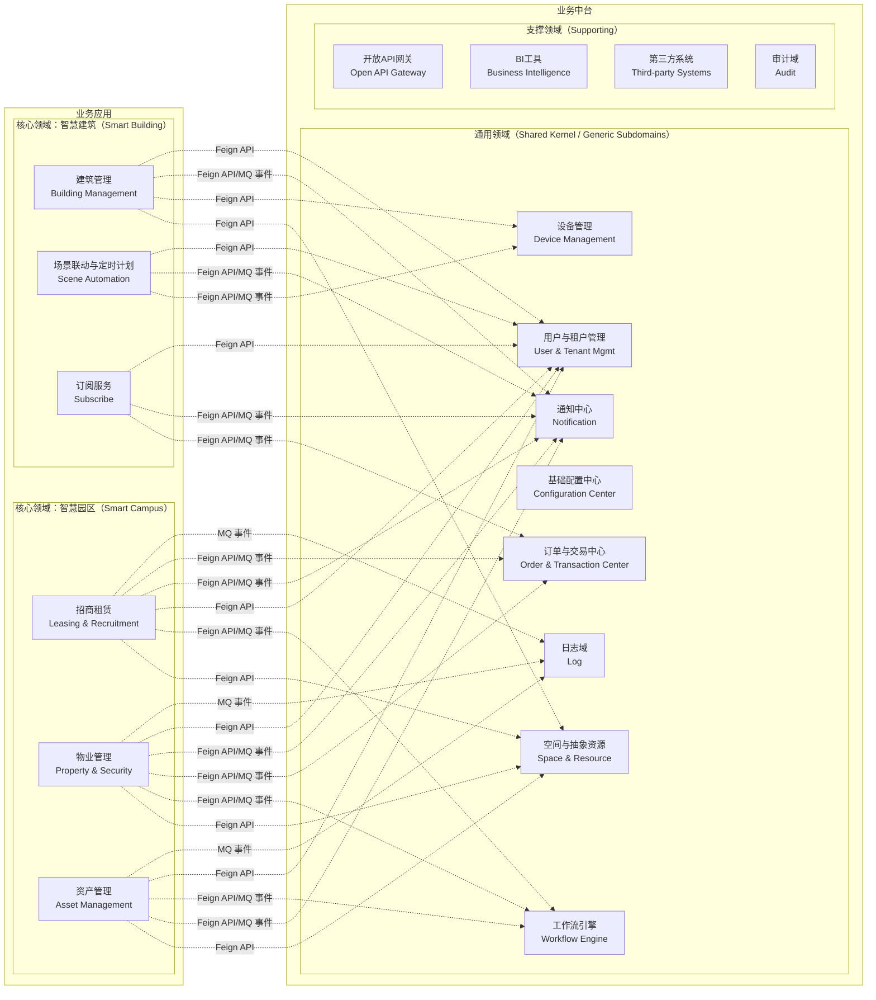

[请至钉钉文档查看「脑图」](https://alidocs.dingtalk.com/i/nodes/AR4GpnMqJzMEj1XYIDMezPLBVKe0xjE3?doc_type=wiki_doc&iframeQuery=anchorId%3DX02mkqhiur3vbjp0t26qns)

## 通用领域（Core & Shared Domains）

> 这些是跨多个业务线共享的基础能力，应作为独立的限界上下文。

| **限界上下文** | **描述** | **模块** |
| --- | --- | --- |
| 用户与租户管理（User & Tenant Management） | 管理租户生命周期、RBAC权限、SSO/MFA认证 | 用户与租户 |
| 订单与交易中心（Order & Transaction Center） | 订单创建、支付集成、发票生成 | 订单与交易中心 |
| 通知中心（Notification） | 多渠道消息推送、消息模板引擎 | 通知中心 |
| 基础配置中心（Configuration Center） | 参数配置、国际化、数据字典 | 基础配置中心 |
| 工作流引擎（Workflow Engine） | BPM流程编排、SLA管理、审批 | 工作流 |
| 设备管理（Device Management） | 设备接入、OTA升级、状态监控、设备控制 | 物联网中台 → 设备管理，设备License管控 |
| 空间与抽象资源（Space & Resource） | 空间层级结构、空间节点、空间与抽象资源关联维护（只保存抽象的关联关系，抽象资源由各自业务解读具体的资源） | 空间管理 |
| 日志域（Log） | 操作日志记录，包含用户操作日志和定时任务日志 | 日志管理 |

## 核心领域（Core Domains）

> 每个 MVP 是一个独立的业务方向，可视为一个 **核心领域**，内部再细分为子域。

### 2.1 智慧园区（Smart Campus）

| **限界上下文** | **描述** |
| --- | --- |
| 招商租赁（Leasing & Recruitment） | 客户跟进、合同全生命周期、房源管理 |
| 物业管理（Property & Security） | 收费、账单、合同全生命周期 |
| 资产管理（Asset Management） | 资产台账、盘点、生命周期 |

### 2.2 智慧建筑（Smart Building）

| **限界上下文** | **描述** |
| --- | --- |
| 建筑管理（Building Management） | 建筑结构、空间规划、场景联动 |
| 场景联动与定时计划（Scene Automation） | 场景触发、定时任务、联动控制 |
| 订阅服务（Subscribe） | 建筑下设备配额、增值服务订阅 |

## 支撑领域（Supporting Domains）

| **限界上下文** | **描述** |
| --- | --- |
| 第三方支撑系统（Third-party Systems） | 涂鸦系统、停车系统、送餐机器人等系统接入 |
| 开放API网关（Open API Gateway） | 提供标准化接口，支持外部系统对接 |
| BI工具（Business Intelligence） | 数据可视化、报表分析 |
| 审计（Audit） | GDPR相关的审计日志、删除报告 |

## 领域关系示意图

通信方式选择原则

| 场景 | 同步通道 | 异步通道 | 设计目的 |
| --- | --- | --- | --- |
| 招商租赁 ↔ 工作流 | Feign API 启动流程 | MQ 事件接收流程结果 | 启动快，结果异步通知 |
| 物业管理 ↔ 订单中心 | Feign API 创建订单 | MQ 事件接收支付回调 | 防止支付回调阻塞业务 |
| 场景联动 ↔ 设备管理 | Feign API 实时控制 | MQ 事件接收设备上报 | 控制指令实时，状态异步 |

| 场景 | 选择 | 理由 |
| --- | --- | --- |
| **查询类操作** (查资源、查设备状态) | **同步 Feign/REST** | 需要立即返回结果，用户等待 |
| **事务性操作** (下单、支付) | **混合模式** | 同步：立即查询价格/库存 异步：最终状态通知（防耦合） |
| **通知类操作** (消息推送、告警) | **异步 MQ** | 解耦，失败可重试，不阻塞主流程 |
| **流程编排** (审批、工单) | **同步 Feign** | 工作流需要同步获取流程状态 |

上下文映射与通信方式对照表

| 源上下文 | 目标上下文 | 通信方式 | 技术实现 | 业务场景说明 |
| --- | --- | --- | --- | --- |
| **招商租赁** | 空间与抽象资源 | **同步** | Feign API | 查询可租赁空间、资源占用情况 |
| **招商租赁** | 工作流 | **同步** | Feign API | 审批流程驱动（租赁合同审批） |
| **招商租赁** | 工作流 | **异步** | MQ 事件 | 流程状态变更通知、异步回调 |
| **招商租赁** | 用户中心 | **同步** | Feign API | 查询租户信息、联系人详情 |
| **招商租赁** | 通知中心 | **同步** | Feign API | 立即发送短信/邮件通知 |
| **招商租赁** | 通知中心 | **异步** | MQ 事件 | 批量通知、延迟发送、广播模式 |
| **招商租赁** | 订单中心 | **同步** | Feign API | 创建租赁订单、查询支付状态 |
| **招商租赁** | 订单中心 | **异步** | MQ 事件 | 订单状态变更异步处理、财务对账 |
| **物业管理** | 空间与抽象资源 | **同步** | Feign API | 查询物业管辖范围的空间资源 |
| **物业管理** | 工作流 | **同步** | Feign API | 维修工单流程编排 |
| **物业管理** | 工作流 | **异步** | MQ 事件 | 工单状态变更通知、SLA监控 |
| **物业管理** | 订单中心 | **同步** | Feign API | 查询账单详情、创建支付订单 |
| **物业管理** | 订单中心 | **异步** | MQ 事件 | 物业费缴纳状态变更通知 |
| **物业管理** | 通知中心 | **同步** | Feign API | 紧急报修即时推送 |
| **物业管理** | 通知中心 | **异步** | MQ 事件 | 物业公告推送、报修状态通知 |
| **物业管理** | 用户中心 | **同步** | Feign API | 查询业主信息、住户权限 |
| **资产管理** | 空间与抽象资源 | **同步** | Feign API | 资产在空间中的位置映射 |
| **资产管理** | 工作流 | **同步** | Feign API | 资产调拨流程、报废流程 |
| **资产管理** | 工作流 | **异步** | MQ 事件 | 资产状态变更驱动流程 |
| **资产管理** | 通知中心 | **同步** | Feign API | 资产告警即时通知 |
| **资产管理** | 通知中心 | **异步** | MQ 事件 | 资产保养提醒、报废审批通知 |
| **资产管理** | 用户中心 | **同步** | Feign API | 查询资产负责人、使用人信息 |
| **建筑管理** | 空间与抽象资源 | **同步** | Feign API | 获取建筑结构数据、楼层信息 |
| **建筑管理** | 设备管理 | **同步** | Feign API | 实时查询设备状态、下发控制指令 |
| **建筑管理** | 通知中心 | **同步** | Feign API | 紧急告警即时推送 |
| **建筑管理** | 通知中心 | **异步** | MQ 事件 | 建筑告警通知（消防、门禁） |
| **建筑管理** | 用户中心 | **同步** | Feign API | 查询建筑管理员、租户信息 |
| **场景联动** | 设备管理 | **同步** | Feign API | 实时控制设备（灯光、空调调节） |
| **场景联动** | 设备管理 | **异步** | MQ 事件 | 设备状态异步同步、联动触发 |
| **场景联动** | 通知中心 | **同步** | Feign API | 场景执行异常即时告警 |
| **场景联动** | 通知中心 | **异步** | MQ 事件 | 场景执行结果反馈、异常告警 |
| **场景联动** | 用户中心 | **同步** | Feign API | 查询场景配置权限、用户偏好 |
| **订阅服务** | 订单中心 | **同步** | Feign API | 查询套餐价格、立即下单支付 |
| **订阅服务** | 订单中心 | **异步** | MQ 事件 | 套餐变更异步处理、续费提醒 |
| **订阅服务** | 通知中心 | **同步** | Feign API | 订阅确认即时通知 |
| **订阅服务** | 通知中心 | **异步** | MQ 事件 | 订阅到期提醒、发票开具通知 |
| **订阅服务** | 用户中心 | **同步** | Feign API | 查询用户订阅状态、套餐信息 |