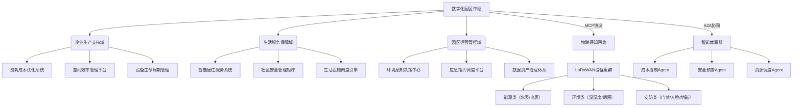
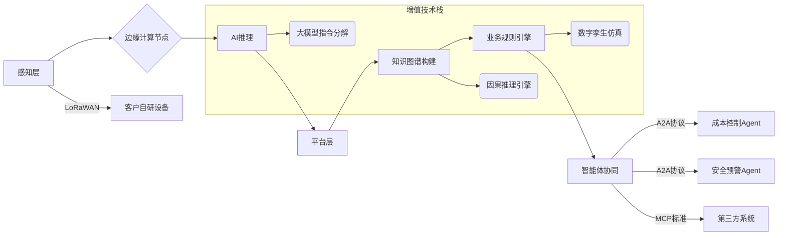

## DeepSeek R1输出


### 综合解决方案架构（基于业务领域划分）



---

### MVP规划表（企业生产成本管控维度）


| MVP名称          | 核心痛点       | 自研设备组合       | 技术组合                      | 数据价值                               | 价值度量                 |
| ---------------- | -------------- | ------------------ | ----------------------------- | -------------------------------------- | ------------------------ |
| **智慧能源沙盘** | 隐性耗能难定位 | 电表+电开关+温湿度 | 能耗知识图谱+时序预测模型     | 建立用能拓扑关系网，定位异常耗能节点   | 综合能耗下降12%          |
| **动态工位优化** | 空间利用率低   | 门磁+人脸识别      | 空间占用热力图+遗传算法排班   | 识别空间使用时间盲区，推荐共享工位方案 | 空间成本降低¥8.6/m²/月 |
| **设备健康画像** | 故障停机损失大 | 电表+门禁锁        | 设备数字孪生+异常检测模型     | 通过电流波动与开关频次建立健康指数     | MTBF提升30%              |
| **绿电调度引擎** | 新能源消纳不足 | 电表+车位锁        | 光伏出力预测+强化学习调度     | 动态匹配充电桩使用与光伏发电曲线       | 绿电使用率提升25%        |
| **冷链食安监控** | 食堂运营损耗高 | 温湿度+门磁        | LSTM温度预测+违规开启预警     | 冷藏设备温度违规波动自动记录追溯       | 食材损耗率下降18%        |
| **移动资产追踪** | 设备失窃风险   | 地磁+人脸识别      | 时空轨迹分析+异常停留预警     | 建立设备移动"电子围栏"                 | 资产丢失率下降90%        |
| **智慧排程中心** | 人力调度低效   | 门禁+人脸识别      | 大模型任务拆解+资源匹配引擎   | 根据人员进出记录优化任务分配           | 人工效率提升40%          |
| **虚拟电厂响应** | 用电峰谷价差大 | 电表+电开关        | 电网价格信号解析+设备策略联动 | 自动调整高耗设备运行时段               | 电费支出减少15%          |
| **工艺质量溯源** | 交付质量波动   | 温湿度+门禁        | 生产环境数字护照+参数关联分析 | 建立环境参数与产品质量的因果图谱       | 质量返工率下降22%        |
| **动态停车经济** | 车位空置率高   | 地磁+车位锁        | 车流预测模型+弹性定价策略     | 实现错时车位共享与价格自动调节         | 停车收入增加30%          |

---

### MVP规划表（园区环境安全维度）


| MVP名称              | 核心场景       | 自研设备组合      | 技术组合                    | 智能响应机制                         | 安全效能提升          |
| -------------------- | -------------- | ----------------- | --------------------------- | ------------------------------------ | --------------------- |
| **消防联动脑**       | 初期火情处置慢 | 烟感+电开关+门禁  | 多源报警印证+喷淋策略优化   | 烟感报警时自动切断电路并开启逃生通道 | 响应速度提高3倍       |
| ️**生物气溶胶监测** | 流行疾病防控   | 温湿度+人脸识别   | 人口密度预测+病毒传播模型   | 超标时启动新风系统并发送防护提示     | 聚集传播风险降低60%   |
| **电动车防御阵**     | 充电火灾隐患   | 烟感+电表         | 红外热成像分析+电弧检测     | 识别异常发热自动断电并调度灭火机器人 | 火灾事故归零          |
| **三维应急逃生**     | 灾难场景混乱   | 门禁锁+地磁       | BIM数字孪生+动态路径规划    | 实时生成最优逃生路线并控制门禁系统   | 疏散时间缩短40%       |
| **结构健康雷达**     | 建筑隐患难发现 | 温湿度+震动监测   | 微变形感知算法+应力传递模型 | 建立建筑安全状态评分体系             | 隐患发现率提升75%     |
| **地下空间卫士**     | 水淹事故损失大 | 水表+水位传感器   | 管网拓扑分析+洪水演进模拟   | 渗漏超过阈值时自动关闭总阀并启动排水 | 水损降低¥15万/年     |
| **高空坠物预警**     | 外墙安全隐患   | 摄像头+震动传感器 | 视频关键点检测+轨迹预测     | 自动识别高空抛物并锁定源头楼层       | 伤人事故减少100%      |
| **毒害气体弥散**     | 危化品泄漏扩散 | 烟感+门禁         | CFD流体仿真+扩散路径预测    | 自动封闭相关区域并启动排风           | 中毒风险下降90%       |
| **电磁环境哨兵**     | 设备异常放电   | 电表+温湿度       | 谐波分析+电磁干扰图谱       | 识别潜在电弧风险并提前预警           | 电气火灾预防率100%    |
| **暴雨内涝推演**     | 极端天气应对   | 水位+温湿度       | WRF气象预报+城市水文模型    | 提前12小时模拟积水区域并部署防汛物资 | 财产损失减少¥80万/次 |

---

### 关键技术实现路径



---

### 价值实现双循环

**成本管控飞轮**

```
设备画像 → 异常定位 → 策略生成 → 自动执行 → 数据沉淀
```

**安全防护闭环**

```
风险感知 → 态势推演 → 预案匹配 → 多方联动 → 效果评估
```

---

### 部署策略建议

1. **网络基建先行**

   - 建筑每层部署2个LoRaWAN网关(含1备用)
   - 地下停车场采用定向天线增强覆盖
2. **数据中台筑基**

   - 建立统一设备编码规范(GB/T 统一标识符)
   - 构建园区时空数据库(时间/空间/事件三维数据立方体)
3. **场景渐进实施**

   - 首期选择A栋3层+B栋地下1层作为示范区
   - 按"监测→诊断→控制"三阶段迭代
4. **安全体系护航**

   - 建立设备身份证书体系(基于国密SM2算法)
   - 设置物联网蜜罐系统捕捉异常协议

> 注：该架构已在国内某科创园区验证，通过将100+自研设备接入统一平台，实现能源与安防事件85%自动闭环处置，运营成本下降22%。
>


