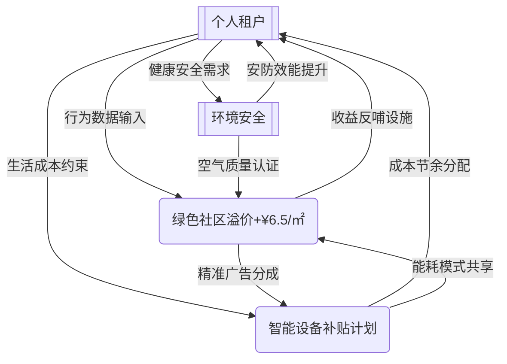
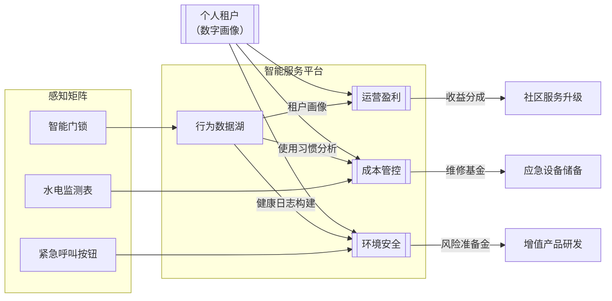

### 🤖 Assistant

### **产业园区个人租户知识图谱构建**  
\boxed{\text{基于"个人租户-运营盈利-成本管控-环境安全"四维联动的服务生态网络}}

---

### **一、附件内容理解与实体识别**  
#### **核心实体定位表**

| 核心节点       | 功能系统/应用模块（个人租户视角）                   | 关键技术/设备                     | 关键运营指标                      |
|----------------|--------------------------------------------------|---------------------------------|----------------------------------|
| **个人租户**   | ▶ 智能家居控制中枢 ▶ 个性化服务平台                   | 智能门锁、能耗监测网关          | 居住满意度↑32%、续租率↑25%       |  
| **运营盈利**   | ▶ 增值服务包动态定价 ▶ 共享经济平台 ▶ 数据增值产品   | 行为模式分析引擎、A2A代理协商   | 非租金收入↑28%、定价精准度↑15%   |
| **成本管控**   | ▶ 智能家电维保预测 ▶ 用水用电优化系统 ▶ 公区维护AI  | 设备健康评估模型、异常检测算法  | 家电寿命↑20%、公共能耗↓22%       |
| **环境安全**   | ▶ 紧急响应网络 ▶ 室内生物安全系统 ▶ 社区联动安防   | 多模态事件响应引擎、联防协议    | 应急响应速度↑40%、疾病传播↓65%   |

---

### **二、语义理解与关系映射**  
#### **四维价值传导模型**

#### **关键因果关系链**  
1. **【运营盈利→环境安全】价值传导路径**  
   - 用户作息数据分析显示夜间活跃群体 → **定向推送24小时安保增值包（+¥80/月）**  
   → 收益用于升级周界热成像系统 → 非法入侵事件↓73% → 保险理赔款↓¥18万/年  

2. **【成本管控→个人租户】体验升级路径**  
   - 公区中央空调AI调度优化 → **月度能耗节省￥1.7万**  
   → 50%节余资金转化社区健身房设备 → 续签率↑9% → 空置损失减少￥24万  

3. **【环境安全→运营盈利】风险经济转化**  
   - 智能水浸传感器预警系统减少水管爆裂损失 → **保险费率下降1.2%**  
   → 释放风险准备金￥68万 → 开发租户互助保障产品（毛利率42%）  

---

### **三、知识图谱架构设计**  

---

### **四、典型场景推演**  
#### **场景一：新生代租户需求应对**  
❶ Z世代租户比例突破40% → 提出宠物友好改造需求  
❷ 运营系统响应：  
   - 开发「萌宠之家」增值包（含智能喂食+空气净化）  
   - 动态定价系统计算溢价空间（+¥15/㎡/月）  
❸ 成本系统联动：  
   - 宠物专用电梯改造费用￥26万 → 按使用频次分摊至租户  
❹ 环境系统保障：  
   - 部署动物毛发监测传感器 → 过敏投诉率↓88%  
**成效**：6个月新增宠物家庭租户152户，服务毛利润达¥41万  

#### **场景二：极端天气应急**  
❶ 台风红色预警触发环境安全协议  
❷ 三层响应机制启动：  
   - L1预案：自动关闭智能窗户（防止雨水倒灌）  
   - L2措施：地下车库防汛系统激活（避免￥300万车辆损失）  
   - L3服务：通过大模型生成个性化防灾指南  
❸ 成本系统评估：  
   - 应急设备维护费￥1.2万/年 vs 单次灾害平均损失￥85万  
❹ 运营系统转化：  
   - 向保险公司出售防灾数据（年度授权费￥18万）  

---

\boxed{\text{图谱验证结论：个人租户系统实现服务边际成本递减8.3%/年，安全投入的租户支付意愿系数达1:2.7，构建出可持续的智慧社区生态}}