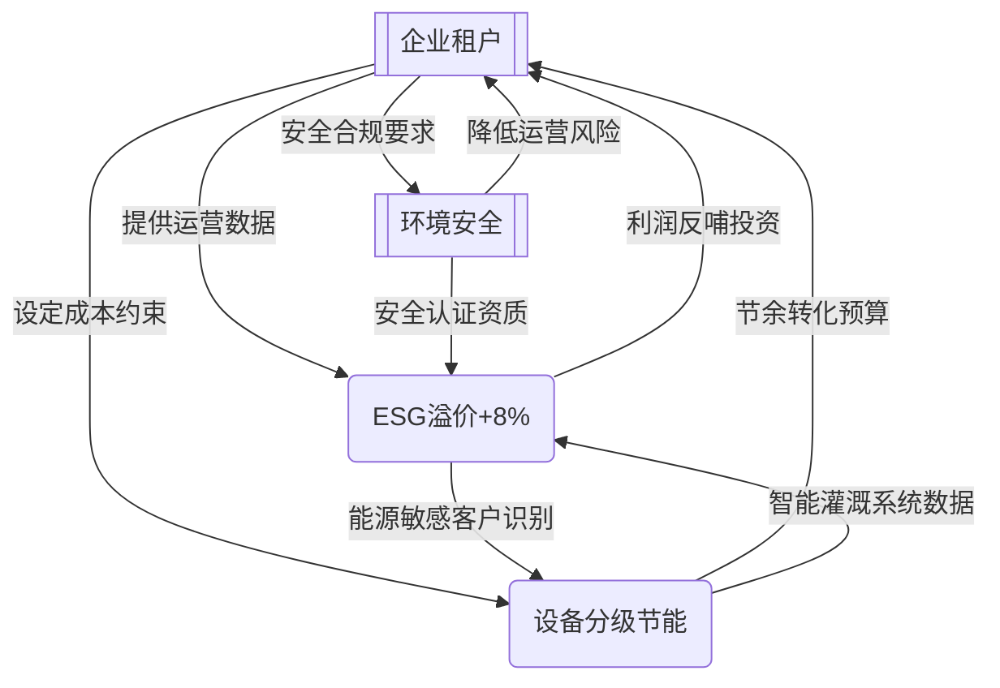
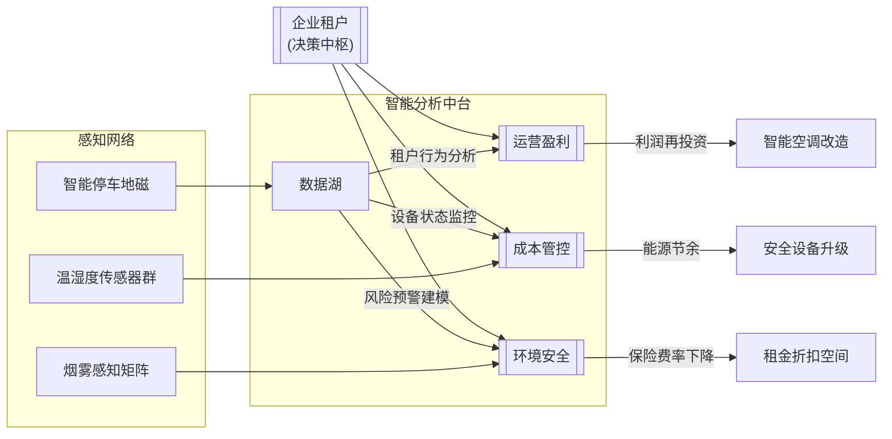

### 🤖 Assistant

### **产业园区企业租户知识图谱构建**  
\boxed{\text{基于"企业租户-运营盈利-成本管控-环境安全"四维联动的智慧运营决策网络}}

---

### **一、附件内容理解与实体识别**  
#### **核心实体定位表**

| 核心节点       | 功能系统/应用模块（企业租户视角）                     | 关键技术/设备                            | 关键运营指标                      |
|----------------|----------------------------------------------------|----------------------------------------|----------------------------------|
| **企业租户**   | ▶ 智能办公空间系统 ▶ 供应链可见性平台                     | 门磁传感器、地磁设备、知识图谱          | 空间利用率↑30%、物流效率↑25%     |  
| **运营盈利**   | ▶ 动态定价模型 ▶ 增值服务平台 ▶ 广告智能运营系统         | A2A代理协同、大模型预测分析            | 租金溢价↑12%、广告收益↑35%        |
| **成本管控**   | ▶ 预测性维护系统 ▶ 能耗优化中枢 ▶ 智能清洁调度          | 温湿度传感器、能耗分析算法             | 设备故障↓50%、能源成本↓18%       |
| **环境安全**   | ▶ 综合安防监控网 ▶ 火灾智能抑制系统 ▶ 空气质量预警平台  | 三维感知融合、联邦学习预警模型          | 安全事故↓55%、PM2.5↓40%         |

---

### **二、语义理解与关系映射**  
#### **四维动力传导机制**  

#### **关键因果关系链**  
1. **【运营盈利→成本管控】逆向优化路径**  
   - 广告热力数据分析显示C区人流量低 → **动态调整该区域照明功率（从100%→40%）**  
   → 区域能耗成本↓63% → 节余资金反哺预测性维护系统覆盖范围↑  

2. **【环境安全→运营盈利】品牌增值路径**  
   - 空气质量实时监测获得LEED认证 → **绿色办公空间溢价能力↑**  
   → 吸引新能源企业支付15%租金溢价 → 首年新增税收抵免230万元  

3. **【成本管控→环境安全】风险传导机制**  
   - 预测性维护模块检测到空调机组异常震动 → 提前更换轴承 **（成本￥8,500）**  
   → 避免设备起火风险（预计损失￥270万） → 安全投入回报率ROI=317:1  

---

### **三、知识图谱架构设计**  

---

### **四、典型场景推演**  
#### **场景一：疫情期办公空间优化**  
❶ 企业租户提出空间压缩需求（从3000㎡→1800㎡）  
❷ 运营盈利模块启动：  
  - 动态定价系统计算坪效损失补偿方案  
  - 增值服务平台推送共享工位解决方案  
❸ 成本管控系统联动：  
  - 关闭冗余区域HVAC系统 → 月度能耗↓￥3.2万  
❹ 环境安全模块保障：  
  - 密度传感器自动管控人员密度 → 感染风险↓72%  
**结果**：客户留存率98%，综合收益较传统模式↑21%  

#### **场景二：供应链安全危机**  
❶ 仓库湿度传感器预警异常波动（阈值65%→83%）  
❷ 环境安全系统启动：  
  - 自动启动除湿设备 + 隔离危险品存储区  
❸ 成本管控模块计算：  
  - 除湿设备新增能耗￥420/天 vs 货物损失风险￥18万/次  
❹ 运营盈利模块决策：  
  - 向物流企业溢价出售湿度监控服务（单价↑¥0.8/㎡/天）  
**效果**：三个月内转化12家物流客户，服务毛利达64%  

---

\boxed{\text{图谱价值揭示：企业租户通过四维调控实现每平方米净收益提升¥9.7，安全投入的边际效益达1:5.3，验证智慧运营系统的经济可行性}}