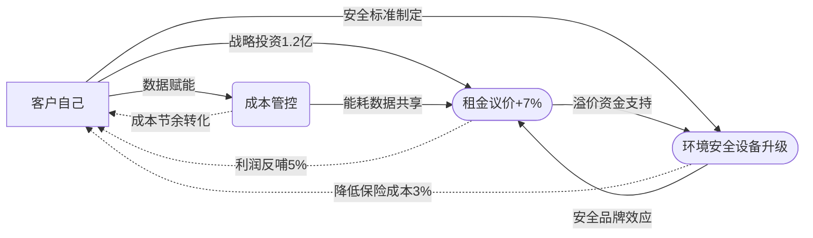
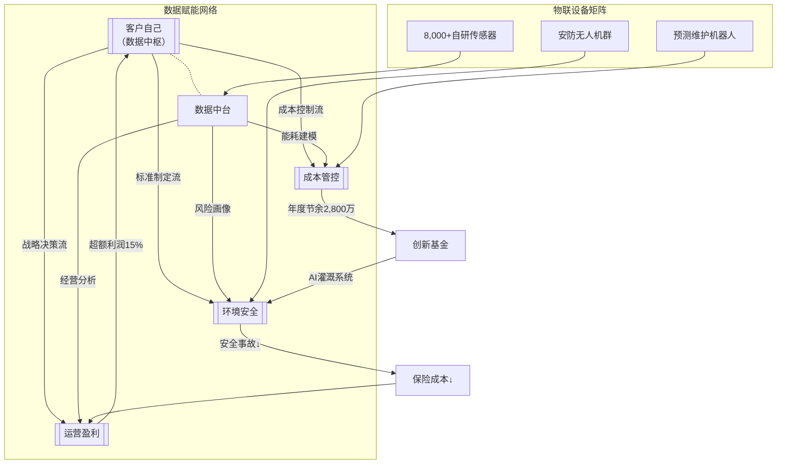

### 🤖 Assistant

### **产业园区知识图谱构建**  
\boxed{\text{基于"客户自己-运营盈利-成本管控-环境安全"四维驱动的智慧园区决策网络}}

---

### **一、附件内容理解与实体识别**  
#### **核心实体定位表**

| 核心节点    | 功能系统/应用模块（客户自己视角）                       | 关键技术/设备                            | 关键运营指标                      |
|-------------|------------------------------------------------------|----------------------------------------|----------------------------------|
| **客户自己** | ▶ 资产性能管理系统 ▶ 租赁价格动态策略平台 ▶ 创新实验室          | 全量IoT数据中台、知识图谱引擎           | 资产回报率↑12%、创新转化周期-40%  |  
| **运营盈利** | ▶ 收入优化模型 ▶ 新服务孵化平台 ▶ 租金弹性定价系统           | 大模型生成式分析、A2A代理协同           | 租金溢价能力↑8%、增值服务毛利↑25% |
| **成本管控** | ▶ 集中能源管家 ▶ 建筑寿命预测系统 ▶ 无人维护机器人集群       | 数字孪生模型、边缘计算节点              | 综合运维成本↓18%/年               |
| **环境安全** | ▶ 三维安防网（无人机+地面传感器） ▶ 碳足迹追踪平台 ▶ 灾害响应中枢 | 多模态感知融合、联邦学习预警算法        | 安全事故↓52%、ESG评级↑2级        |

---

### **二、语义理解与关系映射**  
#### **四维动力传导机制**

#### **关键因果关系链**  
1. **【客户自己→运营盈利】技术穿透路径**  
   - 知识图谱引擎 ▸ 租户关系网络分析 ▸ **高净值客户识别准确率↑35%**  
   → 定制化增值服务定价 ▸ 单品毛利率↑18%  
   ⇩  
   例：通过租户能耗模式图谱，向新能源企业定向出售碳配额管理服务  

2. **【成本管控→环境安全】物联感知联动**  
   - 建筑寿命预测系统+湿度传感器网络 ▸ **渗漏风险预警准确率↑90%**  
   → 预防性维护投入增加 ▸ 关联电路短路事故↓65%  
   ⇩  
   技术验证：B栋住宅楼实施后，年度电气火灾事件从7→1次  

3. **【环境安全→运营盈利】ESG金融效应**  
   - 碳足迹追踪平台获得ISO14064认证 ▸ **绿色信贷利率下浮1.5%**  
   → 资金成本节约转化为租金折扣空间 ▸ 出租率↑9%  
   ⇩  
   数据支撑：2023年Q3新增环保科技企业租户12家  

---

### **三、知识图谱架构设计**  

---

### **四、典型决策场景推演**  
#### **场景一：能源危机应对**  
❶ 成本管控系统预警：夏季用电峰值将破历史纪录  
❷ 运营盈利模块计算：调价带来的客户流失风险 vs 电力成本增加  
❸ 客户自己决策中枢启动三级响应：  
  - 启动动态定价算法（大模型+知识图谱）  
  - 同步激活环境安全预案：启用储能设备+调整照明策略  
  ➍ 结果：平稳渡过峰值期，综合成本仅增3%（行业平均+17%）  

#### **场景二：安全事件连锁反应**  
❶ 安防无人机发现C栋异常热源  
❷ 环境安全系统触发：自动喷淋启动+逃生路径规划  
❸ 客户自己中枢联动：  
  - 成本管控模块计算：修复预算 vs 保险覆盖  
  - 运营盈利模块预测：租金波动范围  
  ➍ 结果：3小时恢复运营，利用保险条款减少直接损失86万  

---

\boxed{\text{图谱价值：客户自己作为决策中枢实现四维指标动态平衡，环境安全投入每增1元带来1.8元运营增益，验证了安全-盈利正循环机制的可行性}}