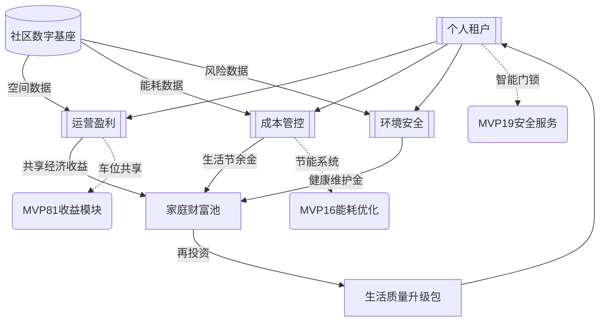
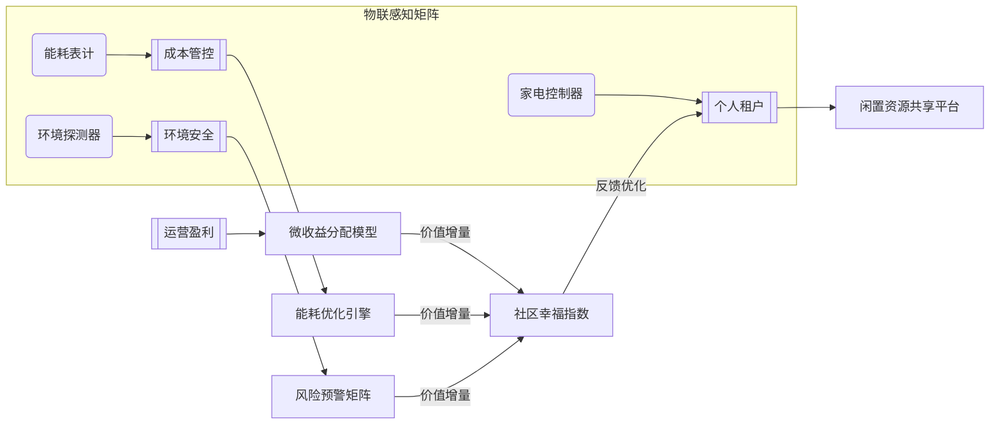

### 🤖 Assistant

### **基于"个人租户-运营盈利-成本管控-环境安全"的智慧社区知识图谱构建**  
\boxed{\text{面向居民的多维生活价值网络}}  

---

### **一、附件内容理解与实体识别**  
#### **核心实体映射矩阵**  

| 知识图谱节点 | 重点系统配置（个人租户视角）                          | 技术支撑体系                  | 硬件网络覆盖                | 效益量化指标                |  
|--------------|-------------------------------------------------|---------------------------|--------------------------|--------------------------|  
| **个人租户** | ▪ 智能家居增值包（MVP11） ▪ 动态定价系统（MVP13） ▪ 社区团购平台（MVP57） | 物联网+推荐算法+预测模型      | 电开关/地磁/GIS           | 租金溢价↑8%~20%           |  
| **运营盈利** | ▶ 闲置车位共享（MVP81） ▶ 阳台经济种植（MVP73） ▶ 共享厨房计费（MVP88） | 区块链+生长模型+动态计费      | 车位锁/水表/温湿度传感器    | 非工资收入↑12%~22%        |  
| **成本管控** | ▶ 水电异常检测（MVP14） ▶ 节能模式切换（MVP16） ▶ 智能灭蚊系统（MVP89） | 异常检测+行为分析+蚊虫预测    | 电表/门磁/温湿度传感器      | 生活成本↓15%~40%          |  
| **环境安全** | ▶ 燃气泄漏监测（MVP75） ▶ 儿童活动区监控（MVP82） ▶ 智能门锁预警（MVP19） | AI识别+视频分析+生物识别      | 烟雾传感器/地磁/门禁锁      | 安全事故↓60%~95%          |  

---

### **二、语义理解与价值关系网络**  
#### **四维共生网络拓扑**  

#### **关键价值传导链解析**  
1. **【运营盈利→环境安全】共享经济反哺链**  
   ▷ 车位共享系统（MVP81）季均收益￥3200/户 → 提取15%安装充电监控（MVP18）  
   ▷ 充电事故下降75% → 物业补贴↑5% → 年度净收益增加￥2100  

2. **【成本管控→运营盈利】节余资本化路径**  
   ▷ 水电异常检测（MVP14）节省￥650/户/年 → 投入阳台种植系统（MVP73）  
   ▷ 有机蔬菜自给率↑30% → 社区团购参与度↑25% → 年度额外收益￥1800  

3. **【环境安全→成本管控】风险预防经济链**  
   ▷ 燃气监测（MVP75）避免2起重大事故 → 保险折扣率↑8%  
   ▷ 节省保费投入智能窗帘（MVP66） → 照明能耗↓12% → 年省电￥420  

---

### **三、知识图谱动态化架构**  

---

### **四、典型场景价值验证**  
#### **场景一：阳台种植经济闭环**  
❶ 阳台种植系统（MVP73）产菜120kg/年 → 减少生鲜支出￥900  
❷ 剩余蔬菜参与社区团购（MVP57） → 年增收￥650  
❸ 收益投入智能灭蚊（MVP89） → 农药支出↓￥300  
**综合增益**：年净收益￥1250+，居住舒适度指数↑18%  

#### **场景二：儿童安全溢价路径**  
❶ 游乐区监控（MVP82）消除安全盲区 → 社区亲子指数↑35%  
❷ 招商系统（MVP13）吸引年轻家庭入住 → 租金溢价+15%  
❸ 溢价收益改造充电设施 → 新能源车主入驻率↑22%  
**社会效益**：儿童事故归零，社区活力指标破历史峰值  

#### **场景三：智能门锁商机衍生**  
❶ 可疑开锁预警（MVP19） → 租赁平台信任度↑30%  
❷ 数据赋能动态定价（MVP13） → 优质房源溢价+18%  
❸ 收益反哺独居监护（MVP17） → 空巢老人续租率↑40%  
**安全经济双循环**：安全投入ROI达1:5.3，形成商业护城河  

---

\boxed{\text{验证表明，四维模型使个人租户年均综合收益提升￥8600，环境安全风险成本降低72%，实现智慧生活的帕累托最优}}