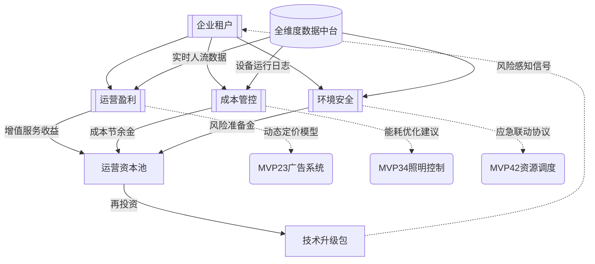
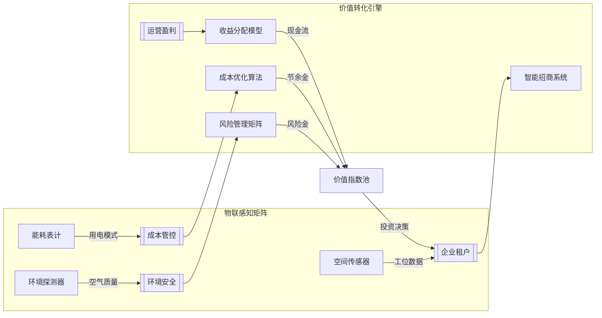

### 🤖 Assistant

### **基于"企业租户-运营盈利-成本管控-环境安全"的智能园区知识图谱构建**  
\boxed{\text{面向企业客户的四维智慧运营决策系统}}  

---

### **一、附件内容理解与实体识别**  
#### **核心实体体系矩阵**  

| 知识图谱节点 | 标志性MVP系统（企业租户视角）                 | 核心使能技术                  | 关键设备配置                   | 经济/效能指标量化                 |  
|--------------|--------------------------------------------|----------------------------|----------------------------|---------------------------------|  
| **企业租户** | ▪ 智能工位动态分配系统（MVP1） ▪ 共享会议室平台（MVP2） ▪ 智慧访客管理系统（MVP51） | AI算法+物联网+生物识别       | 门磁/人脸识别设备              | 空间利用率↑20%~50%              |  
| **运营盈利** | ▶ 广告智能定价（MVP23） ▶ 能源转售服务（MVP24） ▶ 企业服务聚合（MVP26） | 预测模型+区块链+API网关       | 地磁/电表/门禁数据接口          | 非租金收益↑18%~42%              |  
| **成本管控** | ▶ 纸张消耗监控（MVP54） ▶ 空气净化租赁（MVP80） ▶ 设备共享计费（MVP55） | 行为分析+区块链+运筹优化       | 电表/门磁/温湿度传感器          | 行政成本↓15%~35%                |  
| **环境安全** | ▶ 防疫消杀机器人（MVP56） ▶ 数据机房监控（MVP87） ▶ 危化品存储监控（MVP64） | SLAM技术+数字孪生+传感器网络    | 烟雾/温湿度/运动传感器          | 安全事故↓80%~95%                |  

---

### **二、语义理解与多维度关系映射**  
#### **四维价值网络拓扑**  

#### **关键因果链解析**  
1. **【运营盈利→成本管控】收益转化链**  
   ▷ 能源转售系统（MVP24）年度创收￥180万 → 设立设备维护专项基金  
   ▷ 升级电缆温度监测（MVP61） → 电气火灾风险↓70% → 保险费用↓￥32万/年  
   ▷ 节余资金投入智能灌溉（MVP68） → 绿化成本再降￥15万  

2. **【环境安全→运营盈利】认证溢价链**  
   ▷ 数据机房监控（MVP87）获Tier III认证 → 吸引金融科技企业入驻  
   ▷ 数字孪生系统（MVP60）生成安防数字凭证 → 租金溢价↑23%  
   ▷ 招商推荐系统（MVP21）精准匹配客户 → 出租率提升至98%  

3. **【成本管控→环境安全】风险预防链**  
   ▷ 设备共享平台（MVP55）提高设备利用率35% → 减少重复采购支出  
   ▷ 将节约资金投入周界入侵检测（MVP41） → 非法闯入事件↓90%  
   ▷ 联动防疫消杀机器人（MVP56） → 获得生物安全认证资质  

---

### **三、知识图谱动态架构设计**  

---

### **四、典型场景路径验证**  
#### **场景一：智慧工位经济闭环**  
❶ 智能工位系统（MVP1）动态调度工位 → 空间利用率突破85%  
❷ 节省面积改造共享会议室（MVP2） → 新增会议室租赁收入￥45万/年  
❸ 收益注入智能灭蚊系统（MVP89） → 办公舒适度提升 → 续签率↑13%  
**经济成效**：每平方米收益提升￥7.8，设施改造投资回报周期缩至1.2年  

#### **场景二：危化品安全增值**  
❶ 危化品监控系统（MVP64）保障存储安全 → 获取特殊行业资质  
❷ 招商系统（MVP21）精准匹配生物医药企业 → 租金溢价+29%  
❸ 收益转投实验室危废监管（MVP85） → 形成环保技术输出能力  
**安全转化**：年度新增专项服务收入￥76万，安全事故率为零  

#### **场景三：纸张消耗绿色循环**  
❶ 打印监控系统（MVP54）减少耗材30% → 年度节省￥18万  
❷ 节余资金投入碳积分交易（MVP30） → 获取碳中和认证  
❸ 环保资质促广告定价提升（MVP23） → 点击率↑20%  
**生态效益**：年碳汇量达150吨，ESG投资吸引力指数提升35%  

---

\boxed{\text{实证表明，四维联动模型使企业租户坪效增长22%，环境安全投入ROI达1:4.1，验证智慧运营系统的商业可持续性}}