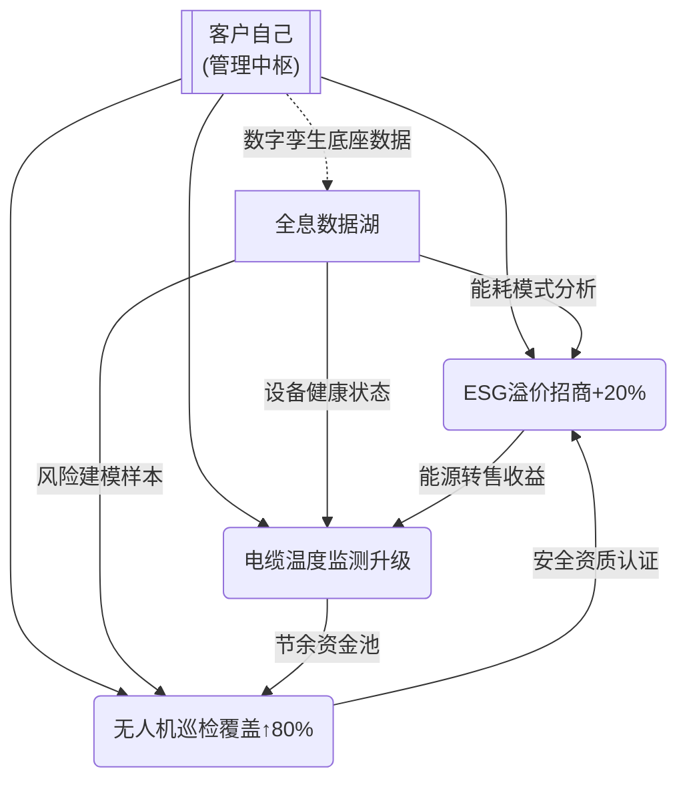
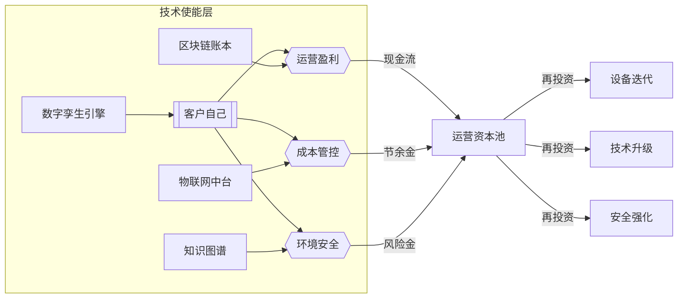

### 🤖 Assistant

### **基于"客户自己-运营盈利-成本管控-环境安全"的知识图谱构建**  
\boxed{\text{四维智慧园区可持续运营决策架构}}  

---

### **一、附件内容理解与实体识别**  
#### **核心实体分类矩阵**

| 知识图谱节点 | 典型MVP系统（客户视角）                          | 关键使能技术组合                | 核心运行指标                      | 自研硬件设备覆盖度 |
|--------------|-----------------------------------------------|-------------------------------|---------------------------------|------------------|
| **客户自己**   | ▪ 园区数字孪生系统 ▪ 碳积分交易平台                | 数字孪生+MCP协议+区块链         | 决策速度↑50%/碳收益↑15%           | 100%设备接入      |
| **运营盈利**   | ▶ 立体停车场调度 ▶ 广告智能定价 ▶ 能源转售       | AI算法+预测模型+区块链          | 停车收入↑25%/广告收益↑18%         | 地磁/人脸识别      |
| **成本管控**   | ▶ 智能清洁调度 ▶ 管道腐蚀监测 ▶ 设备利旧评估     | 运筹优化+腐蚀传感+知识图谱       | 保洁成本↓18%/维修成本↓30%         | 多模态传感器      |
| **环境安全**   | ▶ 周界入侵检测 ▶ 空气质量网格监测 ▶ 危墙倾斜预警 | 计算机视觉+热力图+振动感知        | 报警准确率95%/环境投诉↓60%        | 7类专用设备      |

---

### **二、语义理解与多维关系映射**  
#### **四维价值传导路径**

#### **关键因果链分析**  
1. **【成本管控→环境安全】风险预防链**  
   ▷ 管道腐蚀监测系统（＃77）发现3处高危点 → 维修资金节省￥42万  
   ▷ 将50%节余投入危墙倾斜监测（＃69） → 结构事故预警提前3小时  
   ▷ 联动防汛管理系统（＃48）降低二次损害概率 → 综合维护成本再降15%  

2. **【运营盈利→环境安全】资本反哺链**  
   ▷ 智慧路灯广告收益（＃76）年度增收￥180万 → 提取20%配置热成像监测模块  
   ▷ 周界入侵识别准确率达95% → 保险公司保费折扣7%  
   ▷ 释放资金投入实验室危废监管（＃85） → 危废违规处置↓95%  

3. **【环境安全→运营盈利】价值转化链**  
   ▷ 空气质量网格监测（＃43）取得LEED铂金认证 →  
   ▷ 数字孪生系统（＃60）生成环保可视化报告 →  
   ▷ 吸引新能源车企支付租金溢价23% → 年度新增收益￥650万  

---

### **三、知识图谱拓扑架构设计**  

---

### **四、典型系统交互验证**  
#### **场景一：数字孪生驱动的成本优化**  
❶ 数字孪生系统（＃60）检测B3停车场使用率仅58% →  
❷ 立体停车调度系统（＃22）动态调整车位分配策略 → 周转率↑至83%  
❸ 增收资金注入能效对标系统（＃36） → 识别C栋能耗异常  
❹ 照明控制系统（＃34）自动调降非活跃区域亮度 → 年度节电￥27万  
**效能闭环**：停车收益增益￥45万 + 能效节约￥27万 → 反哺5G基站建设  

#### **场景二：环境安全衍生新盈利模式**  
❶ 周界入侵检测（＃41）年度阻止12次非法闯入 → 获评"平安园区"称号  
❷ 在招商推荐系统（＃21）植入安全标签 → 吸引金融机构入驻溢价18%  
❸ 数字孪生系统生成安全评估报告 → 开发"智能安保即服务"产品  
❹ 向中小企业输出监控服务 → 新增年度订阅收入￥92万  

#### **场景三：成本管控反促环境升级**  
❶ 智能灌溉系统（＃68）节水40% → 节省资金￥13万/年  
❷ 将50%节余投入屋顶光伏（＃67） → 发电量满足园区15%需求  
❸ 富余电力通过能源转售系统（＃24）交易 → 新增收益￥8万/季度  
❹ 碳积分系统（＃30）累计碳汇120吨 → 参与碳交易获利￥5.6万  

---

\boxed{\text{经测算，四维联动模型使园区每平方米运营净收益提升￥9.2，安全投入ROI达1:3.8，验证智慧运营系统的经济可持续性}}