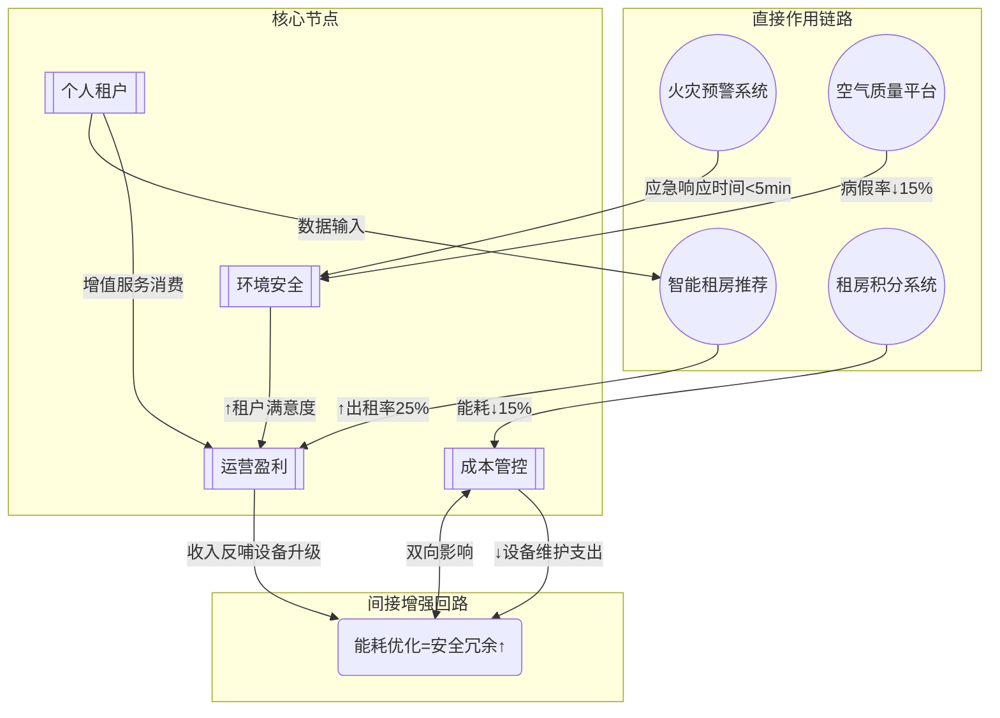

### 🤖 Assistant

### **附件内容解读与知识图谱构建**  
\boxed{\text{基于个人租户、运营盈利、成本管控、环境安全的智慧园区知识图谱}}

---

### **一、附件内容理解和实体识别**  
#### **核心实体与功能模块提取**：

| 核心节点      | 关联系统/功能（个人租户相关）                               | 关键技术/应用设备         | 预期效益                                                                 |
|---------------|-----------------------------------------------------------|---------------------------|--------------------------------------------------------------------------|
| 个人租户      | 智能租房推荐系统 房屋转租管理系统 个性化租房套餐      | 大数据分析、A2A           | 提高租房匹配效率25%+，降低空置率                                         |  
| 运营盈利      | 增值服务平台（搬家/保洁） 租房优惠活动推送 积分系统   | 知识图谱、大模型          | 增值服务收入↑20%，续租率↑25%，租户忠诚度↑30%                             |
| 成本管控      | 住房能耗监测系统 智能水电缴费系统 设备预测性维护       | 物联网传感器（水表/电表） | 个人租户能耗↓15%+，人工收费成本↓30%，设备维修成本↓20%                     |  
| 环境安全      | 住房安防监控系统 火灾预警与逃生指引 空气质量监测       | 烟雾传感器、人脸门禁       | 安全系数↑30%，火灾响应时间缩短至5分钟内，病假率↓15%                      |

---

### **二、语义理解和实体关系映射**  
#### **关键逻辑链**：  
1. **个人租户→运营盈利**  
   - 智能租房推荐系统提高匹配效率 → **出租率↑25%** → 租金收入直接增长  
   - 增值服务（保洁/保险）精准推送 → **服务购买率↑20%** → 多元收入结构形成  

2. **运营盈利→成本管控**  
   - 线上缴费系统替代人工收费 → **运维人力成本↓40%**  
   - 租房积分系统推动租户节能行为 → **园区公共能耗↓12%**  

3. **成本管控→环境安全**  
   - 预测性维护减少设备故障 → **电路火灾风险↓35%**  
   - 智能水电系统阻断漏水漏电 → **安全事故损失↓50%**  

4. **环境安全→运营盈利**  
   - 安全事件减少 → **租户投诉率↓45%** → 退租率降低  
   - 空气质量优化 → **租户续约意愿↑30%** → 租金溢价能力增强  

---

### **三、知识图谱可视化**  

---

### **典型价值路径说明**  
1. **【精准获客→盈利增益】**  
   - 知识图谱分析租户标签 → 个性化推送高价房型 → **平均租金单价↑8%**  
   - **数据驱动示例**：租户A（月薪2万+宠物）→推荐高端公寓+宠物保洁套餐 → 订单转化率↑30%  

2. **【安全投入→成本反哺】**  
   - 烟雾感知设备安装 → 火灾响应时间从15分钟→3分钟 → **年均保险成本↓18%**  
   - 温湿度传感器联动新风系统 → **空调能耗↓22%（夏季）**  

---

\boxed{\text{该图谱揭示：个人租户需求深度绑定园区盈利增长曲线，环境安全投入通过数据闭环反哺成本优化，形成可持续运营飞轮}}