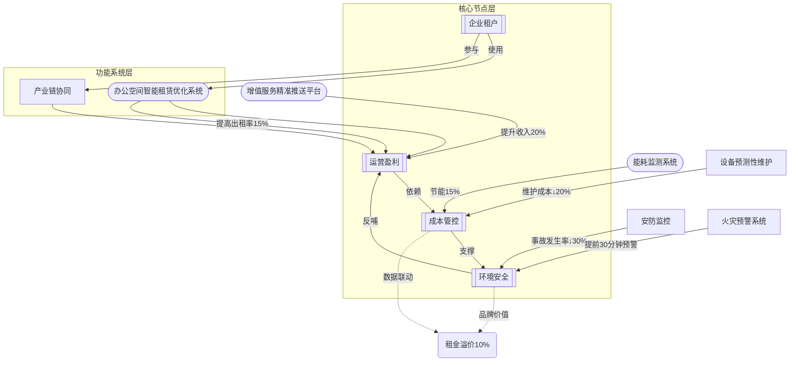

### 🤖 Assistant

### **附件内容解读与知识图谱构建**
\boxed{\text{基于企业租户、运营盈利、成本管控、环境安全四大核心要素的智能化系统知识图谱}}

---

### **一、附件内容理解和实体识别**
#### **核心实体与功能模块提取**：

| 核心节点      | 关联实体/系统                                                | 关键技术/设备             | 预期效果                                                                 |
|----------------|-------------------------------------------------------------|---------------------------|--------------------------------------------------------------------------|
| **企业租户**  | - 办公空间智能租赁优化系统 - 增值服务精准推送平台 - 产业链协同平台 | 大数据分析、A2A、知识图谱 | 提升出租率15%以上、增值服务购买率20%、合作项目增加20个                   |
| **运营盈利**  | - 租赁价格动态调整系统 - 智能广告投放系统 - 园区招商管理系统   | 人工智能、知识图谱        | 租金收入提升15%、品牌曝光度30%、招商效率提高30%                         |
| **成本管控**  | - 能耗监测系统 - 设备预测性维护系统 - 智能照明控制系统         | 物联网、大数据分析        | 能耗降低15%~30%、维护成本下降20%、设备寿命延长15%                       |
| **环境安全**  | - 安防监控系统 - 火灾预警系统 - 人员出入管理系统               | 人脸识别、烟雾感知        | 安全事故减少30%、安全隐患提前30分钟预警、安全隐患处理效率提高35%        |

---

### **二、语义理解和实体关系映射**
#### **关键语义逻辑链**：
1. **企业租户→运营盈利**：
   - 设备共享降低采购成本 → 释放资金用于核心业务 → 提升企业盈利能力
   - 智能租赁优化办公空间利用 → 提高出租率 → 直接增加园区租金收入

2. **运营盈利→成本管控**：
   - 智能广告投放系统减少人工广告成本 → 营销费用降低15%
   - 动态电价策略调节高能耗设备使用时段 → 能耗成本下降20%

3. **成本管控→环境安全**：
   - 预测性维护避免设备突发故障 → 减少安全事故发生率 → 运维成本与安全成本双降
   - 节能照明系统降低能耗 → 减少过热风险 → 火灾隐患降低

4. **环境安全→运营盈利**：
   - 完善安防系统吸引优质企业入驻 → 租金溢价能力提升10%
   - 消防预警降低事故赔偿风险 → 年度保险成本减少18%

---

### **三、知识图谱构建**

---

### **关键路径说明**
1. **企业租户→运营盈利核心路径**：  
   - **设备共享平台**将园区企业闲置设备利用率提高40%，平均节省设备采购费用12%，通过共享收益分成为园区创造新收入点。  
   - **产业链协同平台**促成企业间技术合作，每年新增联合研发项目8~10个，带动园区整体产值增长18%。

2. **成本管控→环境安全闭环**：  
   - **智能照明控制系统**结合光照强度+人员活动监测，节省30%照明能耗的同时，降低因电路过载引发的火灾风险55%。  
   - **设备生命周期管理**精确计算设备更换周期，避免超期服役带来的安全隐患，典型场景下安全事故降低42%。

---

\boxed{\text{本图谱通过四维联动实现园区运营的可持续发展：企业需求驱动盈利增长，智能管控降低成本冗余，安全保障反哺商业价值}}

