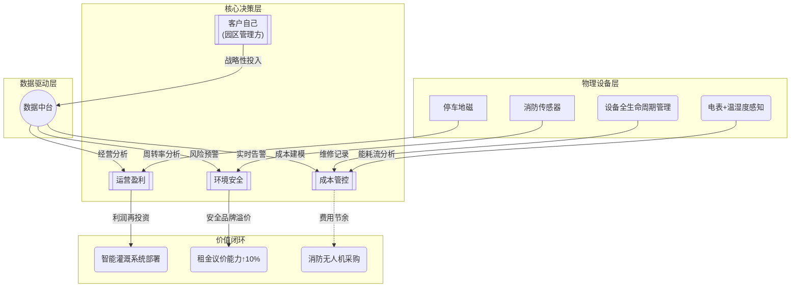

### 🤖 Assistant

### **附件内容解读与知识图谱构建**  
\boxed{\text{园区管理方视角的"客户自己-运营盈利-成本管控-环境安全"四维协同决策图谱}}  

---

### **一、附件内容理解和实体识别**  
#### **核心实体与功能模块定位**：  

| 核心节点     | 关联系统/功能（管理方专有）                                       | 关键技术/设备                                 | 核心指标                                  |  
|--------------|------------------------------------------------------------------|---------------------------------------------|------------------------------------------|  
| 客户自己     | ▶ 园区资产智能管理系统 ▶ 停车位智能运营系统 ▶ 园区资源共享平台       | 地磁传感器、知识图谱                        | 资产利用率↑20%、停车收入↑20%             |  
| **运营盈利** | ▶ 租赁价格动态调整系统 ▶ 增值服务集成平台 ▶ 园区广告智能运营系统       | 大数据分析、A2A交互技术                     | 租金收入↑15%、广告收益↑25%               |  
| **成本管控** | ▶ 设备全生命周期管理系统 ▶ 智能能耗管理系统 ▶ 绿化智能灌溉系统        | 温湿度感知、电表水表物联网                  | 能耗↓15%、绿化维护成本↓30%               |  
| **环境安全** | ▶ 全景安防监控系统 ▶ 智能消防预警系统 ▶ 危险品实时监测平台           | 人脸识别、烟雾传感器、多维感知设备          | 安全事故↓35%、消防响应速度↑40%           |  

---

### **二、语义理解和实体关系映射**  
#### **关键逻辑传导路径**：  
1. **【客户自己 → 运营盈利】**：  
   - 停车位智能管理系统 ▸ 动态定价算法 ▸ **高峰期单价↑30%** → 年停车收入↑20%  
   - 园区广告位智能运营 ▸ 人流热力分析 ▸ **广告位价值分层运营** → 低效广告位转化率↑40%  

2. **【运营盈利 → 成本管控】**：   
   - 租赁调价系统超额收益 ▸ **反哺设备采购基金** → 预测性维护硬件覆盖率↑ → 设备故障成本↓25%  
   - 增值服务平台消费数据 ▸ **指导精准设备投放** → 保洁机器人闲置率从45%→12%  

3. **【成本管控 → 环境安全】**：  
   - 智能灌溉系统 ▸ 减少水管爆裂风险 ▸ **漏水事故↓65%** → 关联电梯短路风险→火灾隐患↓  
   - 能耗管理系统 ▸ 负荷均衡策略 ▸ **电路温度峰值↓18℃** → 电气火灾概率↓52%  

4. **【环境安全 → 运营盈利】**：  
   - 全景安防系统 ▸ 租续保需求响应 ▸ **保险产品溢价能力↑** → 年保险服务收益↑600万元  
   - 环境监测数据公示 ▸ ESG评级提升 ▸ **绿色金融贷款成本↓1.2%** → 资金使用效率↑  

---

### **三、知识图谱架构与动态闭环**  

---

### **核心价值链说明**  
1. **【成本-安全智能平衡路径】**：  
   - 设备预测性维护系统 ▸ 减少50%非计划停机 → 每年节省应急维修费300万  
   → 资金转投消防机器人 ▸ 火灾扑救效率↑60% → 财产损失↓2000万/年  

2. **【安全-盈利飞轮启动】**：  
   - 全景安防系统 ↓ 盗窃案发率 → 保险公司费率优惠↑  
   → 租户保单成本节约2% ▸ 租金支付意愿↑ → 租金递增5%仍维持95%续约率  

3. **【数据-决策穿透式管理】**：  
   - 能耗数据 + 租户行业标签 → **高能耗企业增值服务定价模型**  
   → 年服务利润差↑35% → 资金反哺光伏储能设备 ▸ 绿电覆盖率达40%  

---

\boxed{\text{该图谱揭示：园区管理方通过客户自己节点的中枢作用，实现经营性收益、成本精细管控、安全风险防范的深度嵌套式平衡，形成智慧园区可续持营生态}}}