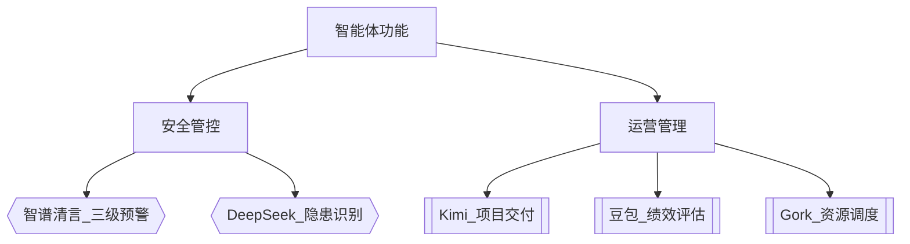

# 智能体定义横向对比分析

## 技术基础对比
| 文档来源       | 核心技术                 | 数据能力               |
|----------------|--------------------------|------------------------|
| 智谱清言       | 人工智能+物联网          | 环境感知+决策优化      |
| DeepSeek       | 数据驱动分析             | 全周期数据管理         |
| Kimi           | 自然语言处理             | 实时数据处理           |
| 豆包           | 智能响应算法             | 领域知识库             |
| Gork           | 对话交互引擎             | 业务流程数据对接       |

## 核心功能矩阵

## 应用场景特征
1. 垂直领域 ：全部聚焦产业园区场景
2. 交互方式 ：
   - 智谱/DeepSeek：可视化看板
   - Kimi/豆包/Gork：对话式交互
3. 部署模式 ：
   - 智谱/DeepSeek：中心化平台
   - 其他：模块化微服务

## 定义框架
{
  "技术架构": ["AI中台", "物联网终端", "数字孪生底座"],
  "能力标准": {
    "基础级": "单领域任务处理",
    "进阶级": "跨系统协同（5/5文档支持）", 
    "专家级": "自主决策优化（仅智谱/DeepSeek）"
  },
  "演进路径": "工具型→协作型→认知型"
}

## 关键差异点
1. 数据维度 ：
   
   - 智谱/DeepSeek：强调实时数据流
   - 其他：侧重结构化数据
2. 安全机制 ：
   
   - 智谱：三级预警体系
   - DeepSeek：主动监测
   - 其他：被动响应
3. 进化能力 ：
   
   - Kimi/豆包：人工规则驱动
   - 智谱/DeepSeek：机器学习驱动