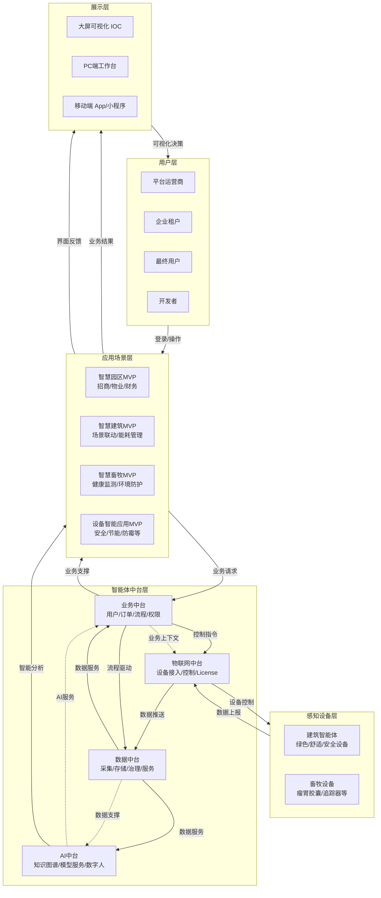

# 业务架构3.0 - 系统架构文档 (PRD)

## 1. 文档概述

### 1.1 文档信息

- **文档版本**: 3.0
- **创建日期**: 2026年
- **文档类型**: 产品需求文档 (PRD)
- **适用范围**: 智慧园区/智慧建筑/智慧畜牧综合管理平台

### 1.2 架构总览

本系统采用分层架构设计，从下到上依次为：感知设备层、物联网中台、智能体中台（业务中台、数据中台、AI中台）、应用场景层、用户层和展示层。系统支持多端访问，包括大屏、PC端和移动端（APP/小程序）。

### 1.3 核心设计理念

本架构不是单纯的软件平台，而是**以销售智能硬件为物理锚点**，通过统一平台实现硬件数据价值最大化，并以**AI驱动业务智能化**的完整技术体系。

#### 1.3.1 三大核心支柱

| 支柱 | 说明 |
| --- | --- |
| **硬件数据化** | 所有销售部署的硬件都是实时数据源 |
| **软件平台化** | 通过中台架构实现能力的标准化与复用 |
| **AI场景化** | 基于硬件数据的智能应用直接创造客户价值 |

#### 1.3.2 架构全景：5层模型

```
硬件部署层 → 数据汇聚层 → 能力中台层 → 场景应用层 → 价值呈现层
        ↓           ↓           ↓           ↓           ↓
    [物理触点]  [数据管道]  [智能引擎]  [业务封装]  [用户交互]
        ↓           ↓           ↓           ↓           ↓
    设备控制流 ←→ 数据价值流 ←→ AI决策流
```

---

## 2. 架构分层详解

### 2.1 感知设备层（最底层）

感知设备层负责采集物理世界的数据，是整个系统的数据源头。

#### 2.1.1 建筑智能体设备


| 类别     | 设备类型                                   | 功能描述           |
| -------- | ------------------------------------------ | ------------------ |
| **能源** | 智能空开、燃气表、电表                     | 能源计量与监控     |
| **环境** | 空气质量传感器、超声波水表、垃圾满溢传感器 | 环境监测与资源管理 |
| **舒适** | 空调控制模块、暖通控制面板、热水器         | 环境舒适度控制     |

#### 2.1.2 安全设备


| 设备类型          | 功能描述 |
| ----------------- | -------- |
| 智能门锁          | 门禁控制 |
| 一氧化碳传感器    | 气体监测 |
| 声光报警器        | 安全告警 |
| 门窗磁传感器      | 入侵检测 |
| 温度传感器        | 环境监测 |
| 烟雾探测器        | 火灾预警 |
| 地磁传感器        | 车位检测 |
| PIR红外运动传感器 | 运动检测 |
| 电涌漏水探测器    | 漏水监测 |

#### 2.1.3 畜牧设备


| 设备类型 | 功能描述                  |
| -------- | ------------------------- |
| 牛胃胶囊 | 畜牧健康监测              |
| 追踪器   | 位置追踪（含GPS、温湿度） |
| 电磁阀   | 设备控制                  |
| 无人机   | 巡查监控                  |

#### 2.1.4 第三方支撑系统

- 涂鸦系统
- 停车系统
- 光伏系统
- 送货机器人系统

---

### 2.2 物联网中台

物联网中台负责设备接入、管理和控制，是连接感知层与中台层的桥梁。

#### 2.2.1 核心定位

物联网中台是**物理世界的数字化接口**，承担数据上行通道和控制下行通道的核心职责。

#### 2.2.2 核心功能架构

```
核心功能模块：
├── 数据上行通道
│   ├── 设备遥测数据采集(原始状态)
│   ├── 边缘计算预处理(业务指标提取)
│   └── 数据质量实时监测
├── 控制下行通道
│   ├── 业务指令到设备动作的转换
│   ├── 指令执行状态跟踪与反馈
│   └── 安全策略执行(权限验证)
└── 数据业务化桥梁
    ├── 设备数据标签化(与业务实体关联)
    ├── 设备事件业务化(如"温度过高"→"影响产品保存")
    └── 控制逻辑参数化(业务规则驱动设备行为)
```

#### 2.2.3 设备管理 (3月13日)

- **功能描述**: Lora/NB-IOT、MBUS等多协议设备接入
- **核心能力**:
  - 设备注册与认证
  - OTA固件升级
  - 设备生命周期管理
- **关键设计原则**:
  - **统一接入规范**：无论自研还是第三方硬件，必须通过标准协议接入
  - **设备孪生建模**：每个物理设备在平台有完整的数字孪生，包含物模型、配置、状态、历史数据
  - **硬件生命周期管理**：从激活、运行、维护到退役的全流程跟踪

#### 2.2.4 设备License管控 (4月17日)

- 设备授权管理
- 激活码验证
- 设备额度控制

#### 2.2.5 设备遥测 (3月13日)

- 实时数据采集
- 数据上报
- 状态监控

#### 2.2.6 设备控制 (3月13日)

- 远程指令下发
- 设备状态控制
- 批量操作

#### 2.2.7 硬件数据业务化示例

**原始数据**:
```json
{
  "设备": "园区B1电表001",
  "当前功率": "85.6kW",
  "当日累计": "1250kWh",
  "时间": "2024-06-15 14:30"
}
```

**业务关联**:
```json
{
  "关联空间": "B1-A区充电桩",
  "租户": "EV快充科技",
  "合同电价": "峰时1.2元/kWh,谷时0.8元/kWh",
  "月用电量": "28500kWh"
}
```

**业务价值**: 当前处于用电高峰时段，每小时电费成本102.7元，本月用电已超2万kWh阈值，建议与客户沟通调整充电时段策略，预计可节约月电费约2100元。

---

### 2.3 智能体中台

智能体中台是系统的核心业务逻辑层，分为三个子中台：业务中台、数据中台、AI中台。

#### 2.3.1 业务中台

业务中台是**所有业务应用共享的核心能力中枢**，它封装了与硬件无关的通用业务逻辑、数据模型和流程规则，确保各业务场景（智慧园区、建筑、畜牧）在用户、权限、交易等基础领域的一致性。

##### 2.3.1.1 用户与租户中心 (3月27日)

**功能架构**：
```
├── 租户生命周期管理
│   ├── 租户注册删除全流程
│   ├── 多级组织架构支持（运营商→集团租户→子公司租户→入驻企业租户）
│   └── 租户数据隔离与权限继承
├── 统一身份认证
│   ├── RBAC权限体系（角色-权限-用户三层管控）
│   ├── SSO单点登录（一次登录访问所有授权应用）
│   └── MFA多因素认证（增强安全场景）
```

**硬件关联示例**：
- 设备操作权限通过RBAC体系控制：普通租户只能看自己设备，运营商可管理所有设备
- 租户退租时，自动触发其名下设备的权限回收流程

##### 2.3.1.2 空间与资产中心 (3月16日)

**功能架构**：
```
├── 多级空间建模
│   ├── 物理空间层级：园区→楼栋→楼层→房间
│   ├── 逻辑空间分组：按应用/按租户
│   └── 空间拓扑关系管理
├── 资产实体
│   ├── 用户
│   ├── 设备
│   └── 其他资产
└── 空间权限映射
    ├── 空间访问权限控制
    ├── 空间使用预定管理
    └── 空间-设备关联关系
```

**硬件关联示例**：
- 每个物联网设备在入库时即与空间位置绑定

##### 2.3.1.3 订单与交易中心

**功能架构**：
```
├── 订单中心
│   ├── 多类型订单支持（租赁、服务、商品、设备）
│   ├── 订单状态机（创建、支付、履约、完成、退款）
│   └── 订单关联关系（主订单、子订单、续费订单）
├── 支付网关集成
│   ├── 多支付渠道聚合（微信、支付宝、银联）
│   ├── 支付结果回调处理
└── 发票管理
    ├── 自动开票申请
    ├── 发票信息管理
```

**硬件关联示例**：
- 能耗费用按月生成账单订单，自动从租户账户扣款

##### 2.3.1.4 审计与日志中心 (3月13日)

**功能架构**：
```
├── 操作日志采集与存储
│   ├── 关键操作留痕（增删改查）
│   ├── 操作人/时间/IP记录
│   └── 日志分级存储（热数据/冷数据）
├── 数据隐私合规
│   ├── 个人信息脱敏
│   ├── 数据访问权限控制
│   └── 数据不出境
├── 地域法规适配
│   ├── 多国数据存储策略
│   ├── 本地化内容管理
└── 安全合规报表
    ├── 操作审计报告
    ├── 数据访问日志
    └── 合规性自检报告
```

##### 2.3.1.5 消息通知中心 (4月17日)

**功能架构**：
```
├── 多渠道消息推送
│   ├── 站内信
│   ├── 短信/邮件
│   ├── 微信
│   └── app push
├── 消息模板引擎
│   ├── 多语言模板
│   ├── 变量替换
└── 通知策略管理
    ├── 接收人分组
    ├── 免打扰时段设置
    └── 通知频次控制
```

**硬件关联示例**：
- 能耗超标预警，提前3天向租户发送提醒通知

##### 2.3.1.6 基础配置中心 (4月17日)

**功能架构**：
```
├── 参数配置管理
│   ├── 全局参数
│   ├── 租户级参数
│   └── 应用级参数
├── 国际化i18n
│   ├── 多语言资源管理
│   ├── 时区与日期格式
└── 数据字典管理
    ├── 枚举值统一管理
    ├── 业务编码规则
    └── 分类体系维护
```

##### 2.3.1.7 工作流引擎

**功能架构**：
```
├── BPM工作流
│   ├── 可视化流程设计器
│   ├── 节点类型支持（审批、操作、通知、网关）
│   └── 流程版本管理与发布
├── SLA服务水平管理
│   ├── 服务等级定义（响应时间、解决时间）
│   ├── SLA计时与超时预警
│   └── SLA达成率统计
└── 工单流转
    ├── 工单模板管理
    ├── 自动派单规则
    └── 工单处理时效分析
```

**硬件关联示例**：
- 设备告警自动创建维修工单，根据SLA等级分配给不同级别的工程师

---

AI中台是**跨域数据的智能决策引擎**，负责多模态数据融合和智能分析。

##### 2.3.2.1 AI中台架构

```
输入层：
├── 硬件特征：设备状态序列、环境指标趋势
├── 业务特征：客户价值等级、合同条款、服务历史
└── 外部特征：季节性因素、市场价格、竞品动态

处理层：
├── 多模态数据融合
│   ├── 时序数据与事件数据的对齐
│   ├── 结构化与非结构化数据的联合分析
│   └── 实时数据与历史模式的对比
├── 领域数字人引擎
│   ├── 业务目标理解(如"提升园区整体能效")
│   ├── 多源数据分析(硬件+业务+外部数据)
│   └── 权衡决策生成(考虑成本、客户体验、法规)
└── 模型协同网络
    ├── 预测模型：基于硬件数据的设备故障预测
    ├── 优化模型：基于业务约束的资源调度优化
    └── 推荐模型：基于客户行为的服务套餐推荐

输出层：
├── 业务洞察报告：数据驱动的决策建议
├── 自动化工作流：智能触发的业务流程
└── 设备控制策略：优化后的设备运行参数
```

##### 2.3.2.2 领域数字人引擎

- 目标识别与分解
- 领域知识检索
- 控制流规划
- 业务能力编排
- 执行效果评估

##### 2.3.2.3 知识编织引擎

- 智能检索服务
- 知识图谱管理
- 提示词工程
- 知识沉淀与更新

##### 2.3.2.4 算法模型平台

- 模型训练
- 特征工程
- 模型管理
- MLOps
- 模型服务化
- 模型评估与解释

##### 2.3.2.5 典型融合决策场景

**场景：园区空调系统优化调度**

**输入数据**：
- 硬件数据：各楼层温度、空调功耗、室外温湿度
- 业务数据：各区域租赁情况、客户合同中的温控要求、当前电价时段
- 外部数据：天气预报、电网负荷预警

**AI决策过程**：
1. 预测未来2小时各区域的人员密度(基于会议室预约数据+历史规律)
2. 计算不同调度方案的总能耗和电费成本
3. 评估各方案对客户舒适度的影响(基于合同条款+客户价值)
4. 生成最优调度策略：提前预冷高价值客户区域，适当调高低使用率区域温度

**执行结果**：
- 硬件层面：下发具体的空调设定值调整指令
- 业务层面：生成节能报告，作为与客户续约的谈资
- 财务层面：预计月度电费降低15%，客户满意度维持98%以上

---

数据中台是**数据的融合治理平台**，负责多源数据的统一管理和服务。

##### 2.3.3.1 数据融合架构

```
              ┌─────────────────┐
              │   统一数据服务   │←── 业务应用
              └────────┬────────┘
                       ↓
         ┌─────────────────────────┐
         │     融合数据仓库        │
         │  ┌─────┬─────┬──────┐  │
         │  │贴源层│融合层│服务层│  │
         │  └─────┴─────┴──────┘  │
         └─────────┬───────────────┘
         ┌─────────┼─────────┐
    ┌────┴────┐ ┌────┴────┐ ┌────┴─────┐
    │硬件数据湖│ │业务数据区│ │外部数据区│
    │- 时序数据│ │- 关系数据│ │- 维度数据│
    │- 事件流  │ │- 事务日志│ │- 基准数据│
    └─────────┘ └─────────┘ └─────────┘
```

##### 2.3.3.2 数据采集

- 设备数据接入
- 第三方系统集成
- 数据采集Agent

##### 2.3.3.3 数据存储与计算

- 时序数据库
- 实时数仓
- 非结构化存储

##### 2.3.3.4 数据治理

- 元数据管理
- 治理控制
- 血缘分析
- 生命周期管理

##### 2.3.3.5 数据资产与服务

- 统一数据API服务

##### 2.3.3.6 关键融合场景

| 融合场景 | 说明 |
| --- | --- |
| **设备-租户关联视图** | 每个设备的运行状态关联到具体租户的业务表现 |
| **能耗-营收分析** | 建筑能耗数据与租户租金收入的投入产出分析 |
| **设备故障-客户满意度关联** | 设备停机时间对客户续约意愿的影响分析 |

---

### 2.4 应用场景层 (MVP)

#### 2.4.1 智慧园区MVP

##### 招商租赁

- 线索管理
- 客户跟进
- 合同全生命周期
- 房源管理

##### 入驻企业服务

- 企业入驻全流程服务

##### 物业管理

- 工单管理
- 巡检管理
- 保洁服务
- 安保服务

##### 园区管理

- 园区基础信息管理

##### 园区业态管理

- 商业业态规划与管理

##### 公寓租客管理

- 租客信息管理
- 租赁服务

##### 客户管理

- 客户关系维护

##### 房源管理

- 房源状态管理

##### 财务管理

- 收费管理
- 财务报表

#### 2.4.2 智慧建筑MVP

##### 建筑管理 (3月16日)

- 建筑基础信息管理
- 建筑空间管理

##### 建筑场景与计划 (4月24日)

- 场景配置
- 计划管理

##### 订阅管理

- 服务订阅
- 订阅计费

#### 2.4.3 智慧畜牧MVP

##### 牧场管理

- 牧场基础信息管理
- 牧场运营监控

##### 健康监测

- 牲畜健康监测
- 异常预警

##### 电子围栏

- 围栏设置
- 越界告警

##### 环境防护

- 环境监控
- 防护措施

#### 2.4.4 设备智能应用


| 应用系统                    | 功能描述                 |
| --------------------------- | ------------------------ |
| 空间安全与舒适看护系统MVP   | 空间安全监控与舒适度管理 |
| 空调节能降温系统MVP         | 空调节能控制             |
| 园区资产侵占监测系统MVP     | 资产防侵占监控           |
| 防霉管控系统MVP             | 防霉环境监控             |
| 水资源渗漏检测与应急系统MVP | 漏水检测与应急处理       |

#### 2.4.5 设备管控系统


| 系统名称        | 功能描述         |
| --------------- | ---------------- |
| 水表系统MVP     | 水资源计量与管理 |
| 电表系统MVP     | 电能计量与管理   |
| 气表系统MVP     | 燃气计量与管理   |
| 烟雾探测系统MVP | 烟雾监测与报警   |
| 温湿度系统MVP   | 环境温湿度监控   |
| 垃圾满溢系统MVP | 垃圾桶状态监控   |
| 电磁阀系统MVP   | 阀门远程控制     |
| 动物追踪系统MVP | 动物位置追踪     |
| 瘤胃探测系统MVP | 牲畜健康监测     |
| 光感系统MVP     | 光照强度监测     |
| 门锁系统MVP     | 门禁管理         |
| 地磁系统MVP     | 车位检测         |
| 车位锁系统MVP   | 车位锁控制       |

#### 2.4.6 MVP层次关系

```
设备管控MVP（基础层）
    ↑
专业MVP（场景层：安全、节能、畜牧等）
    ↑
综合MVP（业务层：智慧园区、智慧建筑）
    ↑
用户工作台（展示层：不同角色的操作界面）
```

#### 2.4.7 业务价值实现路径

```
设备数据 → 设备管控MVP（监控）→ 专业MVP（分析）→ 综合MVP（决策）→ 业务成果
    ↓           ↓               ↓               ↓           ↓
[原始值]   [状态判断]       [场景洞察]       [业务行动]   [效益体现]
```

#### 2.4.8 智慧园区MVP详细模块

**目标用户**：集团人员、子公司管理人员、园区运营人员、招商团队、物业管理人员、财务人员

| 模块 | 核心功能 | 依赖的中台能力 | 硬件关联 |
| --- | --- | --- | --- |
| **招商租赁** | 线索管理、客户跟进、合同全生命周期、房源管理 | 业务中台：用户管理、订单中心、工作流、空间与资产；数据中台：客户数据报表 | 房源关联空间设备配置 |
| **物业管理** | 工单、巡检、保洁、安保、公寓租客管理 | 业务中台：工单流转、SLA管理；物联网中台：设备告警联动 | 设备故障自动生成工单 |
| **园区资产管理** | 资产台账、资产盘点、资产全生命周期 | 业务中台：空间管理；物联网中台：设备状态同步 | 实物资产与物联网设备统一管理 |
| **财务管理** | 费用管理、账单生成、收款核销、财务报表 | 业务中台：订单交易中心；数据中台：财务数据聚合 | 设备使用费自动计费 |
| **客户管理** | 租户档案、联系人管理、服务历史 | 业务中台：用户中心；数据中台：客户行为分析 | 关联租户使用的设备列表 |
| **房源管理** | 房源信息、状态管理、价格策略、展示页面 | 业务中台：空间管理；数据中台：房源使用分析 | 房源绑定标配设备清单 |

#### 2.4.9 智慧建筑MVP详细模块

**目标用户**：建筑管理人员、设备管理人员

| 模块 | 核心功能 | 依赖的中台能力 | 硬件关联 |
| --- | --- | --- | --- |
| **建筑管理** | 建筑信息、楼层平面图、设备布局 | 业务中台：空间建模；物联网中台：设备位置标定 | 设备在建筑图中的可视化定位 |
| **设备联动** | 设备联动 | 物联网中台：设备控制指令下发 | 多设备协同控制规则执行 |
| **定时计划** | 设备定时启停、模式切换、数据采集计划 | 物联网中台：设备遥测、设备控制 | 设备自动化运行策略 |
| **订阅管理** | 告警订阅、报表订阅、事件通知订阅 | 业务中台：通知中心、订单交易中心；物联网中台：设备事件源 | 设备状态变化实时通知 |

#### 2.4.10 智慧畜牧MVP详细模块

**目标用户**：牧场管理人员、兽医、饲养员

| 模块 | 核心功能 | 依赖的中台能力 | 硬件关联 |
| --- | --- | --- | --- |
| **牧场管理** | 牧场信息、畜群分组 | 业务中台：空间管理(牧场分区)；数据中台：养殖数据统计 | 分区关联环境监测设备 |
| **健康监测** | 个体健康指标、异常预警、生长曲线 | 物联网中台：瘤胃胶囊数据接入；AI中台：健康风险预测(未来扩展) | 专用畜牧设备数据采集 |
| **电子围栏** | 活动范围设定、越界告警、位置轨迹 | 物联网中台：追踪器数据；业务中台：告警通知 | 定位设备实时监控 |
| **环境防护** | 环境监测、智能灌溉 | 物联网中台：电磁阀；业务中台：应急预案管理 | 电磁阀 |

**硬件数据业务化示例（健康监测）**：

- **原始数据**：{设备: "瘤胃胶囊0387", 温度: 39.8℃, 活动量: "低于均值30%"}
- **业务关联**：{动物: "奶牛089", 历史病例: "上月轻微消化不良", 饲养员: "张三"}
- **业务价值**：及时通知饲养员检查，避免病情恶化，减少治疗成本和生产损失

#### 2.4.11 专业MVP详细模块

**共同特点**：围绕特定类型设备的专业化管理场景

| MVP名称 | 核心管控设备 | 核心功能 | 中台依赖 |
| --- | --- | --- | --- |
| **空间安全与舒适看护系统** | 门禁、烟雾探测、PIR红外、温湿度传感器 | 安全告警、舒适度监测、异常行为识别 | 物联网中台+业务告警 |
| **空调节能降温系统** | 空调控制器、温湿度传感器、智能电表 | 能耗监测、节能策略、碳排放计算 | AI中台+物联网控制+数据分析 |
| **园区资产侵占监测** | 地磁、边界传感器 | 侵占识别、自动告警、取证记录 | 物联网+AI识别(扩展) |
| **防霉管控系统** | 温湿度传感器、智能除湿机/新风机、智能空调 | 霉菌风险预警、自动湿度调节控制、通风策略优化、历史霉变数据分析、预防性维护提醒 | 物联网中台+数据中台+AI中台+业务中台 |
| **水资源渗透与应急系统检测** | 水表 | 漏水识别、阀控关闭 | 物联网监测+自动控制 |

---

### 2.5 用户层

用户角色定义：


| 用户角色             | 职责描述           |
| -------------------- | ------------------ |
| 平台建设方（维护）   | 系统维护与技术支持 |
| 平台运营商           | 平台运营管理       |
| 企业租户             | 企业级客户         |
| 最终用户（终端用户） | 最终使用人员       |
| 开发者               | 第三方开发者       |

---

### 2.6 展示层

#### 2.6.1 大屏

- 2D/3D IOC智能运营中心大屏
- 招商可视化大屏

#### 2.6.2 PC端

- 运营商总控台
- 建筑管理者工作台
- 集团管理后台
- 项目运营工作台（招商/物业/财务）

#### 2.6.3 移动端（APP/小程序）

- 畜牧、防霉、园区工作人员移动办公
- 租客缴费
- 场馆预约
- 设备控制

---

### 2.7 开放平台

#### 2.7.1 开放API (4月17日)

- API网关
- 开发者门户
- Webhook事件推送
- 帮助文档查询

#### 2.7.2 BI工具

- 数据分析与可视化

---

## 3. 开发计划与里程碑

### 3.1 关键时间节点


| 日期    | 里程碑                                           | 说明                                                                   |
| ------- | ------------------------------------------------ | ---------------------------------------------------------------------- |
| 3月13日 | 设备管理、审计日志、物联网中台                   | 基础平台功能上线                                                       |
| 3月16日 | 空间与资产、建筑管理                             | 建筑模块上线                                                           |
| 3月20日 | **阶段性目标**                                   | 绿色文字和蓝色文字内容完成开发（不含测试），需确保结合真实设备走通流程 |
| 3月27日 | 用户与租户                                       | 租户管理体系上线                                                       |
| 4月17日 | 消息通知、基础配置中心、设备License管控、开放API | 通知与配置体系上线                                                     |
| 4月24日 | 建筑场景与计划                                   | 建筑高级功能上线                                                       |

### 3.2 开发优先级说明

1. **绿色文字**: 波兰客户需求，优先开发
2. **蓝色文字**: 防霉管控MVP相关内容，优先开发
3. **橙色部分**: 计划在P0完成，但不作为本次演示内容
4. **消息通知、国际化、建筑场景与计划**: 计划在4月完成，分优先级，在3月20日前完成核心内容，迭代完成剩余部分

### 3.3 待完成任务

1. 物联网中台、用户与租户需要进行需规调整和评审
2. 防霉管控MVP需要基于业务架构图的中台核验原需求设计
3. 确定用哪些设备、安装数量、安装位置，实现接入和数据展示

---

## 4. 数据流向

### 4.1 全域数据价值链

各层之间的核心数据流、业务流与控制流关系：



### 4.2 上行数据流（采集方向）

```
感知设备层 → 物联网中台 → 数据中台 → 业务中台/AI中台 → 应用场景层 → 展示层
```

### 4.3 下行控制流（控制方向）

```
展示层/应用场景层 → 业务中台 → 物联网中台 → 感知设备层
```

### 4.4 数据存储

- **时序数据**: 设备遥测数据存储在时序数据库
- **业务数据**: 业务操作数据存储在关系型数据库
- **非结构化数据**: 文档、图片等存储在非结构化存储
- **知识数据**: 知识图谱存储在图数据库

---

## 5. 系统集成关系

### 5.1 内部集成

- 各中台之间通过标准API进行通信
- 数据共享通过数据中台统一提供
- 消息通知通过消息中心统一推送

### 5.2 外部集成

- 第三方设备通过物联网中台接入
- 第三方系统通过开放平台API集成
- 支付系统通过支付中心对接

---

## 6. 安全与合规

### 6.1 安全机制

- SSO单点登录
- MFA多因素认证
- RBAC基于角色的访问控制
- 操作审计日志
- 数据隐私保护

### 6.2 合规要求

- 地域法规适配
- 数据隐私合规
- 安全合规报表

---

## 7. 附录

### 7.1 术语表


| 术语  | 说明                                          |
| ----- | --------------------------------------------- |
| MVP   | Minimum Viable Product，最小可行产品          |
| IOC   | Intelligent Operations Center，智能运营中心   |
| RBAC  | Role-Based Access Control，基于角色的访问控制 |
| SSO   | Single Sign-On，单点登录                      |
| MFA   | Multi-Factor Authentication，多因素认证       |
| OTA   | Over-The-Air，空中下载技术                    |
| BPM   | Business Process Management，业务流程管理     |
| SLA   | Service Level Agreement，服务等级协议         |
| MLOps | Machine Learning Operations，机器学习运维     |
| i18n  | Internationalization，国际化                  |

### 7.2 文档版本历史


| 版本 | 日期   | 变更内容 | 作者 |
| ---- | ------ | -------- | ---- |
| 3.0  | 2025年 | 初始版本 | -    |

---

**文档结束**
