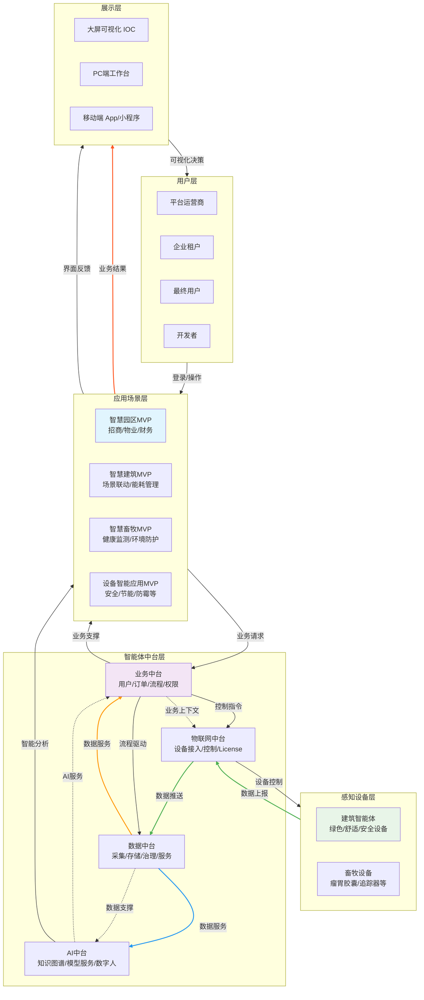

# 业务架构图

## 华宽通园区智能体业务架构图3.0


# 详细架构解读

## 一、架构总览：硬件数据化、软件平台化、AI场景化的一体设计

### 1.1 核心设计理念：硬件为锚，中台为核，AI为脑

本架构不是单纯的软件平台，而是**以销售智能硬件为物理锚点**，通过统一平台实现硬件数据价值最大化，并以**AI驱动业务智能化**的完整技术体系。

**三大核心支柱：**

*   **硬件数据化**：所有销售部署的硬件都是实时数据源
    
*   **软件平台化**：通过中台架构实现能力的标准化与复用
    
*   **AI场景化**：基于硬件数据的智能应用直接创造客户价值
    

### 1.2 架构全景：5层模型

```plaintext
硬件部署层 → 数据汇聚层 → 能力中台层 → 场景应用层 → 价值呈现层
        ↓           ↓           ↓           ↓           ↓
    [物理触点]  [数据管道]  [智能引擎]  [业务封装]  [用户交互]
        ↓           ↓           ↓           ↓           ↓
    设备控制流 ←→ 数据价值流 ←→ AI决策流

```
---

## 二、逐层详解：从硬件到智能的价值链实现

### 2.1 感知设备层：硬件资产的统一数字孪生

**定位：所有已售硬件的虚拟化映射与管理入口**

| 硬件类别 | 核心价值 | 数据特点 | 典型业务场景 |
| --- | --- | --- | --- |
| **建筑智能体**<br>（电表、传感器等） | 空间运营效率提升 | 时序数据，高频采集 | 能耗管理、空间优化 |
| **畜牧专用设备**<br>（瘤胃胶囊、追踪器） | 养殖过程数字化 | 生物特征数据，专业性强 | 健康监测、生长优化 |
| **第三方系统集成**<br>（停车、光伏系统） | 生态扩展与数据聚合 | 系统级接口数据 | 综合运营分析 |

**关键设计原则：**

*   **统一接入规范**：无论自研还是第三方硬件，必须通过标准协议接入
    
*   **设备孪生建模**：每个物理设备在平台有完整的数字孪生，包含物模型、配置、状态、历史数据
    
*   **硬件生命周期管理**：从激活、运行、维护到退役的全流程跟踪
    

### 2.2 智能体中台层：数据的融合与增值引擎

#### 2.2.1 物联网中台：物理世界的数字化接口

```plaintext
核心功能模块：
├── 数据上行通道
│   ├── 设备遥测数据采集(原始状态)
│   ├── 边缘计算预处理(业务指标提取)
│   └── 数据质量实时监测
├── 控制下行通道
│   ├── 业务指令到设备动作的转换
│   ├── 指令执行状态跟踪与反馈
│   └── 安全策略执行(权限验证)
└── 数据业务化桥梁
    ├── 设备数据标签化(与业务实体关联)
    ├── 设备事件业务化(如"温度过高"→"影响产品保存")
    └── 控制逻辑参数化(业务规则驱动设备行为)

```

**硬件数据业务化示例：**

*   原始数据：{设备: "园区B1电表001", 当前功率: 85.6kW, 当日累计: 1250kWh, 时间: "2024-06-15 14:30"}
    
*   业务关联：{关联空间: "B1-A区充电桩", 租户: "EV快充科技", 合同电价: "峰时1.2元/kWh,谷时0.8元/kWh", 月用电量: 28500kWh}
    
*   业务价值：当前处于用电高峰时段，每小时电费成本102.7元，本月用电已超2万kWh阈值，建议与客户沟通调整充电时段策略，预计可节约月电费约2100元
    

#### 2.2.2 数据中台：数据的融合治理平台

**数据融合架构：**

```plaintext
              ┌─────────────────┐
              │   统一数据服务   │←── 业务应用
              └────────┬────────┘
                       ↓
         ┌─────────────────────────┐
         │     融合数据仓库        │
         │  ┌─────┬─────┬──────┐  │
         │  │ 贴源层 │ 融合层 │ 服务层 │  │
         │  └─────┴─────┴──────┘  │
         └─────────┬───────────────┘
         ┌─────────┼─────────┐
    ┌────┴────┐ ┌────┴────┐ ┌────┴─────┐
    │硬件数据湖│ │业务数据区│ │外部数据区│
    │- 时序数据│ │- 关系数据│ │- 维度数据│
    │- 事件流  │ │- 事务日志│ │- 基准数据│
    └─────────┘ └─────────┘ └─────────┘

```

**关键融合场景：**

1.  **设备-租户关联视图**：每个设备的运行状态关联到具体租户的业务表现
    
2.  **能耗-营收分析**：建筑能耗数据与租户租金收入的投入产出分析
    
3.  **设备故障-客户满意度关联**：设备停机时间对客户续约意愿的影响分析
    

#### 2.2.3 AI中台：跨域数据的智能决策引擎

```plaintext
输入层：
├── 硬件特征：设备状态序列、环境指标趋势
├── 业务特征：客户价值等级、合同条款、服务历史
└── 外部特征：季节性因素、市场价格、竞品动态

处理层：
├── 多模态数据融合
│   ├── 时序数据与事件数据的对齐
│   ├── 结构化与非结构化数据的联合分析
│   └── 实时数据与历史模式的对比
├── 领域数字人引擎
│   ├── 业务目标理解(如"提升园区整体能效")
│   ├── 多源数据分析(硬件+业务+外部数据)
│   └── 权衡决策生成(考虑成本、客户体验、法规)
└── 模型协同网络
    ├── 预测模型：基于硬件数据的设备故障预测
    ├── 优化模型：基于业务约束的资源调度优化
    └── 推荐模型：基于客户行为的服务套餐推荐

输出层：
├── 业务洞察报告：数据驱动的决策建议
├── 自动化工作流：智能触发的业务流程
└── 设备控制策略：优化后的设备运行参数

```

**典型融合决策场景：**

```plaintext
场景：园区空调系统优化调度
输入数据：
- 硬件数据：各楼层温度、空调功耗、室外温湿度
- 业务数据：各区域租赁情况、客户合同中的温控要求、当前电价时段
- 外部数据：天气预报、电网负荷预警

AI决策过程：
1. 预测未来2小时各区域的人员密度(基于会议室预约数据+历史规律)
2. 计算不同调度方案的总能耗和电费成本
3. 评估各方案对客户舒适度的影响(基于合同条款+客户价值)
4. 生成最优调度策略：提前预冷高价值客户区域，适当调高低使用率区域温度

执行结果：
- 硬件层面：下发具体的空调设定值调整指令
- 业务层面：生成节能报告，作为与客户续约的谈资
- 财务层面：预计月度电费降低15%，客户满意度维持98%以上

```
---

#### 2.2.4 业务中台：核心业务能力的标准化沉淀平台

业务中台是**所有业务应用共享的核心能力中枢**，它封装了与硬件无关的通用业务逻辑、数据模型和流程规则，确保各业务场景（智慧园区、建筑、畜牧）在用户、权限、交易等基础领域的一致性。

##### 1. 用户与租户中心

```plaintext
├── 租户生命周期管理
│   ├── 租户注册删除全流程
│   ├── 多级组织架构支持（运营商→集团租户→子公司租户→入驻企业租户）
│   └── 租户数据隔离与权限继承
├── 统一身份认证
│   ├── RBAC权限体系（角色-权限-用户三层管控）
│   ├── SSO单点登录（一次登录访问所有授权应用）
│   └── MFA多因素认证（增强安全场景）

```

**硬件关联示例**：

*   设备操作权限通过RBAC体系控制：普通租户只能看自己设备，运营商可管理所有设备
    
*   租户退租时，自动触发其名下设备的权限回收流程
    

##### 2. 空间与资产中心

```plaintext
├── 多级空间建模
│   ├── 物理空间层级：园区→楼栋→楼层→房间
│   ├── 逻辑空间分组：按应用/按租户
│   └── 空间拓扑关系管理
├── 资产实体
│   ├── 用户
│   ├── 设备
│   └── 其他资产
└── 空间权限映射
    ├── 空间访问权限控制
    ├── 空间使用预定管理
    └── 空间-设备关联关系

```

**硬件关联示例**：

*   每个物联网设备在入库时即与空间位置绑定
    

##### 3. 订单与交易中心

```plaintext
├── 订单中心
│   ├── 多类型订单支持（租赁、服务、商品、设备）
│   ├── 订单状态机（创建、支付、履约、完成、退款）
│   └── 订单关联关系（主订单、子订单、续费订单）
├── 支付网关集成
│   ├── 多支付渠道聚合（微信、支付宝、银联）
│   ├── 支付结果回调处理
└── 发票管理
    ├── 自动开票申请
    ├── 发票信息管理

```

**硬件关联示例**：

*   能耗费用按月生成账单订单，自动从租户账户扣款
    

##### 4. 工作流引擎

```plaintext
├── BPM工作流
│   ├── 可视化流程设计器
│   ├── 节点类型支持（审批、操作、通知、网关）
│   └── 流程版本管理与发布
├── SLA服务水平管理
│   ├── 服务等级定义（响应时间、解决时间）
│   ├── SLA计时与超时预警
│   └── SLA达成率统计
└── 工单流转
    ├── 工单模板管理
    ├── 自动派单规则
    └── 工单处理时效分析

```

**硬件关联示例**：

*   设备告警自动创建维修工单，根据SLA等级分配给不同级别的工程师
    

##### 5. 告警与通知中心

```plaintext
├── 多渠道消息推送
│   ├── 站内信
│   ├── 短信/邮件
│   ├── 微信
│   └── app push
├── 消息模板引擎
│   ├── 多语言模板
│   ├── 变量替换
└── 通知策略管理
    ├── 接收人分组
    ├── 免打扰时段设置
    └── 通知频次控制

```

**硬件关联示例**：

*   能耗超标预警，提前3天向租户发送提醒通知
    

##### 6. 合规与审计中心

```plaintext
├── 操作日志采集与存储
│   ├── 关键操作留痕（增删改查）
│   ├── 操作人/时间/IP记录
│   └── 日志分级存储（热数据/冷数据）
├── 数据隐私合规
│   ├── 个人信息脱敏
│   ├── 数据访问权限控制
│   └── 数据不出境
├── 地域法规适配
│   ├── 多国数据存储策略
│   ├── 本地化内容管理
└── 安全合规报表
    ├── 操作审计报告
    ├── 数据访问日志
    └── 合规性自检报告

```

##### 7. 基础配置中心

```plaintext
├── 参数配置管理
│   ├── 全局参数
│   ├── 租户级参数
│   └── 应用级参数
├── 国际化i18n
│   ├── 多语言资源管理
│   ├── 时区与日期格式
└── 数据字典管理
    ├── 枚举值统一管理
    ├── 业务编码规则
    └── 分类体系维护

```

### 2.3 应用场景层：基于中台能力组装的具体解决方案

应用场景层是通过**组合智能体中台的各种能力**，面向特定业务领域打包成的完整解决方案。每个MVP都是可独立部署、满足特定用户需求的产品模块。

#### 2.3.1 智慧园区MVP（核心业务场景）

**目标用户**：集团人员、子公司管理人员、园区运营人员、招商团队、物业管理人员、财务人员

**核心模块与中台依赖关系**：

| 模块 | 核心功能 | 依赖的中台能力 | 硬件关联 |
| --- | --- | --- | --- |
| **招商租赁** | 线索管理、客户跟进、合同全生命周期、房源管理 | • 业务中台：用户管理、订单中心、工作流、空间与资产<br>• 数据中台：客户数据报表 | 房源关联空间设备配置 |
| **物业管理** | 工单、巡检、保洁、安保、公寓租客管理 | • 业务中台：工单流转、SLA管理<br>• 物联网中台：设备告警联动 | 设备故障自动生成工单 |
| **园区资产管理** | 资产台账、资产盘点、资产全生命周期 | • 业务中台：空间管理<br>• 物联网中台：设备状态同步 | 实物资产与物联网设备统一管理 |
| **财务管理** | 费用管理、账单生成、收款核销、财务报表 | • 业务中台：订单交易中心<br>• 数据中台：财务数据聚合 | 设备使用费自动计费 |
| **客户管理** | 租户档案、联系人管理、服务历史 | • 业务中台：用户中心<br>• 数据中台：客户行为分析 | 关联租户使用的设备列表 |
| **房源管理** | 房源信息、状态管理、价格策略、展示页面 | • 业务中台：空间管理<br>• 数据中台：房源使用分析 | 房源绑定标配设备清单 |

#### 2.3.2 智慧建筑MVP（设备管控场景）

**目标用户**：建筑管理人员、设备管理人员

**核心模块与中台依赖关系**：

| 模块 | 核心功能 | 依赖的中台能力 | 硬件关联 |
| --- | --- | --- | --- |
| **建筑管理** | 建筑信息、楼层平面图、设备布局 | • 业务中台：空间建模<br>• 物联网中台：设备位置标定 | 设备在建筑图中的可视化定位 |
| **设备联动** | 设备联动 | • 物联网中台：设备控制指令下发 | 多设备协同控制规则执行 |
| **定时计划** | 设备定时启停、模式切换、数据采集计划 | • 物联网中台：设备遥测、设备控制 | 设备自动化运行策略 |
| **订阅管理** | 告警订阅、报表订阅、事件通知订阅 | • 业务中台：通知中心、订单交易中心<br>• 物联网中台：设备事件源 | 设备状态变化实时通知 |

#### 2.3.3 智慧畜牧MVP（垂直行业场景）

**目标用户**：牧场管理人员、兽医、饲养员

**核心模块与中台依赖关系**：

| 模块 | 核心功能 | 依赖的中台能力 | 硬件关联 |
| --- | --- | --- | --- |
| **牧场管理** | 牧场信息、畜群分组 | • 业务中台：空间管理(牧场分区)<br>• 数据中台：养殖数据统计 | 分区关联环境监测设备 |
| **健康监测** | 个体健康指标、异常预警、生长曲线 | • 物联网中台：瘤胃胶囊数据接入<br>• AI中台：健康风险预测(未来扩展) | 专用畜牧设备数据采集 |
| **电子围栏** | 活动范围设定、越界告警、位置轨迹 | • 物联网中台：追踪器数据<br>• 业务中台：告警通知 | 定位设备实时监控 |
| **环境防护** | 环境监测、智能灌溉 | • 物联网中台：电磁阀<br>• 业务中台：应急预案管理 | 电磁阀 |

**硬件数据业务化示例（健康监测）**：

*   原始数据：{设备: "瘤胃胶囊0387", 温度: 39.8℃, 活动量: "低于均值30%"}
    
*   业务关联：{动物: "奶牛089", 历史病例: "上月轻微消化不良", 饲养员: "张三"}
    
*   业务价值：及时通知饲养员检查，避免病情恶化，减少治疗成本和生产损失
    

#### 2.3.4 其他专业MVP（设备管控场景集）

**共同特点**：围绕特定类型设备的专业化管理场景

| MVP名称 | 核心管控设备 | 核心功能 | 中台依赖 |
| --- | --- | --- | --- |
| **空间安全与舒适看护系统** | 门禁、烟雾探测、PIR红外、温湿度传感器 | 安全告警、舒适度监测、异常行为识别 | 物联网中台+业务告警 |
| **空调节能降温系统** | 空调控制器、温湿度传感器、智能电表 | 能耗监测、节能策略、碳排放计算 | AI中台+物联网控制+数据分析 |
| **园区资产侵占监测** | 地磁、边界传感器 | 侵占识别、自动告警、取证记录 | 物联网+AI识别(扩展) |
| **防霉管控系统** | 温湿度传感器、智能除湿机/新风机、智能空调 | 霉菌风险预警、自动湿度调节控制、通风策略优化、历史霉变数据分析、预防性维护提醒 | 物联网中台+数据中台+AI中台+业务中台 |
| **水资源渗透与应急系统检测** | 水表 | 漏水识别、阀控关闭 | 物联网监测+自动控制 |

#### 2.3.5 设备管控MVP（通用设备管理）

**定位**：所有物联设备的通用管理界面，其他MVP的设备管控基础

**核心功能模块**：

```plaintext
├── 设备接入管理
│   ├── 水/电/气表系统
│   ├── 烟雾探测系统
│   ├── 温湿度系统
│   ├── 垃圾满溢系统
│   ├── 电磁阀系统
│   ├── 动物追踪系统
│   ├── 瘤胃探测系统
│   ├── 光感系统
│   ├── 门禁系统
│   ├── 地磁系统
│   └── 车位锁系统
│   └── ...
├── 设备状态监控
│   ├── 实时数据展示
│   ├── 历史数据查询
│   └── 状态变化趋势
└── 设备控制操作
    ├── 远程控制
    ├── 批量操作
    └── 操作日志

```

**依赖关系**：

*   完全基于**物联网中台**的设备管理能力
    
*   通过**业务中台**进行权限控制和操作审计
    
*   数据可推送至**数据中台**进行长期分析
    

MVP间的层次关系

```plaintext
设备管控MVP（基础层）
    ↑
专业MVP（场景层：安全、节能、畜牧等）
    ↑
综合MVP（业务层：智慧园区、智慧建筑）
    ↑
用户工作台（展示层：不同角色的操作界面）

```

业务价值实现路径

```plaintext
设备数据 → 设备管控MVP（监控）→ 专业MVP（分析）→ 综合MVP（决策）→ 业务成果
    ↓           ↓               ↓               ↓           ↓
[原始值]   [状态判断]       [场景洞察]       [业务行动]   [效益体现]

```

### 2.4 核心数据流转：从原始数据到业务价值的完整链路

#### 2.4.1 全域数据价值链

各层之间的核心数据流、业务流与控制流关系：


---

## 三、实施路线图：分阶段实现硬件价值跃迁

### Phase 1：设备基础接入与自动化（1-5个月）

#### 核心目标

建立统一的设备接入与管理体系，实现基础自动化控制，验证硬件数据业务化价值。

#### 关键交付项

1.  **设备基础接入标准化**
    
    *   完成21类核心设备协议适配（水电气表、温湿度、门禁、地磁等）
        
    *   建立设备数字模型，实现500+设备并发接入能力
        
    *   设备管理MVP上线：实时监控、状态查询、基础告警
        
2.  **定时计划功能**
    
    *   基于时间触发的设备自动化控制
        
    *   支持周期性计划（每日/每周/每月）
        
    *   应用于：园区照明定时开关、空调定时启停、灌溉定时执行
        
3.  **场景联动MVP**
    
    *   实现基于简单规则的多设备协同
        
4.  **设备控制标准化**
    
    *   统一的远程控制接口
        
    *   操作权限与业务中台RBAC集成
        
    *   控制日志审计追踪
        

#### 业务价值验证

*   **量化指标**：设备接入效率提升50%
    
*   **收入模式**：设备接入服务费+基础平台授权费
    

---

### Phase 2：智能应用产品化（6-9个月）

#### 核心目标

基于Phase1的基础能力，打造2款具备差异化竞争力的智能应用，形成可复制的产品包。

#### 关键交付项

1.  **防霉管控智能应用**
    
    *   **硬件组合**：温湿度传感器+霉菌检测+智能除湿机+新风控制
        
    *   **核心功能**：
        
        *   霉菌滋生风险预测模型（准确率>85%）
            
        *   自动湿度调节控制策略
            
        *   防霉效果可视化报告
            
    *   **目标客户**：长租公寓运营商、连锁/单体酒店、民宿业主、物业公司、家庭
        
    *   **定价模式**：硬件套餐+年/月服务费（监测服务、分析报告、专家咨询）
        
2.  **智慧畜牧智能应用**
    
    *   **硬件组合**：瘤胃胶囊+追踪器+电磁阀
        
    *   **核心功能**：
        
        *   个体健康监测与异常预警
            
        *   电子围栏与越界告警
            
        *   生长效率分析报告
            
    *   **目标客户**：规模化养殖场、种畜场、畜牧示范区
        
    *   **定价模式**：按牲畜数量订阅（硬件租赁+数据服务）
        

#### 业务价值验证

*   **防霉应用**：在3个仓储客户验证，避免霉变损失均超10万元/客户
    
*   **畜牧应用**：在2个养殖场验证，降低病死率1.5%
    
*   **产品化程度**：形成标准化配置包，实施周期<2周
    
*   **收入贡献**：智能应用收入占总营收20%+
    

---

### Phase 3：智慧园区平台化（10-15个月）

#### 核心目标

将前两个阶段的点状能力，整合成完整的智慧园区解决方案，实现平台级价值。

#### 关键交付项

1.  **智慧园区MVP完整版**
    
    *   **招商租赁全流程数字化**
        
        *   房源VR看房+实时环境数据展示
            
        *   智能定价模型（基于位置、环境、能耗数据）
            
        *   电子合同与在线签约
            
    *   **物业管理智能化升级**
        
        *   设备故障预测性维护工单
            
        *   能耗分户计量与优化建议
            
        *   租户服务请求智能分派
            
    *   **园区运营数据驾驶舱**
        
        *   多维度运营KPI实时展示
            
        *   异常事件智能预警中心
            
        *   决策支持分析报告
            
2.  **跨场景能力融合**
    
    *   防霉系统与园区资产管理融合
        
    *   设备数据与财务系统自动对账
        
    *   空间使用效率优化建议
        

#### 业务价值验证

*   **招商效率**：平均招商周期缩短30%，房源空置率降低15%
    
*   **运营成本**：综合能耗降低25%，运维人力减少20%
    
*   **客户留存**：租户满意度提升至90%+，续约率提升至85%+
    
*   **平台价值**：单个园区年服务合同金额50万+
    

---

### Phase 4：规模化智能升级（16-21个月）

#### 核心目标

在规模化部署中验证和优化AI能力，实现从规则驱动到智能驱动的升级。

#### 关键交付项

1.  **AI中台核心能力落地**
    
    *   **领域数字人引擎1.0**
        
        *   理解业务目标，自动分解为设备控制指令
            
        *   支持3个核心场景：能耗优化、设备健康管理、空间调度
            
    *   **知识编织引擎**
        
        *   设备说明书、维护手册知识图谱化
            
        *   故障处理经验沉淀与复用
            
    *   **算法模型平台**
        
        *   5个核心预测模型上线：
            
            *   设备故障预测（准确率>80%）
                
            *   能耗趋势预测（误差<5%）
                
            *   租赁价格预测
                
            *   客户续约概率预测
                
            *   维护资源需求预测
                
2.  **智能服务规模化**
    
    *   在50+园区部署智能服务
        
    *   服务端智能模型持续学习优化
        
    *   边缘智能能力部署（关键场景本地推理）
        

#### 业务价值验证

*   **智能决策采纳率**：AI建议的业务采纳率>70%
    
*   **预测准确率**：核心场景预测准确率>85%
    
*   **边际成本**：每新增一个园区的AI服务成本降低60%
    
*   **服务收入占比**：智能服务收入占总营收40%+
    

---

### Phase 5：平台生态化（22-24个月）

#### 核心目标

从解决方案提供商升级为平台生态构建者，实现生态共赢。

#### 关键交付项

1.  **开放平台体系**
    
    *   **开发者门户**
        
        *   设备接入SDK（支持第三方硬件快速接入）
            
        *   数据开放API（脱敏后的数据服务）
            
        *   能力调用API（调用平台AI能力）
            
    *   **应用市场**
        
        *   第三方应用上架与分发机制
            
        *   收益分成模式（平台：开发者 = 3:7）
            
        *   应用质量认证体系
            
2.  **硬件生态联盟**
    
    *   **认证硬件计划**：与10+硬件厂商建立深度合作
        
    *   **联合解决方案**：与行业ISV共同打造垂直方案
        
    *   **标准贡献**：参与制定2-3个行业物联标准
        
3.  **数据价值变现**
    
    *   **行业数据报告**：基于脱敏数据的行业洞察报告
        
    *   **数据服务API**：向研究机构、政府部门提供数据服务
        
    *   **碳交易平台对接**：将节能数据对接碳交易市场
        

#### 业务价值验证

*   **生态规模**：吸引30+开发者，上架30+第三方应用
    
*   **平台收入**：平台抽成收入占总营收20%
    
*   **行业影响力**：成为2-3个垂直行业的首选物联网平台
    
*   **估值提升**：完成从硬件公司到平台公司的估值重构
    

---

## 四、架构价值：从成本中心到价值引擎

### 4.1 对硬件业务的技术赋能

1.  **数据增值**：硬件数据与业务数据结合，创造新的服务品类
    
2.  **差异竞争**：基于融合数据的洞察形成独特竞争优势
    
3.  **客户锁定**：数据积累形成迁移成本，提升客户留存
    

### 4.2 对业务运营的智能升级

1.  **从响应到预测**：基于数据的主动问题发现与预防
    
2.  **从标准化到个性化**：基于客户特征和数据行为的差异化服务
    
3.  **从经验驱动到数据驱动**：关键决策有数据支撑，降低风险
    

### 4.3 可衡量的技术目标

*   数据融合度：核心业务场景的数据关联覆盖率达到90%
    
*   智能决策采纳率：AI建议的业务采纳率超过70%
    
*   价值量化能力：每个功能模块都能明确其对业务的贡献度
    
*   数据产品收入：数据智能服务占总营收比例逐年提升
    

---

## 五、总结：数据融合的智能时代

**架构的核心洞见：**

*   **硬件数据**告诉我们"发生了什么"
    
*   **业务数据**告诉我们"对谁有影响"
    
*   **AI引擎**告诉我们"应该做什么"
    
*   **只有三者融合**，才能实现从"感知"到"行动"的完整智能闭环
    

**给IT团队的关键信息：**

1.  **我们的核心资产是数据，而不仅仅是硬件或代码**
    
2.  **每一次数据关联的建立，都可能发现新的商业机会**
    
3.  **我们要构建的不是一个系统，而是一个持续学习的智能体**
    
4.  **安全与隐私不是约束，而是我们赢得信任的竞争优势**
    

这个架构确保了华宽通不仅销售硬件，也不仅提供软件，而是成为客户**业务成功的智能合作伙伴**。每一台设备、每一个数据点、每一次分析，都在深化这种合作关系，构建长期、可持续的竞争优势。

## 业务架构图2.0


1月20日版本VS1月19日1.0版本调整如下：

#### 1.业务中台

##### IOC调整位置：已放在 “应用场景” 层智慧园区的最上方 。

IOC（智能运营中心 / Intelligent Operations Center）不属于中台（因为它是中台能力的聚合展示），也不属于具体的某个业务模块（因为它统管全局），可以放在智慧园区的最上方，作为整个园区的 “驾驶舱” 和 “总入口”。

##### 计费中心改成“订单与交易中心”：计费规则和费用计算上浮到各业务，业务中台核心是订单中心与支付中心。

计费规则（怎么算钱） 差别非常大；计费规则 和 费用计算 是密不可分的。如果规则在应用层，计算在中台，那么两者之间的数据交互（传参）会异常复杂且频繁。建议计费规则和费用计算到上浮到各业务。

以下是计费规则示例：

*   1.合同管理中租金递增设置...特别注意装修优惠是在单价折扣后计算的” 。
    
*   \- 这意味着计算公式不是简单的 A \* B ，而是 (A \* discount) \* (1 + increase\_rate)^n ，且装修期还要单独处理。
    
*   2.公用表...支持按面积分摊、按房间分摊以及按比例分摊”
    
*   3.海外智慧建筑：根据每个建筑的设备数量\*对于套餐（固定价格）+溢价  订阅
    
*   4.购买游泳池年卡可以赠送公寓租赁等场景
    

##### 增加了基础配置中心

基于实际业务场景以及P0版本的业务域，增加基础配置中心

##### 增加了开放api

##### “空间与场景”改成了“空间与资源”

#### 2.数据中台：

##### 知识治理

数据中台的知识治理，核心对象是结构化的知识系统，重点关注知识的关联性、推理能力、语义理解，属于AI中台。

#### 3.第三方系统：

示例增加以下系统：涂鸦系统、停车系统、光伏系统、送货机器人系统

#### 4.增加了展示层：

展示大屏（大屏可视化）、中屏（web）、小屏（APP/小程序）

#### 5.已用红色文字标注P0内容

## 业务架构图1.0

