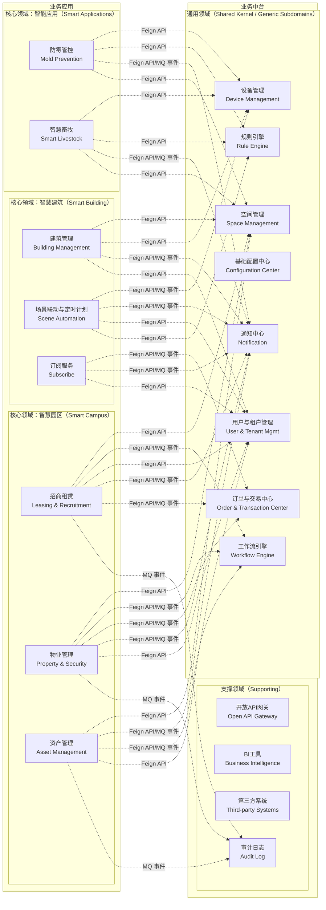
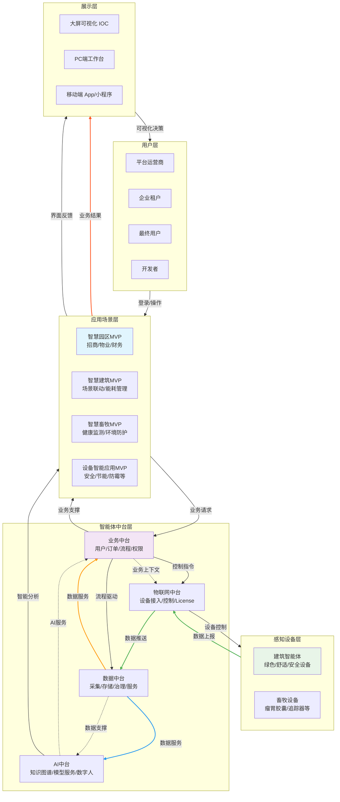

# 华宽通智能体系统设计说明书（DDD）

**文档版本：** V1.6  
**创建日期：** 2026-02-14  
**更新日期：** 2026-02-15  
**设计方法：** 领域驱动设计（Domain-Driven Design）  
**变更说明：** 根据第7次评审报告修正，主要变更如下：
1. 统一订单与交易中心里程碑口径（与PRD一致：Phase 2交付）
2. 收敛设备遥测/事件聚合边界（写侧快照 + 读侧时序/查询模型）
3. 补充告警与通知事件契约（事件定义、幂等键、重试与死信策略）
4. 仓储端口去框架化（Pageable替换为领域分页对象）
5. 增补NFR落地设计与压测口径
6. 补充外部系统ACL设计要点

---

## 1. 领域愿景

### 1.1 核心愿景

华宽通智能体系统的核心愿景是：**以硬件销售为物理锚点，通过统一平台实现硬件数据价值最大化，并以AI驱动业务智能化**。

### 1.2 设计理念

- **硬件数据化**：所有销售部署的硬件都是实时数据源
- **软件平台化**：通过中台架构实现能力的标准化与复用
- **AI场景化**：基于硬件数据的智能应用直接创造客户价值

### 1.3 5层架构模型

```
硬件部署层 → 数据汇聚层 → 能力中台层 → 场景应用层 → 价值呈现层
      ↓           ↓           ↓           ↓           ↓
  [物理触点]  [数据管道]  [智能引擎]  [业务封装]  [用户交互]
      ↓           ↓           ↓           ↓           ↓
  设备控制流 ←→ 数据价值流 ←→ AI决策流
```

---

## 2. 战略设计

### 2.1 限界上下文划分

#### 2.1.1 通用领域（Core & Shared Domains）

| 限界上下文 | 描述 | 模块 |
|------------|------|------|
| **用户与租户管理** | 管理租户生命周期、RBAC权限、SSO/MFA认证 | 用户与租户 |
| **订单与交易中心** | 订单创建、支付集成、发票生成（**Phase 2 交付**） | 订单与交易中心 |
| **通知中心** | 多渠道消息推送、消息模板引擎 | 通知中心 |
| **基础配置中心** | 参数配置、国际化、数据字典 | 基础配置中心 |
| **工作流引擎** | BPM流程编排、SLA管理、审批 | 工作流 |
| **设备管理** | 设备接入、OTA升级、状态监控、设备控制 | 物联网中台 → 设备管理，设备License管控 |
| **空间管理** | 空间层级结构（园区→楼栋→楼层→房间）、空间节点、空间与抽象资源关联维护 | 空间管理 |
| **规则引擎** | 告警规则、联动规则、计费规则的统一管理与执行 | 规则引擎 |

#### 2.1.2 核心领域（Core Domains）

##### 智慧园区（Smart Campus）

| 限界上下文 | 描述 |
|------------|------|
| **招商租赁** | 客户跟进、合同全生命周期、房源管理 |
| **物业管理** | 收费、账单、合同全生命周期 |
| **资产管理** | 资产台账、盘点、生命周期 |

##### 智慧建筑（Smart Building）

| 限界上下文 | 描述 |
|------------|------|
| **建筑管理** | 建筑空间命名、平面图管理、设备安置规划、BIM模型管理 |
| **场景联动与定时计划** | 场景触发、定时任务、联动控制 |
| **订阅服务** | 建筑下设备配额、增值服务订阅 |

##### 智能应用（Smart Applications）

| 限界上下文 | 描述 |
|------------|------|
| **防霉管控** | 霉菌风险监测、自动湿度调节、防霉效果报告 |
| **智慧畜牧** | 牲畜健康监测、电子围栏、生长效率分析 |

#### 2.1.3 支撑领域（Supporting Domains）

| 限界上下文 | 描述 |
|------------|------|
| **审计日志** | 操作日志记录、GDPR审计日志、删除报告、用户操作日志和定时任务日志（横切关注点） |
| **第三方支撑系统** | 涂鸦系统、停车系统、送餐机器人等系统接入 |
| **开放API网关** | 提供标准化接口，支持外部系统对接 |
| **BI工具** | 数据可视化、报表分析 |

#### 2.1.4 第三方系统ACL设计要点

- **反腐层职责**：对接外部协议/数据模型，转换为平台通用语言与领域对象
- **适配器拆分**：按外部系统独立适配器（涂鸦/停车/光伏/机器人），避免共享模型污染
- **错误隔离**：统一错误码与异常分类，屏蔽外部系统差异与波动
- **幂等与重试**：幂等键由外部业务ID+租户ID生成，失败采用指数退避重试
- **限流与熔断**：按租户与系统维度进行限流，超阈值自动降级到离线缓存/补偿队列
- **数据映射审计**：保留原始载荷与映射结果对照，支持追溯与问题定位

### 2.2 上下文映射图



### 2.3 通信方式选择原则

| 场景 | 同步通道 | 异步通道 | 设计目的 |
|------|----------|----------|----------|
| 招商租赁 ↔ 工作流 | Feign API 启动流程 | MQ 事件接收流程结果 | 启动快，结果异步通知 |
| 物业管理 ↔ 订单中心 | Feign API 创建订单 | MQ 事件接收支付回调 | 防止支付回调阻塞业务 |
| 场景联动 ↔ 设备管理 | Feign API 实时控制 | MQ 事件接收设备上报 | 控制指令实时，状态异步 |

| 场景 | 选择 | 理由 |
|------|------|------|
| **查询类操作**<br>(查资源、查设备状态) | **同步 Feign/REST** | 需要立即返回结果，用户等待 |
| **事务性操作**<br>(下单、支付) | **混合模式** | 同步：立即查询价格/库存<br>异步：最终状态通知（防耦合） |
| **通知类操作**<br>(消息推送、告警) | **异步 MQ** | 解耦，失败可重试，不阻塞主流程 |
| **流程编排**<br>(审批、工单) | **同步 Feign** | 工作流需要同步获取流程状态 |

### 2.4 上下文映射与通信方式对照表

| 源上下文 | 目标上下文 | 通信方式 | 技术实现 | 业务场景说明 |
|----------|------------|----------|----------|--------------|
| **招商租赁** | 空间与抽象资源 | **同步** | Feign API | 查询可租赁空间、资源占用情况 |
| **招商租赁** | 工作流 | **同步** | Feign API | 审批流程驱动（租赁合同审批） |
| **招商租赁** | 工作流 | **异步** | MQ 事件 | 流程状态变更通知、异步回调 |
| **招商租赁** | 用户中心 | **同步** | Feign API | 查询租户信息、联系人详情 |
| **招商租赁** | 通知中心 | **同步** | Feign API | 立即发送短信/邮件通知 |
| **招商租赁** | 通知中心 | **异步** | MQ 事件 | 批量通知、延迟发送、广播模式 |
| **招商租赁** | 订单中心 | **同步** | Feign API | 创建租赁订单、查询支付状态 |
| **招商租赁** | 订单中心 | **异步** | MQ 事件 | 订单状态变更异步处理、财务对账 |
| **物业管理** | 空间与抽象资源 | **同步** | Feign API | 查询物业管辖范围的空间资源 |
| **物业管理** | 工作流 | **同步** | Feign API | 维修工单流程编排 |
| **物业管理** | 工作流 | **异步** | MQ 事件 | 工单状态变更通知、SLA监控 |
| **物业管理** | 订单中心 | **同步** | Feign API | 查询账单详情、创建支付订单 |
| **物业管理** | 订单中心 | **异步** | MQ 事件 | 物业费缴纳状态变更通知 |
| **物业管理** | 通知中心 | **同步** | Feign API | 紧急报修即时推送 |
| **物业管理** | 通知中心 | **异步** | MQ 事件 | 物业公告推送、报修状态通知 |
| **物业管理** | 用户中心 | **同步** | Feign API | 查询业主信息、住户权限 |
| **资产管理** | 空间与抽象资源 | **同步** | Feign API | 资产在空间中的位置映射 |
| **资产管理** | 工作流 | **同步** | Feign API | 资产调拨流程、报废流程 |
| **资产管理** | 工作流 | **异步** | MQ 事件 | 资产状态变更驱动流程 |
| **资产管理** | 通知中心 | **同步** | Feign API | 资产告警即时通知 |
| **资产管理** | 通知中心 | **异步** | MQ 事件 | 资产保养提醒、报废审批通知 |
| **资产管理** | 用户中心 | **同步** | Feign API | 查询资产负责人、使用人信息 |
| **建筑管理** | 空间与抽象资源 | **同步** | Feign API | 获取建筑结构数据、楼层信息 |
| **建筑管理** | 设备管理 | **同步** | Feign API | 实时查询设备状态、下发控制指令 |
| **建筑管理** | 通知中心 | **同步** | Feign API | 紧急告警即时推送 |
| **建筑管理** | 通知中心 | **异步** | MQ 事件 | 建筑告警通知（消防、门禁） |
| **建筑管理** | 用户中心 | **同步** | Feign API | 查询建筑管理员、租户信息 |
| **场景联动** | 设备管理 | **同步** | Feign API | 实时控制设备（灯光、空调调节） |
| **场景联动** | 设备管理 | **异步** | MQ 事件 | 设备状态异步同步、联动触发 |
| **场景联动** | 通知中心 | **同步** | Feign API | 场景执行异常即时告警 |
| **场景联动** | 通知中心 | **异步** | MQ 事件 | 场景执行结果反馈、异常告警 |
| **场景联动** | 用户中心 | **同步** | Feign API | 查询场景配置权限、用户偏好 |
| **订阅服务** | 订单中心 | **同步** | Feign API | 查询套餐价格、立即下单支付 |
| **订阅服务** | 订单中心 | **异步** | MQ 事件 | 套餐变更异步处理、续费提醒 |
| **订阅服务** | 通知中心 | **同步** | Feign API | 订阅确认即时通知 |
| **订阅服务** | 通知中心 | **异步** | MQ 事件 | 订阅到期提醒、发票开具通知 |
| **订阅服务** | 用户中心 | **同步** | Feign API | 查询用户订阅状态、套餐信息 |
| **防霉管控** | 设备管理 | **同步** | Feign API | 实时查询温湿度传感器、控制除湿设备 |
| **防霉管控** | 设备管理 | **异步** | MQ 事件 | 接收设备遥测数据、告警事件 |
| **防霉管控** | 规则引擎 | **同步** | Feign API | 查询防霉规则、执行规则计算 |
| **防霉管控** | 通知中心 | **同步** | Feign API | 霉菌风险告警即时推送 |
| **防霉管控** | 通知中心 | **异步** | MQ 事件 | 防霉报告推送、设备异常通知 |
| **防霉管控** | 空间管理 | **同步** | Feign API | 查询监测空间信息、设备位置 |
| **智慧畜牧** | 设备管理 | **同步** | Feign API | 实时查询牲畜追踪器、控制电磁阀 |
| **智慧畜牧** | 设备管理 | **异步** | MQ 事件 | 接收瘤胃胶囊数据、位置更新事件 |
| **智慧畜牧** | 规则引擎 | **同步** | Feign API | 查询健康预警规则、电子围栏规则 |
| **智慧畜牧** | 通知中心 | **同步** | Feign API | 牲畜健康异常即时告警 |
| **智慧畜牧** | 通知中心 | **异步** | MQ 事件 | 越界告警、健康报告推送 |
| **智慧畜牧** | 空间管理 | **同步** | Feign API | 查询牧场区域、电子围栏范围 |
| **场景联动** | 规则引擎 | **同步** | Feign API | 查询联动规则、执行规则计算 |

#### 2.4.1 告警与通知事件契约

**事件流：** 告警产生 → 通知投递 → 通知回执

| 事件 | 触发方 | 关键字段 | 说明 |
|------|--------|---------|------|
| AlarmTriggeredEvent | 规则引擎/设备管理 | alarmId、tenantId、deviceId、ruleId、severity、occurredAt | 告警已触发 |
| NotificationRequestedEvent | 通知中心 | requestId、alarmId、channel、receiver、templateCode、dedupeKey | 通知请求已创建 |
| NotificationSentEvent | 通知中心 | requestId、channel、providerMessageId、sentAt | 通知已发送 |
| NotificationFailedEvent | 通知中心 | requestId、channel、errorCode、errorMessage、failedAt | 通知发送失败 |

**幂等与重试规则：**
- **幂等键**：`dedupeKey = tenantId + alarmId + channel + receiver + templateCode`
- **重试策略**：指数退避（1min/5min/15min），最多3次
- **死信策略**：超过最大重试进入DLQ，人工补发或自动补偿

### 2.5 通用语言（Ubiquitous Language）

#### 2.5.1 用户与租户管理

| 术语 | 定义 |
|------|------|
| **租户（Tenant）** | 使用平台的企业客户，有独立的数据隔离 |
| **多级组织架构** | 运营商→集团租户→子公司租户→入驻企业租户 |
| **RBAC** | 角色-权限-用户三层权限管控体系 |
| **SSO** | 单点登录，一次登录访问所有授权应用 |
| **MFA** | 多因素认证，增强安全场景 |

#### 2.5.2 订单与交易中心

| 术语 | 定义 |
|------|------|
| **订单类型** | 租赁订单、服务订单、商品订单、设备订单 |
| **订单状态机** | 创建→支付→履约→完成→退款 |
| **主订单/子订单** | 订单关联关系，支持续费订单 |
| **支付回调** | 支付结果异步通知 |

#### 2.5.3 空间管理

| 术语 | 定义 |
|------|------|
| **空间层级** | 园区→楼栋→楼层→房间 |
| **逻辑空间** | 按应用/按租户的空间分组 |
| **空间拓扑** | 空间节点之间的关联关系 |
| **抽象资源** | 只保存关联关系，具体由业务解读 |
| **空间边界** | 空间的地理坐标范围 |

#### 2.5.4 设备管理

| 术语 | 定义 |
|------|------|
| **设备数字孪生** | 物理设备在平台的虚拟化映射，包含物模型、配置、状态、历史数据 |
| **物模型** | 设备属性、服务、事件的标准化定义 |
| **设备License** | 设备授权管控 |
| **OTA升级** | 设备固件远程升级 |
| **遥测数据** | 设备上报的实时状态数据 |
| **设备命令** | 下发给设备的控制指令 |

#### 2.5.5 工作流引擎

| 术语 | 定义 |
|------|------|
| **BPM** | 业务流程管理，可视化流程设计器 |
| **SLA** | 服务水平协议，响应时间、解决时间要求 |
| **工单流转** | 工单模板、自动派单、处理时效 |

#### 2.5.6 规则引擎

| 术语 | 定义 |
|------|------|
| **规则** | 条件-动作的定义，支持复杂逻辑表达式 |
| **告警规则** | 设备数据触发告警的条件定义 |
| **联动规则** | 多设备协同控制的条件定义 |
| **计费规则** | 基于用量或时间的计费逻辑定义 |

#### 2.5.7 防霉管控

| 术语 | 定义 |
|------|------|
| **霉菌风险等级** | 基于温湿度数据计算的霉菌滋生风险（低/中/高/极高） |
| **湿度调节策略** | 自动控制除湿设备的策略规则 |
| **防霉效果报告** | 周期性生成的防霉效果分析报告 |

#### 2.5.8 智慧畜牧

| 术语 | 定义 |
|------|------|
| **瘤胃胶囊** | 嵌入牲畜瘤胃的传感器设备，监测体温、pH值等 |
| **电子围栏** | 基于GPS定位的虚拟围栏，牲畜越界触发告警 |
| **健康评分** | 基于多维度数据计算的牲畜健康状态评分 |
| **生长效率** | 牲畜增重与饲料消耗的比率分析 |

---

## 3. 战术设计

### 3.1 用户与租户管理限界上下文

#### 3.1.1 聚合根

**聚合根：Tenant（租户）**

```java
class Tenant {
    private TenantId id;
    private TenantName name;
    private TenantCode code;
    private TenantType type; // OPERATOR, GROUP, SUBSIDIARY, ENTERPRISE
    private TenantStatus status; // ACTIVE, SUSPENDED, TERMINATED
    private Tenant parent; // 上级租户
    private List<Tenant> children; // 下级租户
    private List<User> users;
    private List<Role> roles;
    private DateTime createdAt;
    private DateTime updatedAt;

    // 业务方法
    public void suspend() { ... }
    public void activate() { ... }
    public void terminate() { ... }
    public void addChild(Tenant child) { ... }
    public void addUser(User user) { ... }
    public void createRole(Role role) { ... }
}
```

**聚合根：User（用户）**

```java
class User {
    private UserId id;
    private Username username;
    private Email email;
    private Password password; // 加密存储
    private UserStatus status;
    private List<Role> roles;
    private Tenant tenant;
    private DateTime lastLoginAt;
    private DateTime createdAt;

    // 业务方法
    public void authenticate(String password) { ... }
    public void changePassword(String oldPassword, String newPassword) { ... }
    public void assignRole(Role role) { ... }
    public void revokeRole(Role role) { ... }
}
```

#### 3.1.2 实体

```java
class Role {
    private RoleId id;
    private RoleName name;
    private RoleCode code;
    private List<Permission> permissions;
    private Tenant tenant;
}

class Permission {
    private PermissionId id;
    private PermissionCode code;
    private PermissionName name;
    private String resource;
    private String action;
}
```

#### 3.1.3 值对象

```java
@Value
class TenantId {
    private String value;
}

@Value
class TenantName {
    private String value;
}

@Value
class TenantCode {
    private String value;
}

enum TenantType {
    OPERATOR, GROUP, SUBSIDIARY, ENTERPRISE
}

enum TenantStatus {
    ACTIVE, SUSPENDED, TERMINATED
}

@Value
class UserId {
    private String value;
}

@Value
class Username {
    private String value;
}

@Value
class Email {
    private String value;
}

enum UserStatus {
    ACTIVE, INACTIVE, LOCKED
}
```

#### 3.1.4 领域事件

```java
class TenantCreatedEvent {
    private TenantId tenantId;
    private TenantName tenantName;
    private DateTime occurredAt;
}

class TenantSuspendedEvent {
    private TenantId tenantId;
    private DateTime occurredAt;
}

class TenantTerminatedEvent {
    private TenantId tenantId;
    private DateTime occurredAt;
}

class UserCreatedEvent {
    private UserId userId;
    private Email email;
    private TenantId tenantId;
    private DateTime occurredAt;
}

class UserLoggedInEvent {
    private UserId userId;
    private DateTime occurredAt;
}
```

#### 3.1.5 仓储接口

```java
interface TenantRepository extends OptimisticLockRepository<Tenant, TenantId> {
    Optional<Tenant> findByCode(TenantCode code);
    List<Tenant> findByParent(TenantId parentId);
    List<Tenant> findByStatus(TenantStatus status);
    List<Tenant> findByStatus(TenantStatus status, PageRequest pageRequest);
    boolean existsByCode(TenantCode code);
    long countByStatus(TenantStatus status);
}

interface UserRepository extends OptimisticLockRepository<User, UserId> {
    Optional<User> findByEmail(Email email);
    Optional<User> findByUsername(Username username);
    List<User> findByTenant(TenantId tenantId);
    List<User> findByTenant(TenantId tenantId, PageRequest pageRequest);
    List<User> findByRole(RoleId roleId);
    List<User> findByTenantAndStatus(TenantId tenantId, UserStatus status);
    boolean existsByEmail(Email email);
    boolean existsByUsername(Username username);
    long countByTenant(TenantId tenantId);
}

interface RoleRepository extends BaseRepository<Role, RoleId> {
    List<Role> findByTenant(TenantId tenantId);
    List<Role> findByTenant(TenantId tenantId, PageRequest pageRequest);
    Optional<Role> findByTenantAndCode(TenantId tenantId, RoleCode code);
    boolean existsByTenantAndCode(TenantId tenantId, RoleCode code);
}
```

#### 3.1.6 SSO单点登录设计

**聚合根：SSOSession（SSO会话）**

```java
class SSOSession {
    private SSOSessionId id;
    private UserId userId;
    private TenantId tenantId;
    private String clientId;
    private SSOSessionStatus status; // ACTIVE, EXPIRED, REVOKED
    private DateTime createdAt;
    private DateTime expiresAt;
    private DateTime lastAccessedAt;
    private String ipAddress;
    private String userAgent;
    private List<SSOToken> tokens;

    // 业务方法
    public void refresh(DateTime newExpiresAt) { ... }
    public void revoke(String reason) { ... }
    public boolean isValid() { ... }
    public SSOToken createToken(TokenType type, Duration ttl) { ... }
}
```

**实体：SSOToken（SSO令牌）**

```java
class SSOToken {
    private TokenId id;
    private SSOSessionId sessionId;
    private TokenType type; // ACCESS, REFRESH, ID
    private String tokenValue;
    private TokenStatus status; // VALID, EXPIRED, REVOKED
    private DateTime issuedAt;
    private DateTime expiresAt;
    private String scope;
}
```

**值对象：**

```java
@Value
class SSOSessionId {
    private String value;
}

@Value
class TokenId {
    private String value;
}

enum SSOSessionStatus {
    ACTIVE, EXPIRED, REVOKED
}

enum TokenType {
    ACCESS, REFRESH, ID
}

enum TokenStatus {
    VALID, EXPIRED, REVOKED
}

@Value
class OAuth2Config {
    private String clientId;
    private String clientSecret;
    private List<String> redirectUris;
    private List<String> scopes;
    private GrantType grantType; // AUTHORIZATION_CODE, CLIENT_CREDENTIALS, PASSWORD
}

enum GrantType {
    AUTHORIZATION_CODE, CLIENT_CREDENTIALS, PASSWORD, REFRESH_TOKEN
}
```

**领域事件：**

```java
class SSOSessionCreatedEvent {
    private SSOSessionId sessionId;
    private UserId userId;
    private DateTime occurredAt;
}

class SSOSessionExpiredEvent {
    private SSOSessionId sessionId;
    private DateTime occurredAt;
}

class SSOTokenIssuedEvent {
    private TokenId tokenId;
    private SSOSessionId sessionId;
    private TokenType type;
    private DateTime occurredAt;
}

class SSOUserAuthenticatedEvent {
    private UserId userId;
    private String authenticationMethod; // PASSWORD, SMS, EMAIL, SOCIAL
    private DateTime occurredAt;
}
```

**仓储接口：**

```java
interface SSOSessionRepository {
    SSOSession save(SSOSession session);
    Optional<SSOSession> findById(SSOSessionId id);
    Optional<SSOSession> findByToken(String tokenValue);
    List<SSOSession> findByUser(UserId userId);
    List<SSOSession> findByTenant(TenantId tenantId);
    List<SSOSession> findExpired(DateTime beforeTime);
    void delete(SSOSession session);
}

interface SSOTokenRepository {
    SSOToken save(SSOToken token);
    Optional<SSOToken> findById(TokenId id);
    Optional<SSOToken> findByTokenValue(String tokenValue);
    List<SSOToken> findBySession(SSOSessionId sessionId);
    void delete(SSOToken token);
}
```

**应用服务：SSOApplicationService**

```java
class SSOApplicationService {
    private SSOSessionRepository sessionRepository;
    private SSOTokenRepository tokenRepository;
    private UserRepository userRepository;
    private PasswordService passwordService;

    // OAuth2授权码流程
    public AuthorizationCodeResponse authorize(
        String clientId,
        String redirectUri,
        String scope,
        UserId userId
    ) { ... }

    // 令牌交换
    public TokenResponse exchangeToken(
        String grantType,
        String code,
        String redirectUri,
        String clientId,
        String clientSecret
    ) { ... }

    // 刷新令牌
    public TokenResponse refreshToken(String refreshToken, String clientId) { ... }

    // 验证令牌
    public TokenValidationResponse validateToken(String accessToken) { ... }

    // 登出
    public void logout(String accessToken) { ... }

    // 撤销会话
    public void revokeSession(SSOSessionId sessionId, String reason) { ... }
}
```

#### 3.1.7 MFA多因素认证设计

**聚合根：MFAConfig（MFA配置）**

```java
class MFAConfig {
    private MFAConfigId id;
    private UserId userId;
    private TenantId tenantId;
    private MFAStatus status; // DISABLED, PENDING, ENABLED
    private List<MFAMethod> enabledMethods;
    private MFAMethod primaryMethod;
    private DateTime createdAt;
    private DateTime updatedAt;

    // 业务方法
    public void enableMethod(MFAMethod method) { ... }
    public void disableMethod(MFAMethod method) { ... }
    public void setPrimaryMethod(MFAMethod method) { ... }
    public void activate() { ... }
    public void deactivate() { ... }
}
```

**实体：MFADevice（MFA设备）**

```java
class MFADevice {
    private MFADeviceId id;
    private MFAConfigId configId;
    private MFAMethod method; // SMS, EMAIL, TOTP, WECHAT, DINGTALK
    private String deviceIdentifier; // 手机号、邮箱、设备ID等
    private String deviceName;
    private MFADeviceStatus status; // UNVERIFIED, VERIFIED, REVOKED
    private String secret; // TOTP密钥
    private DateTime createdAt;
    private DateTime verifiedAt;

    // 业务方法
    public void verify(String verificationCode) { ... }
    public void generateVerificationCode() { ... }
    public boolean validateCode(String code) { ... }
}
```

**实体：MFAChallenge（MFA挑战）**

```java
class MFAChallenge {
    private MFAChallengeId id;
    private UserId userId;
    private MFAMethod method;
    private String challengeId;
    private String verificationCode;
    private MFAChallengeStatus status; // PENDING, VERIFIED, EXPIRED, FAILED
    private int retryCount;
    private DateTime createdAt;
    private DateTime expiresAt;
    private DateTime verifiedAt;

    // 业务方法
    public boolean verify(String code) { ... }
    public boolean isExpired() { ... }
    public boolean canRetry() { ... }
}
```

**值对象：**

```java
@Value
class MFAConfigId {
    private String value;
}

@Value
class MFADeviceId {
    private String value;
}

@Value
class MFAChallengeId {
    private String value;
}

enum MFAStatus {
    DISABLED, PENDING, ENABLED
}

enum MFAMethod {
    SMS, EMAIL, TOTP, WECHAT, DINGTALK, FINGERPRINT, FACE
}

enum MFADeviceStatus {
    UNVERIFIED, VERIFIED, REVOKED
}

enum MFAChallengeStatus {
    PENDING, VERIFIED, EXPIRED, FAILED
}

@Value
class TOTPConfig {
    private String secret;
    private String issuer;
    private String accountName;
    private int digits;
    private int periodSeconds;
    private String algorithm; // SHA1, SHA256, SHA512
}
```

**领域事件：**

```java
class MFAConfigEnabledEvent {
    private MFAConfigId configId;
    private UserId userId;
    private DateTime occurredAt;
}

class MFADeviceVerifiedEvent {
    private MFADeviceId deviceId;
    private MFAConfigId configId;
    private MFAMethod method;
    private DateTime occurredAt;
}

class MFAChallengeSentEvent {
    private MFAChallengeId challengeId;
    private UserId userId;
    private MFAMethod method;
    private DateTime occurredAt;
}

class MFAVerifiedEvent {
    private UserId userId;
    private MFAMethod method;
    private DateTime occurredAt;
}

class MFAFailedEvent {
    private UserId userId;
    private MFAMethod method;
    private String reason;
    private DateTime occurredAt;
}
```

**仓储接口：**

```java
interface MFAConfigRepository {
    MFAConfig save(MFAConfig config);
    Optional<MFAConfig> findById(MFAConfigId id);
    Optional<MFAConfig> findByUser(UserId userId);
    List<MFAConfig> findByTenant(TenantId tenantId);
    List<MFAConfig> findEnabledByTenant(TenantId tenantId);
    void delete(MFAConfig config);
}

interface MFADeviceRepository {
    MFADevice save(MFADevice device);
    Optional<MFADevice> findById(MFADeviceId id);
    List<MFADevice> findByConfig(MFAConfigId configId);
    List<MFADevice> findByUser(UserId userId);
    Optional<MFADevice> findByMethodAndIdentifier(MFAMethod method, String identifier);
    void delete(MFADevice device);
}

interface MFAChallengeRepository {
    MFAChallenge save(MFAChallenge challenge);
    Optional<MFAChallenge> findById(MFAChallengeId id);
    Optional<MFAChallenge> findByChallengeId(String challengeId);
    List<MFAChallenge> findByUser(UserId userId);
    List<MFAChallenge> findExpired(DateTime beforeTime);
    void delete(MFAChallenge challenge);
}
```

**应用服务：MFAApplicationService**

```java
class MFAApplicationService {
    private MFAConfigRepository configRepository;
    private MFADeviceRepository deviceRepository;
    private MFAChallengeRepository challengeRepository;
    private NotificationService notificationService;
    private TOTPService totpService;

    // 初始化MFA配置
    public MFAConfig initializeMFA(UserId userId, TenantId tenantId) { ... }

    // 添加MFA设备
    public MFADevice addDevice(
        MFAConfigId configId,
        MFAMethod method,
        String identifier,
        String deviceName
    ) { ... }

    // 发送验证码
    public MFAChallenge sendChallenge(
        UserId userId,
        MFAMethod method
    ) { ... }

    // 验证MFA
    public boolean verifyMFA(
        String challengeId,
        String verificationCode
    ) { ... }

    // 验证TOTP
    public boolean verifyTOTP(
        UserId userId,
        String code
    ) { ... }

    // 生成TOTP二维码
    public String generateTOTPQrCode(UserId userId) { ... }

    // 启用MFA
    public void enableMFA(MFAConfigId configId) { ... }

    // 禁用MFA
    public void disableMFA(MFAConfigId configId) { ... }

    // 撤销设备
    public void revokeDevice(MFADeviceId deviceId) { ... }
}
```

### 3.2 订单与交易中心限界上下文（**Phase 2 交付**）

#### 3.2.1 聚合根

**聚合根：Order（订单）**

```java
class Order {
    private OrderId id;
    private OrderNo orderNo;
    private OrderType type; // LEASE, SERVICE, PRODUCT, DEVICE
    private OrderStatus status; // CREATED, PAID, FULFILLED, COMPLETED, REFUNDED
    private TenantId tenantId;
    private UserId userId;
    private Money totalAmount;
    private Currency currency;
    private List<OrderItem> items;
    private List<Payment> payments;
    private List<Invoice> invoices;
    private OrderId parentOrderId; // 主订单ID
    private DateTime createdAt;
    private DateTime updatedAt;

    // 业务方法
    public void addItem(OrderItem item) { ... }
    public void pay(Payment payment) { ... }
    public void fulfill() { ... }
    public void complete() { ... }
    public void refund(Money amount) { ... }
    public void generateInvoice() { ... }
}
```

#### 3.2.2 实体

```java
class OrderItem {
    private OrderItemId id;
    private ProductId productId;
    private ProductName productName;
    private Quantity quantity;
    private Money unitPrice;
    private Money subtotal;
}

class Payment {
    private PaymentId id;
    private PaymentNo paymentNo;
    private PaymentMethod method; // WECHAT, ALIPAY, UNIONPAY
    private Money amount;
    private PaymentStatus status; // PENDING, SUCCESS, FAILED
    private String thirdPartyTransactionId;
    private DateTime paidAt;
}

class Invoice {
    private InvoiceId id;
    private InvoiceNo invoiceNo;
    private InvoiceType type; // GENERAL, SPECIAL
    private Money amount;
    private String taxNumber;
    private String companyName;
    private InvoiceStatus status; // PENDING, ISSUED, SENT
    private DateTime issuedAt;
}
```

#### 3.2.3 值对象

```java
@Value
class OrderId {
    private String value;
}

@Value
class OrderNo {
    private String value;
}

enum OrderType {
    LEASE, SERVICE, PRODUCT, DEVICE
}

enum OrderStatus {
    CREATED, PAID, FULFILLED, COMPLETED, REFUNDED
}

@Value
class Money {
    private BigDecimal amount;
    private Currency currency;

    public Money add(Money other) { ... }
    public Money subtract(Money other) { ... }
    public Money multiply(int factor) { ... }
}

enum Currency {
    CNY, USD, EUR
}

@Value
class Quantity {
    private int value;
}

@Value
class PaymentId {
    private String value;
}

@Value
class PaymentNo {
    private String value;
}

enum PaymentMethod {
    WECHAT, ALIPAY, UNIONPAY
}

enum PaymentStatus {
    PENDING, SUCCESS, FAILED
}

@Value
class InvoiceId {
    private String value;
}

@Value
class InvoiceNo {
    private String value;
}

enum InvoiceType {
    GENERAL, SPECIAL
}

enum InvoiceStatus {
    PENDING, ISSUED, SENT
}
```

#### 3.2.4 领域事件

```java
class OrderCreatedEvent {
    private OrderId orderId;
    private OrderNo orderNo;
    private OrderType type;
    private Money totalAmount;
    private TenantId tenantId;
    private DateTime occurredAt;
}

class OrderPaidEvent {
    private OrderId orderId;
    private PaymentId paymentId;
    private Money paidAmount;
    private DateTime occurredAt;
}

class OrderFulfilledEvent {
    private OrderId orderId;
    private DateTime occurredAt;
}

class OrderCompletedEvent {
    private OrderId orderId;
    private DateTime occurredAt;
}

class OrderRefundedEvent {
    private OrderId orderId;
    private Money refundAmount;
    private DateTime occurredAt;
}

class InvoiceIssuedEvent {
    private OrderId orderId;
    private InvoiceId invoiceId;
    private InvoiceNo invoiceNo;
    private DateTime occurredAt;
}
```

#### 3.2.5 仓储接口

```java
@Value
class PageRequest {
    private int page;
    private int size;
    private String sortBy;
    private SortDirection direction;
}

@Value
class PageResult<T> {
    private List<T> items;
    private long total;
    private int page;
    private int size;
}

enum SortDirection {
    ASC, DESC
}

/**
 * 仓储接口基类
 * 定义通用的CRUD和批量操作方法
 */
interface BaseRepository<T, ID> {
    /**
     * 保存实体
     */
    T save(T entity);
    
    /**
     * 批量保存实体
     */
    List<T> saveAll(List<T> entities);
    
    /**
     * 根据ID查找
     */
    Optional<T> findById(ID id);
    
    /**
     * 根据ID列表批量查找
     */
    List<T> findAllById(List<ID> ids);
    
    /**
     * 查找所有
     */
    List<T> findAll();
    
    /**
     * 分页查找
     */
    PageResult<T> findAll(PageRequest pageRequest);
    
    /**
     * 根据ID删除
     */
    void deleteById(ID id);
    
    /**
     * 删除实体
     */
    void delete(T entity);
    
    /**
     * 批量删除
     */
    void deleteAll(List<T> entities);
    
    /**
     * 根据ID批量删除
     */
    void deleteAllById(List<ID> ids);
    
    /**
     * 判断是否存在
     */
    boolean existsById(ID id);
    
    /**
     * 计数
     */
    long count();
}

/**
 * 乐观锁仓储接口
 * 支持版本号控制的并发更新
 */
interface OptimisticLockRepository<T, ID> extends BaseRepository<T, ID> {
    /**
     * 保存实体（带乐观锁检查）
     * 如果版本号不匹配，抛出OptimisticLockException
     */
    T saveWithVersion(T entity);
    
    /**
     * 批量保存实体（带乐观锁检查）
     */
    List<T> saveAllWithVersion(List<T> entities);
    
    /**
     * 刷新实体状态
     */
    void refresh(T entity);
    
    /**
     * 获取实体当前版本号
     */
    Long getCurrentVersion(ID id);
}

interface OrderRepository extends OptimisticLockRepository<Order, OrderId> {
    Optional<Order> findByOrderNo(OrderNo orderNo);
    List<Order> findByTenant(TenantId tenantId);
    List<Order> findByTenant(TenantId tenantId, PageRequest pageRequest);
    List<Order> findByUser(UserId userId);
    List<Order> findByUser(UserId userId, PageRequest pageRequest);
    List<Order> findByStatus(OrderStatus status);
    List<Order> findByStatus(OrderStatus status, PageRequest pageRequest);
    List<Order> findByTenantAndStatus(TenantId tenantId, OrderStatus status);
    List<Order> findByTenantAndStatus(TenantId tenantId, OrderStatus status, PageRequest pageRequest);
    List<Order> findByCreateTimeBetween(DateTime from, DateTime to);
    List<Order> findByCreateTimeBetween(DateTime from, DateTime to, PageRequest pageRequest);
    long countByTenant(TenantId tenantId);
    long countByTenantAndStatus(TenantId tenantId, OrderStatus status);
    boolean existsByOrderNo(OrderNo orderNo);
}

interface PaymentRepository extends BaseRepository<Payment, PaymentId> {
    Optional<Payment> findByPaymentNo(PaymentNo paymentNo);
    List<Payment> findByOrder(OrderId orderId);
    List<Payment> findByOrder(OrderId orderId, PageRequest pageRequest);
    List<Payment> findByStatus(PaymentStatus status);
    List<Payment> findByStatus(PaymentStatus status, PageRequest pageRequest);
    List<Payment> findByPaymentTimeBetween(DateTime from, DateTime to);
    Optional<Payment> findLatestByOrder(OrderId orderId);
    boolean existsByPaymentNo(PaymentNo paymentNo);
}

interface InvoiceRepository extends BaseRepository<Invoice, InvoiceId> {
    Optional<Invoice> findByInvoiceNo(InvoiceNo invoiceNo);
    List<Invoice> findByOrder(OrderId orderId);
    List<Invoice> findByOrder(OrderId orderId, PageRequest pageRequest);
    List<Invoice> findByTenant(TenantId tenantId);
    List<Invoice> findByTenant(TenantId tenantId, PageRequest pageRequest);
    List<Invoice> findByStatus(InvoiceStatus status);
    List<Invoice> findByStatus(InvoiceStatus status, PageRequest pageRequest);
    boolean existsByInvoiceNo(InvoiceNo invoiceNo);
}
```

#### 3.2.6 能耗费用账单自动生成设计

**聚合根：EnergyBill（能耗账单）**

```java
class EnergyBill {
    private EnergyBillId id;
    private EnergyBillNo billNo;
    private TenantId tenantId;
    private SpaceId spaceId;
    private BillPeriod period;
    private BillStatus status; // DRAFT, PENDING, PAID, OVERDUE, CANCELLED
    private List<EnergyItem> items;
    private Money totalAmount;
    private Currency currency;
    private DateTime dueDate;
    private DateTime paidAt;
    private OrderId relatedOrderId;
    private DateTime createdAt;
    private DateTime updatedAt;

    // 业务方法
    public void addItem(EnergyItem item) { ... }
    public void calculateTotal() { ... }
    public void issue() { ... }
    public void pay(PaymentId paymentId) { ... }
    public void overdue() { ... }
    public void cancel(String reason) { ... }
}
```

**实体：EnergyItem（能耗明细项）**

```java
class EnergyItem {
    private EnergyItemId id;
    private EnergyBillId billId;
    private EnergyType type; // ELECTRICITY, WATER, GAS, HEAT
    private DeviceId meterId;
    private String meterNo;
    private BigDecimal startReading;
    private BigDecimal endReading;
    private BigDecimal consumption;
    private Unit unit; // KWH, CUBIC_METER, GJ
    private Money unitPrice;
    private Money subtotal;
    private DateTime readingStartDate;
    private DateTime readingEndDate;
}
```

**实体：BillGenerationTask（账单生成任务）**

```java
class BillGenerationTask {
    private BillGenerationTaskId id;
    private TenantId tenantId;
    private BillPeriod period;
    private BillGenerationTaskStatus status; // PENDING, RUNNING, COMPLETED, FAILED
    private List<SpaceId> targetSpaceIds;
    private int totalCount;
    private int successCount;
    private int failedCount;
    private List<String> errorMessages;
    private DateTime scheduledAt;
    private DateTime startedAt;
    private DateTime completedAt;
    private Duration executionTime;

    // 业务方法
    public void start() { ... }
    public void complete(int successCount, int failedCount) { ... }
    public void fail(String errorMessage) { ... }
    public boolean isTimeout() { ... }
}
```

**值对象：**

```java
@Value
class EnergyBillId {
    private String value;
}

@Value
class EnergyBillNo {
    private String value;
}

enum EnergyType {
    ELECTRICITY, WATER, GAS, HEAT
}

enum BillStatus {
    DRAFT, PENDING, PAID, OVERDUE, CANCELLED
}

@Value
class BillPeriod {
    private int year;
    private int month;
    private DateTime startDate;
    private DateTime endDate;

    public static BillPeriod of(int year, int month) { ... }
    public BillPeriod previous() { ... }
    public BillPeriod next() { ... }
}

enum Unit {
    KWH, CUBIC_METER, GJ, TON
}

@Value
class EnergyItemId {
    private String value;
}

@Value
class BillGenerationTaskId {
    private String value;
}

enum BillGenerationTaskStatus {
    PENDING, RUNNING, COMPLETED, FAILED
}

@Value
class MeterReading {
    private DeviceId meterId;
    private BigDecimal reading;
    private DateTime readingTime;
    private ReadingSource source; // MANUAL, AUTO, IMPORT
}

enum ReadingSource {
    MANUAL, AUTO, IMPORT
}

@Value
class EnergyPricingRule {
    private EnergyType energyType;
    private Money unitPrice;
    private BigDecimal tierThreshold;
    private Money tierPrice;
    private DateTime effectiveFrom;
    private DateTime effectiveTo;
}
```

**领域事件：**

```java
class EnergyBillCreatedEvent {
    private EnergyBillId billId;
    private EnergyBillNo billNo;
    private TenantId tenantId;
    private BillPeriod period;
    private Money totalAmount;
    private DateTime occurredAt;
}

class EnergyBillIssuedEvent {
    private EnergyBillId billId;
    private EnergyBillNo billNo;
    private TenantId tenantId;
    private DateTime dueDate;
    private DateTime occurredAt;
}

class EnergyBillPaidEvent {
    private EnergyBillId billId;
    private PaymentId paymentId;
    private Money paidAmount;
    private DateTime occurredAt;
}

class EnergyBillOverdueEvent {
    private EnergyBillId billId;
    private EnergyBillNo billNo;
    private Money overdueAmount;
    private int overdueDays;
    private DateTime occurredAt;
}

class BillGenerationTaskCompletedEvent {
    private BillGenerationTaskId taskId;
    private TenantId tenantId;
    private BillPeriod period;
    private int successCount;
    private int failedCount;
    private DateTime occurredAt;
}

class BillGenerationTaskFailedEvent {
    private BillGenerationTaskId taskId;
    private TenantId tenantId;
    private String errorMessage;
    private DateTime occurredAt;
}
```

**仓储接口：**

```java
interface EnergyBillRepository {
    EnergyBill save(EnergyBill bill);
    Optional<EnergyBill> findById(EnergyBillId id);
    Optional<EnergyBill> findByBillNo(EnergyBillNo billNo);
    List<EnergyBill> findByTenant(TenantId tenantId);
    List<EnergyBill> findBySpace(SpaceId spaceId);
    List<EnergyBill> findByPeriod(BillPeriod period);
    List<EnergyBill> findByStatus(BillStatus status);
    List<EnergyBill> findOverdue(DateTime beforeDate);
    void delete(EnergyBill bill);
}

interface BillGenerationTaskRepository {
    BillGenerationTask save(BillGenerationTask task);
    Optional<BillGenerationTask> findById(BillGenerationTaskId id);
    List<BillGenerationTask> findByTenant(TenantId tenantId);
    List<BillGenerationTask> findByStatus(BillGenerationTaskStatus status);
    List<BillGenerationTask> findPending(DateTime beforeTime);
    void delete(BillGenerationTask task);
}

interface EnergyPricingRuleRepository {
    EnergyPricingRule save(EnergyPricingRule rule);
    Optional<EnergyPricingRule> findById(Long id);
    List<EnergyPricingRule> findByTenant(TenantId tenantId);
    List<EnergyPricingRule> findByEnergyType(EnergyType type);
    List<EnergyPricingRule> findEffective(DateTime atTime);
    void delete(EnergyPricingRule rule);
}
```

**应用服务：EnergyBillApplicationService**

```java
class EnergyBillApplicationService {
    private EnergyBillRepository billRepository;
    private BillGenerationTaskRepository taskRepository;
    private EnergyPricingRuleRepository pricingRuleRepository;
    private DeviceMeterReadingService meterReadingService;
    private OrderApplicationService orderApplicationService;
    private SchedulerService schedulerService;

    // 创建月度账单生成任务（定时任务触发）
    public BillGenerationTask createMonthlyBillGenerationTask(
        TenantId tenantId,
        BillPeriod period,
        List<SpaceId> spaceIds
    ) {
        BillGenerationTask task = new BillGenerationTask(
            BillGenerationTaskId.generate(),
            tenantId,
            period,
            BillGenerationTaskStatus.PENDING,
            spaceIds,
            0, 0, 0,
            new ArrayList<>(),
            DateTime.now(),
            null, null, null
        );
        return taskRepository.save(task);
    }

    // 执行账单生成任务
    public BillGenerationTask executeBillGeneration(BillGenerationTaskId taskId) {
        BillGenerationTask task = taskRepository.findById(taskId)
            .orElseThrow(() -> new TaskNotFoundException(taskId));
        
        task.start();
        task = taskRepository.save(task);

        int successCount = 0;
        int failedCount = 0;
        List<String> errors = new ArrayList<>();

        for (SpaceId spaceId : task.getTargetSpaceIds()) {
            try {
                generateEnergyBillForSpace(task.getTenantId(), spaceId, task.getPeriod());
                successCount++;
            } catch (Exception e) {
                failedCount++;
                errors.add("Space " + spaceId + ": " + e.getMessage());
            }
        }

        task.complete(successCount, failedCount);
        task.getErrorMessages().addAll(errors);
        return taskRepository.save(task);
    }

    // 为单个空间生成能耗账单
    public EnergyBill generateEnergyBillForSpace(
        TenantId tenantId,
        SpaceId spaceId,
        BillPeriod period
    ) {
        // 1. 获取该空间下的所有计量设备
        List<DeviceId> meterIds = meterReadingService.getMetersBySpace(spaceId);
        
        // 2. 获取上期读数
        BillPeriod previousPeriod = period.previous();
        Map<DeviceId, MeterReading> previousReadings = 
            meterReadingService.getReadingsForPeriod(meterIds, previousPeriod);
        
        // 3. 获取本期读数
        Map<DeviceId, MeterReading> currentReadings = 
            meterReadingService.getReadingsForPeriod(meterIds, period);
        
        // 4. 获取定价规则
        List<EnergyPricingRule> pricingRules = 
            pricingRuleRepository.findEffective(DateTime.now());
        
        // 5. 创建账单
        EnergyBill bill = new EnergyBill(
            EnergyBillId.generate(),
            EnergyBillNo.generate(),
            tenantId,
            spaceId,
            period,
            BillStatus.DRAFT,
            new ArrayList<>(),
            Money.zero(Currency.CNY),
            Currency.CNY,
            period.endDate().plusDays(15), // 账单日后15天为付款截止日
            null,
            null,
            DateTime.now(),
            DateTime.now()
        );

        // 6. 计算各能耗明细
        for (DeviceId meterId : meterIds) {
            MeterReading previous = previousReadings.get(meterId);
            MeterReading current = currentReadings.get(meterId);
            
            if (previous != null && current != null) {
                EnergyItem item = calculateEnergyItem(
                    meterId, previous, current, pricingRules, period
                );
                bill.addItem(item);
            }
        }

        // 7. 计算总额
        bill.calculateTotal();
        
        // 8. 保存账单
        bill = billRepository.save(bill);
        
        return bill;
    }

    // 计算单个能耗明细项
    private EnergyItem calculateEnergyItem(
        DeviceId meterId,
        MeterReading previousReading,
        MeterReading currentReading,
        List<EnergyPricingRule> pricingRules,
        BillPeriod period
    ) {
        // 获取设备类型和能耗类型
        EnergyType energyType = meterReadingService.getEnergyType(meterId);
        String meterNo = meterReadingService.getMeterNo(meterId);
        
        // 计算用量
        BigDecimal consumption = currentReading.getReading()
            .subtract(previousReading.getReading());
        
        // 获取单价
        EnergyPricingRule rule = pricingRules.stream()
            .filter(r -> r.getEnergyType() == energyType)
            .findFirst()
            .orElseGet(() -> getDefaultPricingRule(energyType));
        
        // 计算金额
        Money unitPrice = rule.getUnitPrice();
        Money subtotal = unitPrice.multiply(consumption);
        
        return new EnergyItem(
            EnergyItemId.generate(),
            null, // billId will be set later
            energyType,
            meterId,
            meterNo,
            previousReading.getReading(),
            currentReading.getReading(),
            consumption,
            getUnitForEnergyType(energyType),
            unitPrice,
            subtotal,
            previousReading.getReadingTime(),
            currentReading.getReadingTime()
        );
    }

    // 发布账单
    public EnergyBill issueBill(EnergyBillId billId) {
        EnergyBill bill = billRepository.findById(billId)
            .orElseThrow(() -> new BillNotFoundException(billId));
        
        bill.issue();
        bill = billRepository.save(bill);
        
        // 创建关联订单
        OrderId orderId = orderApplicationService.createOrderFromEnergyBill(bill);
        bill.setRelatedOrderId(orderId);
        
        return billRepository.save(bill);
    }

    // 批量发布账单
    public List<EnergyBill> issueBillsForPeriod(TenantId tenantId, BillPeriod period) {
        List<EnergyBill> bills = billRepository.findByTenantAndPeriod(tenantId, period)
            .stream()
            .filter(b -> b.getStatus() == BillStatus.DRAFT)
            .collect(Collectors.toList());
        
        return bills.stream()
            .map(bill -> issueBill(bill.getId()))
            .collect(Collectors.toList());
    }

    // 定时任务：每月1日生成上月账单
    public void scheduledMonthlyBillGeneration() {
        // 获取上月账期
        BillPeriod lastMonthPeriod = BillPeriod.of(
            DateTime.now().getYear(),
            DateTime.now().getMonthValue() - 1
        );
        
        // 获取所有租户
        List<TenantId> tenantIds = tenantRepository.findAllActiveTenantIds();
        
        for (TenantId tenantId : tenantIds) {
            // 获取该租户的所有空间
            List<SpaceId> spaceIds = spaceRepository.findByTenant(tenantId)
                .stream()
                .map(Space::getId)
                .collect(Collectors.toList());
            
            if (!spaceIds.isEmpty()) {
                // 创建并执行账单生成任务
                BillGenerationTask task = createMonthlyBillGenerationTask(
                    tenantId, lastMonthPeriod, spaceIds
                );
                executeBillGeneration(task.getId());
                
                // 发布账单
                issueBillsForPeriod(tenantId, lastMonthPeriod);
            }
        }
    }

    // 定时任务：每天凌晨检查逾期账单
    public void scheduledCheckOverdueBills() {
        List<EnergyBill> overdueBills = billRepository.findOverdue(DateTime.now());
        
        for (EnergyBill bill : overdueBills) {
            if (bill.getStatus() == BillStatus.PENDING) {
                bill.overdue();
                billRepository.save(bill);
            }
        }
    }
}
```

#### 3.2.7 订单状态机状态转换校验逻辑

**订单状态机状态转换图：**

```
订单完整状态机：

┌─────────┐    创建订单     ┌─────────────┐
│  START  │ ──────────────> │   CREATED   │
└─────────┘                 └──────┬──────┘
                                   │
           ┌───────────────────────┼───────────────────────┐
           │                       │                       │
           ▼                       ▼                       ▼
    ┌─────────────┐        ┌─────────────┐         ┌─────────────┐
    │   EXPIRED   │        │ CANCELLED   │         │   PAID      │
    │  (超时未支付) │        │   (已取消)   │         │   (已支付)   │
    └─────────────┘        └─────────────┘         └──────┬──────┘
                                                          │
                                    ┌─────────────────────┼─────────────────────┐
                                    │                     │                     │
                                    ▼                     ▼                     ▼
                             ┌─────────────┐      ┌─────────────┐       ┌─────────────┐
                             │  REFUNDING  │      │  FULFILLING │       │   REFUNDED  │
                             │  (退款中)    │      │   (履约中)   │       │  (已退款)   │
                             └──────┬──────┘      └──────┬──────┘       └─────────────┘
                                    │                    │
                    ┌───────────────┴────────┐           │
                    │                        │           │
                    ▼                        ▼           ▼
             ┌─────────────┐         ┌─────────────┐  ┌─────────────┐
             │PARTIALLY_REF│         │   REFUNDED  │  │  COMPLETED  │
             │ (部分退款)   │         │   (已退款)   │  │   (已完成)   │
             └─────────────┘         └─────────────┘  └─────────────┘
```

**状态说明：**

| 状态 | 说明 | 是否终态 |
|------|------|----------|
| CREATED | 订单已创建，待支付 | 否 |
| PENDING_PAYMENT | 待支付状态（可选中间状态） | 否 |
| PAID | 订单已支付 | 否 |
| FULFILLING | 订单履约中 | 否 |
| COMPLETED | 订单已完成 | 是 |
| REFUNDING | 退款中 | 否 |
| PARTIALLY_REFUNDED | 部分退款 | 是 |
| REFUNDED | 已全额退款 | 是 |
| CANCELLED | 已取消 | 是 |
| EXPIRED | 已过期（超时未支付） | 是 |

**值对象：OrderStateMachine（订单状态机）**

```java
class OrderStateMachine {
    // 状态转换规则定义
    private static final Map<OrderStatus, Set<OrderStatus>> ALLOWED_TRANSITIONS = Map.of(
        OrderStatus.CREATED, Set.of(
            OrderStatus.PENDING_PAYMENT,  // 创建后进入待支付
            OrderStatus.PAID,             // 直接支付（无需中间状态）
            OrderStatus.CANCELLED,        // 主动取消
            OrderStatus.EXPIRED           // 超时过期
        ),
        OrderStatus.PENDING_PAYMENT, Set.of(
            OrderStatus.PAID,             // 支付成功
            OrderStatus.CANCELLED,        // 取消订单
            OrderStatus.EXPIRED           // 超时过期
        ),
        OrderStatus.PAID, Set.of(
            OrderStatus.FULFILLING,       // 开始履约
            OrderStatus.REFUNDING,        // 申请退款
            OrderStatus.REFUNDED          // 直接退款（无需履约）
        ),
        OrderStatus.FULFILLING, Set.of(
            OrderStatus.COMPLETED,        // 履约完成
            OrderStatus.REFUNDING         // 履约中申请退款
        ),
        OrderStatus.COMPLETED, Set.of(
            OrderStatus.REFUNDING         // 完成后申请退款
        ),
        OrderStatus.REFUNDING, Set.of(
            OrderStatus.REFUNDED,         // 全额退款完成
            OrderStatus.PARTIALLY_REFUNDED // 部分退款完成
        ),
        // 终态，不可转换
        OrderStatus.PARTIALLY_REFUNDED, Set.of(),
        OrderStatus.REFUNDED, Set.of(),
        OrderStatus.CANCELLED, Set.of(),
        OrderStatus.EXPIRED, Set.of()
    );
    
    // 状态转换触发事件映射
    private static final Map<OrderStatus, Map<OrderStatus, OrderTransitionTrigger>> TRANSITION_TRIGGERS = Map.of(
        OrderStatus.CREATED, Map.of(
            OrderStatus.PENDING_PAYMENT, OrderTransitionTrigger.CREATE,
            OrderStatus.PAID, OrderTransitionTrigger.DIRECT_PAY,
            OrderStatus.CANCELLED, OrderTransitionTrigger.CANCEL,
            OrderStatus.EXPIRED, OrderTransitionTrigger.TIMEOUT
        ),
        OrderStatus.PENDING_PAYMENT, Map.of(
            OrderStatus.PAID, OrderTransitionTrigger.PAY,
            OrderStatus.CANCELLED, OrderTransitionTrigger.CANCEL,
            OrderStatus.EXPIRED, OrderTransitionTrigger.TIMEOUT
        ),
        OrderStatus.PAID, Map.of(
            OrderStatus.FULFILLING, OrderTransitionTrigger.START_FULFILL,
            OrderStatus.REFUNDING, OrderTransitionTrigger.REQUEST_REFUND,
            OrderStatus.REFUNDED, OrderTransitionTrigger.DIRECT_REFUND
        ),
        OrderStatus.FULFILLING, Map.of(
            OrderStatus.COMPLETED, OrderTransitionTrigger.COMPLETE,
            OrderStatus.REFUNDING, OrderTransitionTrigger.REQUEST_REFUND
        ),
        OrderStatus.COMPLETED, Map.of(
            OrderStatus.REFUNDING, OrderTransitionTrigger.REQUEST_REFUND
        ),
        OrderStatus.REFUNDING, Map.of(
            OrderStatus.REFUNDED, OrderTransitionTrigger.REFUND_COMPLETE,
            OrderStatus.PARTIALLY_REFUNDED, OrderTransitionTrigger.PARTIAL_REFUND
        )
    );

    /**
     * 检查状态转换是否允许
     */
    public static boolean canTransition(OrderStatus from, OrderStatus to) {
        if (from == null || to == null) return false;
        Set<OrderStatus> allowed = ALLOWED_TRANSITIONS.get(from);
        return allowed != null && allowed.contains(to);
    }

    /**
     * 验证状态转换，不允许则抛出异常
     */
    public static void validateTransition(OrderStatus from, OrderStatus to) {
        if (!canTransition(from, to)) {
            throw new IllegalOrderStateTransitionException(from, to, 
                String.format("订单状态不能从 %s 转换为 %s", from.getDisplayName(), to.getDisplayName()));
        }
    }

    /**
     * 获取当前状态允许的下一个状态集合
     */
    public static Set<OrderStatus> getNextAllowedStatuses(OrderStatus current) {
        return ALLOWED_TRANSITIONS.getOrDefault(current, Set.of());
    }

    /**
     * 判断是否为终态
     */
    public static boolean isFinalState(OrderStatus status) {
        Set<OrderStatus> next = ALLOWED_TRANSITIONS.get(status);
        return next == null || next.isEmpty();
    }
    
    /**
     * 获取状态转换触发事件
     */
    public static Optional<OrderTransitionTrigger> getTransitionTrigger(OrderStatus from, OrderStatus to) {
        Map<OrderStatus, OrderTransitionTrigger> triggers = TRANSITION_TRIGGERS.get(from);
        if (triggers == null) return Optional.empty();
        return Optional.ofNullable(triggers.get(to));
    }
    
    /**
     * 获取订单生命周期中的所有可能状态
     */
    public static List<OrderStatus> getAllStatuses() {
        return List.of(OrderStatus.values());
    }
    
    /**
     * 获取所有终态
     */
    public static Set<OrderStatus> getFinalStates() {
        return Arrays.stream(OrderStatus.values())
            .filter(OrderStateMachine::isFinalState)
            .collect(Collectors.toSet());
    }
}

/**
 * 状态转换触发事件枚举
 */
enum OrderTransitionTrigger {
    CREATE("创建订单"),
    DIRECT_PAY("直接支付"),
    PAY("支付"),
    CANCEL("取消订单"),
    TIMEOUT("超时过期"),
    START_FULFILL("开始履约"),
    COMPLETE("完成履约"),
    REQUEST_REFUND("申请退款"),
    DIRECT_REFUND("直接退款"),
    REFUND_COMPLETE("退款完成"),
    PARTIAL_REFUND("部分退款");
    
    private final String displayName;
    
    OrderTransitionTrigger(String displayName) {
        this.displayName = displayName;
    }
    
    public String getDisplayName() {
        return displayName;
    }
}
```

**扩展的订单状态枚举：**

```java
enum OrderStatus {
    CREATED("已创建", false),
    PENDING_PAYMENT("待支付", false),
    PAID("已支付", false),
    FULFILLING("履约中", false),
    COMPLETED("已完成", true),
    REFUNDING("退款中", false),
    PARTIALLY_REFUNDED("部分退款", true),
    REFUNDED("已退款", true),
    CANCELLED("已取消", true),
    EXPIRED("已过期", true);
    
    private final String displayName;
    private final boolean isFinal;
    
    OrderStatus(String displayName, boolean isFinal) {
        this.displayName = displayName;
        this.isFinal = isFinal;
    }
    
    public String getDisplayName() {
        return displayName;
    }
    
    public boolean isFinal() {
        return isFinal;
    }
}
```

**领域事件：**

```java
/**
 * 订单状态转换失败事件
 */
class OrderStateTransitionFailedEvent implements DomainEvent {
    private final OrderId orderId;
    private final OrderStatus fromStatus;
    private final OrderStatus toStatus;
    private final String reason;
    private final UserId operatorId;
    private final DateTime occurredAt;
    
    public OrderStateTransitionFailedEvent(OrderId orderId, OrderStatus from, OrderStatus to, 
                                           String reason, UserId operatorId) {
        this.orderId = orderId;
        this.fromStatus = from;
        this.toStatus = to;
        this.reason = reason;
        this.operatorId = operatorId;
        this.occurredAt = DateTime.now();
    }
}

/**
 * 订单状态转换成功事件
 */
class OrderStateTransitionedEvent implements DomainEvent {
    private final OrderId orderId;
    private final OrderStatus fromStatus;
    private final OrderStatus toStatus;
    private final OrderTransitionTrigger trigger;
    private final UserId operatorId;
    private final DateTime occurredAt;
    private final Map<String, Object> metadata;
    
    public OrderStateTransitionedEvent(OrderId orderId, OrderStatus from, OrderStatus to,
                                        OrderTransitionTrigger trigger, UserId operatorId,
                                        Map<String, Object> metadata) {
        this.orderId = orderId;
        this.fromStatus = from;
        this.toStatus = to;
        this.trigger = trigger;
        this.operatorId = operatorId;
        this.metadata = metadata != null ? new HashMap<>(metadata) : new HashMap<>();
        this.occurredAt = DateTime.now();
    }
}
```

**在Order聚合根中添加完整的状态转换校验：**

```java
class Order {
    // ... 现有字段 ...
    
    private List<OrderStateTransitionRecord> transitionHistory = new ArrayList<>();

    /**
     * 支付订单
     */
    public void pay(Payment payment, UserId operatorId) {
        OrderStatus oldStatus = this.status;
        OrderStateMachine.validateTransition(oldStatus, OrderStatus.PAID);
        
        this.status = OrderStatus.PAID;
        this.paidAt = DateTime.now();
        this.paymentId = payment.getId();
        
        // 记录状态转换
        recordTransition(oldStatus, OrderStatus.PAID, operatorId, 
            Map.of("paymentId", payment.getId().getValue()));
        
        // 发布领域事件
        registerEvent(new OrderPaidEvent(this.id, payment.getId(), this.totalAmount, this.paidAt));
    }

    /**
     * 开始履约
     */
    public void startFulfillment(UserId operatorId) {
        OrderStatus oldStatus = this.status;
        OrderStateMachine.validateTransition(oldStatus, OrderStatus.FULFILLING);
        
        this.status = OrderStatus.FULFILLING;
        this.fulfillmentStartedAt = DateTime.now();
        
        recordTransition(oldStatus, OrderStatus.FULFILLING, operatorId, null);
        
        registerEvent(new OrderFulfillmentStartedEvent(this.id, this.fulfillmentStartedAt));
    }

    /**
     * 完成履约
     */
    public void complete(UserId operatorId) {
        OrderStatus oldStatus = this.status;
        OrderStateMachine.validateTransition(oldStatus, OrderStatus.COMPLETED);
        
        this.status = OrderStatus.COMPLETED;
        this.completedAt = DateTime.now();
        
        recordTransition(oldStatus, OrderStatus.COMPLETED, operatorId, null);
        
        registerEvent(new OrderCompletedEvent(this.id, this.completedAt));
    }

    /**
     * 申请退款
     */
    public void requestRefund(Money amount, String reason, UserId operatorId) {
        OrderStatus oldStatus = this.status;
        OrderStateMachine.validateTransition(oldStatus, OrderStatus.REFUNDING);
        
        // 验证退款金额
        if (amount.compareTo(this.totalAmount) > 0) {
            throw new InvalidRefundAmountException("退款金额不能超过订单金额");
        }
        
        this.status = OrderStatus.REFUNDING;
        this.refundAmount = amount;
        this.refundReason = reason;
        
        recordTransition(oldStatus, OrderStatus.REFUNDING, operatorId,
            Map.of("refundAmount", amount.getAmount(), "reason", reason));
        
        registerEvent(new OrderRefundRequestedEvent(this.id, amount, reason, DateTime.now()));
    }

    /**
     * 完成退款
     */
    public void completeRefund(boolean isPartial, UserId operatorId) {
        OrderStatus oldStatus = this.status;
        OrderStatus targetStatus = isPartial ? OrderStatus.PARTIALLY_REFUNDED : OrderStatus.REFUNDED;
        
        OrderStateMachine.validateTransition(oldStatus, targetStatus);
        
        this.status = targetStatus;
        this.refundedAt = DateTime.now();
        
        recordTransition(oldStatus, targetStatus, operatorId,
            Map.of("isPartial", isPartial, "refundAmount", this.refundAmount.getAmount()));
        
        registerEvent(new OrderRefundedEvent(this.id, this.refundAmount, isPartial, this.refundedAt));
    }

    /**
     * 取消订单
     */
    public void cancel(String reason, UserId operatorId) {
        OrderStatus oldStatus = this.status;
        OrderStateMachine.validateTransition(oldStatus, OrderStatus.CANCELLED);
        
        this.status = OrderStatus.CANCELLED;
        this.cancelledAt = DateTime.now();
        this.cancelReason = reason;
        
        recordTransition(oldStatus, OrderStatus.CANCELLED, operatorId,
            Map.of("reason", reason));
        
        registerEvent(new OrderCancelledEvent(this.id, reason, this.cancelledAt));
    }

    /**
     * 订单过期
     */
    public void expire() {
        OrderStatus oldStatus = this.status;
        OrderStateMachine.validateTransition(oldStatus, OrderStatus.EXPIRED);
        
        this.status = OrderStatus.EXPIRED;
        this.expiredAt = DateTime.now();
        
        recordTransition(oldStatus, OrderStatus.EXPIRED, null,
            Map.of("expireTime", this.expiredAt.toString()));
        
        registerEvent(new OrderExpiredEvent(this.id, this.expiredAt));
    }
    
    /**
     * 获取状态转换历史
     */
    public List<OrderStateTransitionRecord> getTransitionHistory() {
        return new ArrayList<>(transitionHistory);
    }
    
    /**
     * 获取当前允许的下一个状态
     */
    public Set<OrderStatus> getAllowedNextStatuses() {
        return OrderStateMachine.getNextAllowedStatuses(this.status);
    }
    
    // 私有方法：记录状态转换
    private void recordTransition(OrderStatus from, OrderStatus to, UserId operatorId, 
                                   Map<String, Object> metadata) {
        OrderTransitionTrigger trigger = OrderStateMachine.getTransitionTrigger(from, to)
            .orElse(OrderTransitionTrigger.CREATE);
        
        OrderStateTransitionRecord record = new OrderStateTransitionRecord(
            from, to, trigger, operatorId, DateTime.now(), metadata
        );
        transitionHistory.add(record);
        
        registerEvent(new OrderStateTransitionedEvent(this.id, from, to, trigger, operatorId, metadata));
    }
}

/**
 * 订单状态转换记录
 */
@Value
class OrderStateTransitionRecord {
    private OrderStatus fromStatus;
    private OrderStatus toStatus;
    private OrderTransitionTrigger trigger;
    private UserId operatorId;
    private DateTime transitionTime;
    private Map<String, Object> metadata;
}
```

**异常定义：**

```java
/**
 * 非法订单状态转换异常
 */
class IllegalOrderStateTransitionException extends DomainException {
    private final OrderStatus fromStatus;
    private final OrderStatus toStatus;
    private final Set<OrderStatus> allowedStatuses;

    public IllegalOrderStateTransitionException(OrderStatus from, OrderStatus to) {
        this(from, to, null);
    }
    
    public IllegalOrderStateTransitionException(OrderStatus from, OrderStatus to, String message) {
        super(message != null ? message : String.format("订单状态不能从 %s 转换为 %s", from, to));
        this.fromStatus = from;
        this.toStatus = to;
        this.allowedStatuses = OrderStateMachine.getNextAllowedStatuses(from);
    }
    
    public OrderStatus getFromStatus() {
        return fromStatus;
    }
    
    public OrderStatus getToStatus() {
        return toStatus;
    }
    
    public Set<OrderStatus> getAllowedStatuses() {
        return allowedStatuses;
    }
    
    public String getAllowedStatusesMessage() {
        if (allowedStatuses.isEmpty()) {
            return String.format("%s 是终态，不可转换", fromStatus.getDisplayName());
        }
        String allowed = allowedStatuses.stream()
            .map(OrderStatus::getDisplayName)
            .collect(Collectors.joining(", "));
        return String.format("当前状态 %s 允许转换到: %s", fromStatus.getDisplayName(), allowed);
    }
}

/**
 * 无效退款金额异常
 */
class InvalidRefundAmountException extends DomainException {
    public InvalidRefundAmountException(String message) {
        super(message);
    }
}
```

### 3.3 空间管理限界上下文

#### 3.3.1 聚合根

**聚合根：Space（空间）**

```java
class Space {
    private SpaceId id;
    private SpaceCode code;
    private SpaceName name;
    private SpaceType type; // CAMPUS, BUILDING, FLOOR, ROOM
    private SpaceStatus status;
    private SpaceId parentId; // 上级空间
    private List<Space> children; // 下级空间
    private List<AbstractResource> resources;
    private TenantId tenantId;
    private SpatialBounds bounds; // 空间边界
    private DateTime createdAt;
    private DateTime updatedAt;

    // 业务方法
    public void addChild(Space child) { ... }
    public void removeChild(SpaceId childId) { ... }
    public void bindResource(AbstractResource resource) { ... }
    public void unbindResource(ResourceId resourceId) { ... }
}
```

#### 3.3.2 实体

```java
class AbstractResource {
    private ResourceId id;
    private ResourceType type; // DEVICE, ASSET, USER, OTHER
    private String businessKey; // 业务ID，由业务方解读
    private Map<String, Object> metadata; // 业务方自定义元数据
    private DateTime createdAt;
}
```

#### 3.3.3 值对象

```java
@Value
class SpaceId {
    private String value;
}

@Value
class SpaceCode {
    private String value;
}

@Value
class SpaceName {
    private String value;
}

enum SpaceType {
    CAMPUS, BUILDING, FLOOR, ROOM
}

enum SpaceStatus {
    ACTIVE, INACTIVE, MAINTENANCE
}

@Value
class SpatialBounds {
    private Coordinate northeast;
    private Coordinate southwest;
}

@Value
class Coordinate {
    private BigDecimal latitude;
    private BigDecimal longitude;
}

@Value
class ResourceId {
    private String value;
}

enum ResourceType {
    DEVICE, ASSET, USER, OTHER
}

@Value
class LogicalSpaceGroup {
    private LogicalSpaceGroupId id;
    private LogicalSpaceGroupName name;
    private LogicalSpaceGroupType type; // BY_APPLICATION, BY_TENANT, BY_BUSINESS, CUSTOM
    private SpaceId parentSpaceId;
    private List<SpaceId> memberSpaceIds;
    private TenantId tenantId;
    private Map<String, Object> metadata;
    private DateTime createdAt;
    private DateTime updatedAt;

    public void addSpace(SpaceId spaceId) { ... }
    public void removeSpace(SpaceId spaceId) { ... }
    public boolean containsSpace(SpaceId spaceId) { ... }
}

@Value
class LogicalSpaceGroupId {
    private String value;
}

@Value
class LogicalSpaceGroupName {
    private String value;
}

enum LogicalSpaceGroupType {
    BY_APPLICATION,    // 按应用分组
    BY_TENANT,         // 按租户分组
    BY_BUSINESS,       // 按业务线分组
    BY_DEPARTMENT,     // 按部门分组
    BY_FLOOR,          // 按楼层分组
    BY_REGION,         // 按区域分组
    CUSTOM             // 自定义分组
}
```

#### 3.3.4 领域事件

```java
class SpaceCreatedEvent {
    private SpaceId spaceId;
    private SpaceCode spaceCode;
    private SpaceType type;
    private SpaceId parentId;
    private TenantId tenantId;
    private DateTime occurredAt;
}

class SpaceResourceBoundEvent {
    private SpaceId spaceId;
    private ResourceId resourceId;
    private ResourceType resourceType;
    private DateTime occurredAt;
}

class SpaceResourceUnboundEvent {
    private SpaceId spaceId;
    private ResourceId resourceId;
    private DateTime occurredAt;
}

class LogicalSpaceGroupCreatedEvent {
    private LogicalSpaceGroupId groupId;
    private LogicalSpaceGroupName groupName;
    private LogicalSpaceGroupType type;
    private TenantId tenantId;
    private DateTime occurredAt;
}

class LogicalSpaceGroupUpdatedEvent {
    private LogicalSpaceGroupId groupId;
    private TenantId tenantId;
    private DateTime occurredAt;
}

class SpaceAddedToGroupEvent {
    private LogicalSpaceGroupId groupId;
    private SpaceId spaceId;
    private DateTime occurredAt;
}

class SpaceRemovedFromGroupEvent {
    private LogicalSpaceGroupId groupId;
    private SpaceId spaceId;
    private DateTime occurredAt;
}
```

#### 3.3.5 仓储接口

```java
interface SpaceRepository {
    Space save(Space space);
    Optional<Space> findById(SpaceId id);
    Optional<Space> findByCode(SpaceCode code);
    List<Space> findByParent(SpaceId parentId);
    List<Space> findByTenant(TenantId tenantId);
    List<Space> findByType(SpaceType type);
    void delete(Space space);
}

interface AbstractResourceRepository {
    AbstractResource save(AbstractResource resource);
    Optional<AbstractResource> findById(ResourceId id);
    List<AbstractResource> findBySpace(SpaceId spaceId);
    List<AbstractResource> findByType(ResourceType type);
    void delete(AbstractResource resource);
}

interface LogicalSpaceGroupRepository {
    LogicalSpaceGroup save(LogicalSpaceGroup group);
    Optional<LogicalSpaceGroup> findById(LogicalSpaceGroupId id);
    List<LogicalSpaceGroup> findByTenant(TenantId tenantId);
    List<LogicalSpaceGroup> findByType(LogicalSpaceGroupType type);
    List<LogicalSpaceGroup> findBySpace(SpaceId spaceId);
    List<LogicalSpaceGroup> findByParentSpace(SpaceId parentSpaceId);
    void delete(LogicalSpaceGroup group);
}
```

### 3.4 设备管理限界上下文

#### 3.4.1 聚合根

**聚合根：Device（设备）**

```java
class Device {
    private DeviceId id;
    private DeviceSn sn; // 设备序列号
    private DeviceName name;
    private DeviceType type; // METER, SENSOR, GATEWAY, etc.
    private DeviceStatus status; // ONLINE, OFFLINE, FAULT, MAINTENANCE
    private DeviceModel model;
    private ThingModel thingModel; // 物模型
    private DeviceConfig config;
    private DeviceState state;
    private DeviceTelemetry latestTelemetry;
    private DeviceEvent latestEvent;
    private SpaceId spaceId;
    private TenantId tenantId;
    private LicenseId licenseId;
    private DateTime activatedAt;
    private DateTime lastOnlineAt;
    private DateTime createdAt;
    private DateTime updatedAt;

    // 业务方法
    public void activate() { ... }
    public void deactivate() { ... }
    public void online() { ... }
    public void offline() { ... }
    public void fault(String reason) { ... }
    public void bindSpace(SpaceId spaceId) { ... }
    public void unbindSpace() { ... }
    public void updateState(DeviceState newState) { ... }
    public void addTelemetry(DeviceTelemetry telemetry) { ... }
    public void addEvent(DeviceEvent event) { ... }
    public void control(DeviceCommand command) { ... }
    public void otaUpgrade(FirmwareVersion version) { ... }
}
```

**设计说明：**
- 写侧聚合仅保留**最新遥测/事件快照**（latestTelemetry/latestEvent），避免历史集合无限增长导致聚合膨胀
- 历史遥测/事件数据进入**读侧时序/查询模型**，提供趋势分析与时间区间查询能力

#### 3.4.2 实体

```java
class ThingModel {
    private ThingModelId id;
    private List<Property> properties;
    private List<Service> services;
    private List<EventDefinition> eventDefinitions;
}

class Property {
    private String identifier;
    private String name;
    private DataType dataType;
    private boolean readOnly;
}

class Service {
    private String identifier;
    private String name;
    private List<InputParam> inputParams;
    private List<OutputParam> outputParams;
}

class EventDefinition {
    private String identifier;
    private String name;
    private EventType type; // INFO, WARN, ERROR
    private List<OutputParam> outputParams;
}

class DeviceTelemetry {
    private TelemetryId id;
    private String propertyIdentifier;
    private Object value;
    private DateTime reportedAt;
}

class DeviceEvent {
    private EventId id;
    private String eventIdentifier;
    private Map<String, Object> params;
    private DateTime occurredAt;
}

class DeviceCommand {
    private CommandId id;
    private String serviceIdentifier;
    private Map<String, Object> inputParams;
    private CommandStatus status; // PENDING, SUCCESS, FAILED, TIMEOUT
    private Map<String, Object> outputParams;
    private DateTime sentAt;
    private DateTime respondedAt;
}

class DeviceLicense {
    private LicenseId id;
    private LicenseType type;
    private LicenseStatus status;
    private TenantId tenantId;
    private DateTime validFrom;
    private DateTime validTo;
}
```

#### 3.4.3 值对象

```java
@Value
class DeviceId {
    private String value;
}

@Value
class DeviceSn {
    private String value;
}

@Value
class DeviceName {
    private String value;
}

enum DeviceType {
    WATER_METER,
    ELECTRIC_METER,
    GAS_METER,
    SMOKE_DETECTOR,
    TEMPERATURE_SENSOR,
    HUMIDITY_SENSOR,
    TRASH_FULL_DETECTOR,
    SOLENOID_VALVE,
    ANIMAL_TRACKER,
    RUMEN_CAPSULE,
    LIGHT_SENSOR,
    DOOR_LOCK,
    GEOMAGNETIC_DETECTOR,
    PARKING_LOCK,
    AIR_CONDITIONER,
    LIGHT,
    GATEWAY,
    DOOR_CONTACT
}

enum DeviceStatus {
    ONLINE, OFFLINE, FAULT, MAINTENANCE
}

@Value
class DeviceModel {
    private String manufacturer;
    private String model;
    private String firmwareVersion;
}

@Value
class ThingModelId {
    private String value;
}

enum DataType {
    INT, FLOAT, BOOL, STRING, ENUM, STRUCT, ARRAY
}

enum EventType {
    INFO, WARN, ERROR
}

@Value
class TelemetryId {
    private String value;
}

@Value
class EventId {
    private String value;
}

@Value
class CommandId {
    private String value;
}

enum CommandStatus {
    PENDING, SUCCESS, FAILED, TIMEOUT
}

@Value
class LicenseId {
    private String value;
}

enum LicenseType {
    BASIC, PROFESSIONAL, ENTERPRISE
}

enum LicenseStatus {
    ACTIVE, EXPIRED, SUSPENDED
}

@Value
class FirmwareVersion {
    private String version;
    private String downloadUrl;
    private String md5;
}
```

#### 3.4.4 领域事件

```java
class DeviceCreatedEvent {
    private DeviceId deviceId;
    private DeviceSn sn;
    private DeviceType type;
    private TenantId tenantId;
    private DateTime occurredAt;
}

class DeviceActivatedEvent {
    private DeviceId deviceId;
    private DateTime occurredAt;
}

class DeviceOnlineEvent {
    private DeviceId deviceId;
    private DateTime occurredAt;
}

class DeviceOfflineEvent {
    private DeviceId deviceId;
    private DateTime occurredAt;
}

class DeviceFaultEvent {
    private DeviceId deviceId;
    private String reason;
    private DateTime occurredAt;
}

class DeviceTelemetryReportedEvent {
    private DeviceId deviceId;
    private String propertyIdentifier;
    private Object value;
    private DateTime occurredAt;
}

class DeviceEventReportedEvent {
    private DeviceId deviceId;
    private String eventIdentifier;
    private Map<String, Object> params;
    private DateTime occurredAt;
}

class DeviceCommandSentEvent {
    private DeviceId deviceId;
    private CommandId commandId;
    private String serviceIdentifier;
    private DateTime occurredAt;
}

class DeviceCommandRespondedEvent {
    private DeviceId deviceId;
    private CommandId commandId;
    private CommandStatus status;
    private DateTime occurredAt;
}

class DeviceBoundToSpaceEvent {
    private DeviceId deviceId;
    private SpaceId spaceId;
    private DateTime occurredAt;
}

class LicenseIssuedEvent {
    private LicenseId licenseId;
    private TenantId tenantId;
    private DeviceId deviceId;
    private DateTime occurredAt;
}

class LicenseExpiredEvent {
    private LicenseId licenseId;
    private DeviceId deviceId;
    private DateTime occurredAt;
}
```

#### 3.4.5 仓储接口

```java
interface DeviceRepository extends OptimisticLockRepository<Device, DeviceId> {
    Optional<Device> findBySn(DeviceSn sn);
    List<Device> findByTenant(TenantId tenantId);
    List<Device> findByTenant(TenantId tenantId, PageRequest pageRequest);
    List<Device> findBySpace(SpaceId spaceId);
    List<Device> findBySpace(SpaceId spaceId, PageRequest pageRequest);
    List<Device> findByType(DeviceType type);
    List<Device> findByType(DeviceType type, PageRequest pageRequest);
    List<Device> findByStatus(DeviceStatus status);
    List<Device> findByStatus(DeviceStatus status, PageRequest pageRequest);
    List<Device> findByTenantAndStatus(TenantId tenantId, DeviceStatus status);
    List<Device> findByTenantAndStatus(TenantId tenantId, DeviceStatus status, PageRequest pageRequest);
    List<Device> findOnlineDevicesByTenant(TenantId tenantId);
    List<Device> findOfflineDevicesByTenant(TenantId tenantId);
    long countByTenant(TenantId tenantId);
    long countByTenantAndStatus(TenantId tenantId, DeviceStatus status);
    long countByTenantAndType(TenantId tenantId, DeviceType type);
    boolean existsBySn(DeviceSn sn);
    boolean existsByTenantAndName(TenantId tenantId, String name);
}

interface DeviceTelemetryReadRepository {
    DeviceTelemetry findLatestByDevice(DeviceId deviceId);
    List<DeviceTelemetry> findByDeviceAndTimeRange(DeviceId deviceId, DateTime from, DateTime to, PageRequest pageRequest);
}

interface DeviceEventReadRepository {
    DeviceEvent findLatestByDevice(DeviceId deviceId);
    List<DeviceEvent> findByDeviceAndTimeRange(DeviceId deviceId, DateTime from, DateTime to, PageRequest pageRequest);
}

interface ThingModelRepository extends BaseRepository<ThingModel, ThingModelId> {
    Optional<ThingModel> findByDeviceModel(DeviceModel model);
    List<ThingModel> findByCategory(String category);
    boolean existsByDeviceModel(DeviceModel model);
}

interface DeviceLicenseRepository extends OptimisticLockRepository<DeviceLicense, LicenseId> {
    Optional<DeviceLicense> findByDevice(DeviceId deviceId);
    List<DeviceLicense> findByTenant(TenantId tenantId);
    List<DeviceLicense> findByTenant(TenantId tenantId, PageRequest pageRequest);
    List<DeviceLicense> findByStatus(LicenseStatus status);
    long countByTenant(TenantId tenantId);
    long countByTenantAndStatus(TenantId tenantId, LicenseStatus status);
}

/**
 * 批量设备控制任务仓储
 */
interface BatchDeviceControlTaskRepository extends OptimisticLockRepository<BatchDeviceControlTask, BatchTaskId> {
    List<BatchDeviceControlTask> findByTenantId(TenantId tenantId);
    List<BatchDeviceControlTask> findByTenantId(TenantId tenantId, PageRequest pageRequest);
    List<BatchDeviceControlTask> findByStatus(BatchTaskStatus status);
    List<BatchDeviceControlTask> findByStatus(BatchTaskStatus status, PageRequest pageRequest);
    List<BatchDeviceControlTask> findRunningTasksBefore(DateTime before);
    long countByTenantId(TenantId tenantId);
    long countByTenantIdAndStatus(TenantId tenantId, BatchTaskStatus status);
}
```

**读写拆分落地：**
- **写侧**：Device聚合持有最新快照，DeviceRepository负责一致性写入
- **读侧**：DeviceTelemetryReadRepository/DeviceEventReadRepository面向时序查询，落地到时序库与查询模型

#### 3.4.6 应用服务

**应用服务：DeviceControlApplicationService（设备控制应用服务）**

```java
class DeviceControlApplicationService {
    private DeviceRepository deviceRepository;
    private DeviceControlService deviceControlService;
    private PermissionService permissionService;
    private AuditLogService auditLogService;

    /**
     * 批量控制设备
     * 约束条件：
     * - 单次最多50台设备
     * - 超时时间5分钟
     * - 失败重试3次
     */
    public BatchControlResult batchControl(
        List<DeviceId> deviceIds,
        String serviceIdentifier,
        Map<String, Object> inputParams,
        UserId operatorId
    ) {
        // 1. 验证设备数量（最多50台）
        if (deviceIds.size() > 50) {
            throw new BatchControlException("单次最多控制50台设备");
        }

        // 2. 验证操作权限
        for (DeviceId deviceId : deviceIds) {
            if (!permissionService.hasControlPermission(operatorId, deviceId)) {
                throw new PermissionDeniedException("无设备控制权限: " + deviceId);
            }
        }

        // 3. 创建批量控制任务
        BatchControlTask task = new BatchControlTask(
            BatchControlTaskId.generate(),
            deviceIds,
            serviceIdentifier,
            inputParams,
            operatorId,
            Duration.ofMinutes(5), // 超时5分钟
            3  // 失败重试3次
        );

        // 4. 执行批量控制
        BatchControlResult result = deviceControlService.executeBatch(task);

        // 5. 记录审计日志
        auditLogService.log(AuditLogEntry.builder()
            .operation("BATCH_CONTROL")
            .operator(operatorId)
            .targetDevices(deviceIds)
            .result(result)
            .build());

        return result;
    }

    /**
     * 单设备控制
     */
    public ControlResult control(
        DeviceId deviceId,
        String serviceIdentifier,
        Map<String, Object> inputParams,
        UserId operatorId
    ) {
        // 验证权限
        if (!permissionService.hasControlPermission(operatorId, deviceId)) {
            throw new PermissionDeniedException("无设备控制权限");
        }

        // 执行控制
        ControlResult result = deviceControlService.execute(deviceId, serviceIdentifier, inputParams);

        // 记录审计日志
        auditLogService.log(AuditLogEntry.builder()
            .operation("CONTROL")
            .operator(operatorId)
            .targetDevice(deviceId)
            .result(result)
            .build());

        return result;
    }
}
```

**值对象：BatchControlResult（批量控制结果）**

```java
@Value
class BatchControlResult {
    private BatchControlTaskId taskId;
    private int totalCount;
    private int successCount;
    private int failedCount;
    private List<DeviceControlResult> results;
    private Duration executionTime;
    private DateTime completedAt;
}

@Value
class DeviceControlResult {
    private DeviceId deviceId;
    private ControlStatus status; // SUCCESS, FAILED, TIMEOUT
    private String errorMessage;
    private int retryCount;
    private Map<String, Object> response;
}

enum ControlStatus {
    SUCCESS, FAILED, TIMEOUT
}
```

**聚合根：BatchDeviceControlTask（批量设备控制任务）**

```java
class BatchDeviceControlTask {
    private BatchTaskId id;
    private TenantId tenantId;
    private UserId operatorId;
    private String serviceIdentifier;
    private Map<String, Object> inputParams;
    
    // 设备列表
    private List<DeviceId> deviceIds;
    private int totalCount;
    
    // 状态机
    private BatchTaskStatus status; // PENDING, RUNNING, COMPLETED, FAILED, TIMEOUT, CANCELLED
    
    // 执行结果统计
    private int successCount;
    private int failedCount;
    private int pendingCount;
    
    // 任务项结果
    private List<BatchTaskItemResult> itemResults;
    
    // 时间控制
    private DateTime createdAt;
    private DateTime startedAt;
    private DateTime completedAt;
    private DateTime timeoutAt; // 5分钟超时
    private Duration timeout = Duration.ofMinutes(5);
    
    // 重试配置
    private int maxRetryCount = 3; // 失败重试3次
    private int currentRetryRound = 0;
    
    // 版本号（乐观锁）
    private Long version;

    // 领域事件
    private List<DomainEvent> domainEvents = new ArrayList<>();

    // 构造函数
    public BatchDeviceControlTask(BatchTaskId id, TenantId tenantId, UserId operatorId,
                                   List<DeviceId> deviceIds, String serviceIdentifier,
                                   Map<String, Object> inputParams) {
        // 验证设备数量上限
        if (deviceIds.size() > 50) {
            throw new BatchTaskException("单次批量操作设备数量不能超过50台");
        }
        if (deviceIds.isEmpty()) {
            throw new BatchTaskException("设备列表不能为空");
        }
        
        this.id = id;
        this.tenantId = tenantId;
        this.operatorId = operatorId;
        this.deviceIds = new ArrayList<>(deviceIds);
        this.totalCount = deviceIds.size();
        this.pendingCount = deviceIds.size();
        this.serviceIdentifier = serviceIdentifier;
        this.inputParams = new HashMap<>(inputParams);
        this.status = BatchTaskStatus.PENDING;
        this.itemResults = new ArrayList<>();
        this.createdAt = DateTime.now();
        this.timeoutAt = createdAt.plus(timeout);
        
        // 初始化任务项结果
        for (DeviceId deviceId : deviceIds) {
            this.itemResults.add(new BatchTaskItemResult(deviceId, BatchTaskItemStatus.PENDING, null, 0));
        }
        
        // 发布任务创建事件
        domainEvents.add(new BatchDeviceControlTaskCreatedEvent(id, tenantId, deviceIds.size(), createdAt));
    }

    // 业务方法：启动任务
    public void start() {
        validateStatus(BatchTaskStatus.PENDING);
        this.status = BatchTaskStatus.RUNNING;
        this.startedAt = DateTime.now();
        this.timeoutAt = startedAt.plus(timeout);
        domainEvents.add(new BatchDeviceControlTaskStartedEvent(id, startedAt));
    }

    // 业务方法：更新设备执行结果
    public void updateItemResult(DeviceId deviceId, BatchTaskItemStatus itemStatus, 
                                  String errorMessage, Map<String, Object> response) {
        validateStatus(BatchTaskStatus.RUNNING);
        
        BatchTaskItemResult item = findItemResult(deviceId);
        if (item == null) {
            throw new BatchTaskException("设备不在任务列表中: " + deviceId);
        }
        
        // 更新前状态
        BatchTaskItemStatus oldStatus = item.getStatus();
        
        // 更新结果
        item.update(itemStatus, errorMessage, response);
        
        // 更新统计
        if (oldStatus == BatchTaskItemStatus.PENDING) {
            this.pendingCount--;
        }
        
        if (itemStatus == BatchTaskItemStatus.SUCCESS) {
            if (oldStatus != BatchTaskItemStatus.SUCCESS) {
                this.successCount++;
            }
        } else if (itemStatus == BatchTaskItemStatus.FAILED || itemStatus == BatchTaskItemStatus.TIMEOUT) {
            if (oldStatus != BatchTaskItemStatus.FAILED && oldStatus != BatchTaskItemStatus.TIMEOUT) {
                this.failedCount++;
            }
        }
        
        // 检查是否全部完成
        if (this.pendingCount == 0) {
            completeTask();
        }
    }

    // 业务方法：标记任务超时
    public void timeout() {
        if (this.status != BatchTaskStatus.RUNNING) {
            return; // 只有运行中的任务才能超时
        }
        
        this.status = BatchTaskStatus.TIMEOUT;
        this.completedAt = DateTime.now();
        
        // 将未完成的设备标记为超时
        for (BatchTaskItemResult item : itemResults) {
            if (item.getStatus() == BatchTaskItemStatus.PENDING || 
                item.getStatus() == BatchTaskItemStatus.RETRYING) {
                item.update(BatchTaskItemStatus.TIMEOUT, "任务超时", null);
                if (item.getStatus() == BatchTaskItemStatus.PENDING) {
                    this.pendingCount--;
                }
                this.failedCount++;
            }
        }
        
        domainEvents.add(new BatchDeviceControlTaskTimeoutEvent(id, completedAt, successCount, failedCount));
    }

    // 业务方法：重试失败的设备
    public List<DeviceId> retryFailed() {
        validateStatus(BatchTaskStatus.COMPLETED, BatchTaskStatus.FAILED, BatchTaskStatus.TIMEOUT);
        
        if (currentRetryRound >= maxRetryCount) {
            throw new BatchTaskException("已达到最大重试次数: " + maxRetryCount);
        }
        
        List<DeviceId> failedDevices = itemResults.stream()
            .filter(item -> item.getStatus() == BatchTaskItemStatus.FAILED || 
                          item.getStatus() == BatchTaskItemStatus.TIMEOUT)
            .filter(item -> item.getRetryCount() < maxRetryCount)
            .map(BatchTaskItemResult::getDeviceId)
            .collect(Collectors.toList());
        
        if (failedDevices.isEmpty()) {
            return Collections.emptyList();
        }
        
        // 重置状态为重试中
        this.currentRetryRound++;
        this.status = BatchTaskStatus.RUNNING;
        this.pendingCount = failedDevices.size();
        
        for (DeviceId deviceId : failedDevices) {
            BatchTaskItemResult item = findItemResult(deviceId);
            item.markRetrying();
        }
        
        // 重置统计（失败的设备重新计入pending）
        this.failedCount -= failedDevices.size();
        
        domainEvents.add(new BatchDeviceControlTaskRetryStartedEvent(id, currentRetryRound, failedDevices.size(), DateTime.now()));
        
        return failedDevices;
    }

    // 业务方法：取消任务
    public void cancel(String reason) {
        if (this.status == BatchTaskStatus.COMPLETED || 
            this.status == BatchTaskStatus.FAILED || 
            this.status == BatchTaskStatus.TIMEOUT ||
            this.status == BatchTaskStatus.CANCELLED) {
            throw new BatchTaskException("任务已结束，无法取消");
        }
        
        this.status = BatchTaskStatus.CANCELLED;
        this.completedAt = DateTime.now();
        
        // 将未完成的设备标记为取消
        for (BatchTaskItemResult item : itemResults) {
            if (item.getStatus() == BatchTaskItemStatus.PENDING || 
                item.getStatus() == BatchTaskItemStatus.RETRYING) {
                item.update(BatchTaskItemStatus.CANCELLED, "任务被取消: " + reason, null);
                this.pendingCount--;
                this.failedCount++;
            }
        }
        
        domainEvents.add(new BatchDeviceControlTaskCancelledEvent(id, reason, completedAt));
    }

    // 业务方法：获取执行结果
    public BatchOperationResult getResult() {
        return new BatchOperationResult(
            id,
            status,
            totalCount,
            successCount,
            failedCount,
            new ArrayList<>(itemResults),
            startedAt,
            completedAt,
            Duration.between(startedAt != null ? startedAt : createdAt, 
                           completedAt != null ? completedAt : DateTime.now())
        );
    }

    // 业务方法：检查是否超时
    public boolean isTimeout() {
        if (status != BatchTaskStatus.RUNNING) {
            return false;
        }
        return DateTime.now().isAfter(timeoutAt);
    }

    // 私有方法：完成任务
    private void completeTask() {
        this.completedAt = DateTime.now();
        
        if (this.failedCount == 0) {
            this.status = BatchTaskStatus.COMPLETED;
            domainEvents.add(new BatchDeviceControlTaskCompletedEvent(id, successCount, completedAt));
        } else if (this.successCount == 0) {
            this.status = BatchTaskStatus.FAILED;
            domainEvents.add(new BatchDeviceControlTaskFailedEvent(id, failedCount, completedAt));
        } else {
            this.status = BatchTaskStatus.COMPLETED; // 部分成功也算完成
            domainEvents.add(new BatchDeviceControlTaskPartiallyCompletedEvent(id, successCount, failedCount, completedAt));
        }
    }

    // 私有方法：查找任务项
    private BatchTaskItemResult findItemResult(DeviceId deviceId) {
        return itemResults.stream()
            .filter(item -> item.getDeviceId().equals(deviceId))
            .findFirst()
            .orElse(null);
    }

    // 私有方法：验证状态
    private void validateStatus(BatchTaskStatus... allowedStatuses) {
        for (BatchTaskStatus allowed : allowedStatuses) {
            if (this.status == allowed) {
                return;
            }
        }
        throw new InvalidBatchTaskStatusException(id, status, allowedStatuses);
    }

    // 获取领域事件
    public List<DomainEvent> getDomainEvents() {
        return new ArrayList<>(domainEvents);
    }

    // 清除领域事件
    public void clearDomainEvents() {
        domainEvents.clear();
    }
}

// 任务状态枚举
enum BatchTaskStatus {
    PENDING,      // 待执行
    RUNNING,      // 执行中
    COMPLETED,    // 已完成（全部成功或部分成功）
    FAILED,       // 失败（全部失败）
    TIMEOUT,      // 超时
    CANCELLED     // 已取消
}

// 任务项状态枚举
enum BatchTaskItemStatus {
    PENDING,      // 待执行
    RUNNING,      // 执行中
    SUCCESS,      // 成功
    FAILED,       // 失败
    TIMEOUT,      // 超时
    RETRYING,     // 重试中
    CANCELLED     // 已取消
}

// 任务项结果实体
class BatchTaskItemResult {
    private DeviceId deviceId;
    private BatchTaskItemStatus status;
    private String errorMessage;
    private Map<String, Object> response;
    private int retryCount;
    private DateTime executedAt;
    private DateTime completedAt;

    public BatchTaskItemResult(DeviceId deviceId, BatchTaskItemStatus status, 
                                String errorMessage, int retryCount) {
        this.deviceId = deviceId;
        this.status = status;
        this.errorMessage = errorMessage;
        this.retryCount = retryCount;
    }

    public void update(BatchTaskItemStatus status, String errorMessage, Map<String, Object> response) {
        this.status = status;
        this.errorMessage = errorMessage;
        this.response = response != null ? new HashMap<>(response) : null;
        this.completedAt = DateTime.now();
        if (this.executedAt == null) {
            this.executedAt = this.completedAt;
        }
    }

    public void markRetrying() {
        this.status = BatchTaskItemStatus.RETRYING;
        this.retryCount++;
        this.executedAt = DateTime.now();
    }

    // Getters...
    public DeviceId getDeviceId() { return deviceId; }
    public BatchTaskItemStatus getStatus() { return status; }
    public String getErrorMessage() { return errorMessage; }
    public Map<String, Object> getResponse() { return response; }
    public int getRetryCount() { return retryCount; }
}

// 批量操作结果值对象
@Value
class BatchOperationResult {
    private BatchTaskId taskId;
    private BatchTaskStatus status;
    private int totalCount;
    private int successCount;
    private int failedCount;
    private List<BatchTaskItemResult> itemResults;
    private DateTime startedAt;
    private DateTime completedAt;
    private Duration executionTime;

    public double getSuccessRate() {
        return totalCount > 0 ? (double) successCount / totalCount * 100 : 0;
    }

    public boolean isAllSuccess() {
        return successCount == totalCount;
    }

    public boolean isPartialSuccess() {
        return successCount > 0 && failedCount > 0;
    }

    public List<BatchTaskItemResult> getSuccessItems() {
        return itemResults.stream()
            .filter(item -> item.getStatus() == BatchTaskItemStatus.SUCCESS)
            .collect(Collectors.toList());
    }

    public List<BatchTaskItemResult> getFailedItems() {
        return itemResults.stream()
            .filter(item -> item.getStatus() == BatchTaskItemStatus.FAILED || 
                          item.getStatus() == BatchTaskItemStatus.TIMEOUT)
            .collect(Collectors.toList());
    }
}

// 任务ID值对象
@Value
class BatchTaskId {
    private String value;

    public static BatchTaskId generate() {
        return new BatchTaskId(UUID.randomUUID().toString());
    }
}

// 领域事件定义
class BatchDeviceControlTaskCreatedEvent implements DomainEvent {
    private final BatchTaskId taskId;
    private final TenantId tenantId;
    private final int deviceCount;
    private final DateTime occurredAt;
}

class BatchDeviceControlTaskStartedEvent implements DomainEvent {
    private final BatchTaskId taskId;
    private final DateTime occurredAt;
}

class BatchDeviceControlTaskCompletedEvent implements DomainEvent {
    private final BatchTaskId taskId;
    private final int successCount;
    private final DateTime occurredAt;
}

class BatchDeviceControlTaskFailedEvent implements DomainEvent {
    private final BatchTaskId taskId;
    private final int failedCount;
    private final DateTime occurredAt;
}

class BatchDeviceControlTaskPartiallyCompletedEvent implements DomainEvent {
    private final BatchTaskId taskId;
    private final int successCount;
    private final int failedCount;
    private final DateTime occurredAt;
}

class BatchDeviceControlTaskTimeoutEvent implements DomainEvent {
    private final BatchTaskId taskId;
    private final DateTime occurredAt;
    private final int successCount;
    private final int failedCount;
}

class BatchDeviceControlTaskCancelledEvent implements DomainEvent {
    private final BatchTaskId taskId;
    private final String reason;
    private final DateTime occurredAt;
}

class BatchDeviceControlTaskRetryStartedEvent implements DomainEvent {
    private final BatchTaskId taskId;
    private final int retryRound;
    private final int retryDeviceCount;
    private final DateTime occurredAt;
}

// 仓储接口
interface BatchDeviceControlTaskRepository {
    BatchDeviceControlTask save(BatchDeviceControlTask task);
    Optional<BatchDeviceControlTask> findById(BatchTaskId id);
    List<BatchDeviceControlTask> findByTenantId(TenantId tenantId);
    List<BatchDeviceControlTask> findByStatus(BatchTaskStatus status);
    List<BatchDeviceControlTask> findRunningTasksBefore(DateTime before);
    void delete(BatchDeviceControlTask task);
}
```

**批量控制任务状态机说明：**

```
状态转换图：

[PENDING] --start()--> [RUNNING] --所有设备完成--> [COMPLETED]
    |                      |
    |                      |--全部失败--> [FAILED]
    |                      |
    |                      |--超时--> [TIMEOUT]
    |                      |
    |                      |--cancel()--> [CANCELLED]
    |                      |
    |                      |--retryFailed()--> [RUNNING] (重试)
    |
    |--cancel()--> [CANCELLED]

状态转换规则：
1. PENDING -> RUNNING: 调用start()方法启动任务
2. RUNNING -> COMPLETED: 所有设备执行完成，至少一个成功
3. RUNNING -> FAILED: 所有设备执行失败
4. RUNNING -> TIMEOUT: 超过5分钟超时时间
5. RUNNING -> CANCELLED: 调用cancel()取消任务
6. COMPLETED/FAILED/TIMEOUT -> RUNNING: 调用retryFailed()重试失败设备

约束条件：
- 单次最多50台设备
- 超时时间5分钟
- 失败重试3次
- 单设备失败不影响其他设备
```

### 3.5 规则引擎限界上下文

#### 3.5.1 聚合根

**聚合根：Rule（规则）**

```java
class Rule {
    private RuleId id;
    private RuleCode code;
    private RuleName name;
    private RuleType type; // ALARM, LINKAGE, BILLING
    private RuleStatus status; // DRAFT, ACTIVE, SUSPENDED, ARCHIVED
    private RuleCondition condition; // 规则条件
    private List<RuleAction> actions; // 规则动作
    private Priority priority;
    private TenantId tenantId;
    private DateTime effectiveFrom;
    private DateTime effectiveTo;
    private DateTime createdAt;
    private DateTime updatedAt;

    // 业务方法
    public void activate() { ... }
    public void suspend() { ... }
    public void archive() { ... }
    public boolean evaluate(RuleContext context) { ... }
    public List<RuleAction> execute(RuleContext context) { ... }
    public void addAction(RuleAction action) { ... }
    public void removeAction(ActionId actionId) { ... }
}
```

#### 3.5.2 实体

```java
class RuleCondition {
    private ConditionId id;
    private String expression; // DSL表达式，如 "temperature > 30 && humidity > 80"
    private List<ConditionVariable> variables;
    private ConditionLogicType logicType; // AND, OR, NOT
    private List<RuleCondition> subConditions; // 嵌套子条件
}

class ConditionVariable {
    private String name;
    private String source; // DEVICE, BUSINESS, EXTERNAL, TIME, SYSTEM
    private String sourceId; // 设备ID或业务ID
    private String path; // 属性路径，如 "properties.temperature.value"
    private DataType dataType; // STRING, NUMBER, BOOLEAN, DATETIME
    private AggregationType aggregation; // 聚合类型：NONE, AVG, SUM, MAX, MIN, COUNT
    private TimeWindow timeWindow; // 时间窗口（用于聚合）
}

/**
 * 规则引擎DSL语法定义
 * 
 * DSL（Domain Specific Language）用于定义规则条件表达式
 */
class RuleDslSpecification {
    
    /**
     * DSL语法规范
     * 
     * 1. 基本表达式格式：
     *    <变量> <操作符> <值>
     *    例如：temperature > 30
     * 
     * 2. 复合表达式格式：
     *    <表达式> <逻辑操作符> <表达式>
     *    例如：temperature > 30 && humidity > 80
     * 
     * 3. 函数表达式格式：
     *    <函数名>(<参数列表>)
     *    例如：avg(temperature, 1h) > 25
     * 
     * 4. 嵌套表达式格式：
     *    (<表达式>)
     *    例如：(temperature > 30 || humidity > 80) && device.online == true
     */
    
    // 支持的操作符
    static final Map<String, OperatorType> OPERATORS = Map.of(
        ">", OperatorType.GREATER_THAN,
        ">=", OperatorType.GREATER_THAN_OR_EQUAL,
        "<", OperatorType.LESS_THAN,
        "<=", OperatorType.LESS_THAN_OR_EQUAL,
        "==", OperatorType.EQUAL,
        "!=", OperatorType.NOT_EQUAL,
        "contains", OperatorType.CONTAINS,
        "startsWith", OperatorType.STARTS_WITH,
        "endsWith", OperatorType.ENDS_WITH,
        "matches", OperatorType.REGEX_MATCH,
        "in", OperatorType.IN,
        "between", OperatorType.BETWEEN
    );
    
    // 支持的逻辑操作符
    static final Map<String, LogicOperator> LOGIC_OPERATORS = Map.of(
        "&&", LogicOperator.AND,
        "||", LogicOperator.OR,
        "!", LogicOperator.NOT
    );
    
    // 支持的内置函数
    static final Map<String, FunctionSpec> BUILTIN_FUNCTIONS = Map.of(
        "avg", new FunctionSpec("avg", List.of(DataType.NUMBER, DataType.TIME_WINDOW), DataType.NUMBER, "计算平均值"),
        "sum", new FunctionSpec("sum", List.of(DataType.NUMBER, DataType.TIME_WINDOW), DataType.NUMBER, "计算总和"),
        "max", new FunctionSpec("max", List.of(DataType.NUMBER, DataType.TIME_WINDOW), DataType.NUMBER, "计算最大值"),
        "min", new FunctionSpec("min", List.of(DataType.NUMBER, DataType.TIME_WINDOW), DataType.NUMBER, "计算最小值"),
        "count", new FunctionSpec("count", List.of(DataType.ANY, DataType.TIME_WINDOW), DataType.NUMBER, "计算数量"),
        "last", new FunctionSpec("last", List.of(DataType.ANY, DataType.TIME_WINDOW), DataType.ANY, "获取最近值"),
        "first", new FunctionSpec("first", List.of(DataType.ANY, DataType.TIME_WINDOW), DataType.ANY, "获取最早值"),
        "diff", new FunctionSpec("diff", List.of(DataType.NUMBER, DataType.TIME_WINDOW), DataType.NUMBER, "计算差值"),
        "rate", new FunctionSpec("rate", List.of(DataType.NUMBER, DataType.TIME_WINDOW), DataType.NUMBER, "计算变化率"),
        "now", new FunctionSpec("now", List.of(), DataType.DATETIME, "获取当前时间"),
        "today", new FunctionSpec("today", List.of(), DataType.DATE, "获取当前日期"),
        "hour", new FunctionSpec("hour", List.of(DataType.DATETIME), DataType.NUMBER, "获取小时"),
        "dayOfWeek", new FunctionSpec("dayOfWeek", List.of(DataType.DATETIME), DataType.NUMBER, "获取星期几"),
        "duration", new FunctionSpec("duration", List.of(DataType.DATETIME, DataType.DATETIME), DataType.NUMBER, "计算时间差")
    );
}

/**
 * 操作符类型
 */
enum OperatorType {
    GREATER_THAN,           // >
    GREATER_THAN_OR_EQUAL,  // >=
    LESS_THAN,              // <
    LESS_THAN_OR_EQUAL,     // <=
    EQUAL,                  // ==
    NOT_EQUAL,              // !=
    CONTAINS,               // contains
    STARTS_WITH,            // startsWith
    ENDS_WITH,              // endsWith
    REGEX_MATCH,            // matches
    IN,                     // in
    BETWEEN                 // between
}

/**
 * 逻辑操作符
 */
enum LogicOperator {
    AND,  // &&
    OR,   // ||
    NOT   // !
}

/**
 * 条件逻辑类型
 */
enum ConditionLogicType {
    SIMPLE,     // 简单条件
    AND,        // 与
    OR,         // 或
    NOT         // 非
}

/**
 * 聚合类型
 */
enum AggregationType {
    NONE,   // 不聚合
    AVG,    // 平均值
    SUM,    // 总和
    MAX,    // 最大值
    MIN,    // 最小值
    COUNT,  // 计数
    LAST,   // 最近值
    FIRST   // 最早值
}

/**
 * 数据类型
 */
enum DataType {
    STRING,     // 字符串
    NUMBER,     // 数字
    BOOLEAN,    // 布尔值
    DATETIME,   // 日期时间
    DATE,       // 日期
    TIME,       // 时间
    ARRAY,      // 数组
    OBJECT,     // 对象
    ANY         // 任意类型
}

/**
 * 时间窗口
 */
@Value
class TimeWindow {
    private long value;
    private TimeUnit unit; // SECOND, MINUTE, HOUR, DAY
    
    public static TimeWindow of(long value, TimeUnit unit) {
        return new TimeWindow(value, unit);
    }
    
    public static TimeWindow minutes(long minutes) {
        return new TimeWindow(minutes, TimeUnit.MINUTE);
    }
    
    public static TimeWindow hours(long hours) {
        return new TimeWindow(hours, TimeUnit.HOUR);
    }
    
    public Duration toDuration() {
        return Duration.of(value, unit.toChronoUnit());
    }
}

/**
 * 函数规格
 */
@Value
class FunctionSpec {
    private String name;
    private List<DataType> paramTypes;
    private DataType returnType;
    private String description;
}

/**
 * DSL表达式解析器
 */
interface RuleDslParser {
    /**
     * 解析DSL表达式
     */
    ParsedCondition parse(String expression);
    
    /**
     * 验证表达式语法
     */
    ValidationResult validate(String expression);
    
    /**
     * 获取表达式中的变量
     */
    List<String> extractVariables(String expression);
    
    /**
     * 获取表达式中的函数调用
     */
    List<String> extractFunctions(String expression);
}

/**
 * 解析后的条件
 */
class ParsedCondition {
    private String rawExpression;
    private ConditionNode rootNode;
    private List<String> variables;
    private List<String> functions;
    
    /**
     * 评估条件
     */
    public boolean evaluate(RuleContext context) {
        return rootNode.evaluate(context);
    }
}

/**
 * 条件节点（抽象语法树）
 */
abstract class ConditionNode {
    abstract boolean evaluate(RuleContext context);
}

/**
 * 比较节点
 */
class ComparisonNode extends ConditionNode {
    private String variable;
    private OperatorType operator;
    private Object value;
    
    @Override
    boolean evaluate(RuleContext context) {
        Object actualValue = context.getVariable(variable);
        return operator.evaluate(actualValue, value);
    }
}

/**
 * 逻辑节点
 */
class LogicNode extends ConditionNode {
    private LogicOperator operator;
    private List<ConditionNode> children;
    
    @Override
    boolean evaluate(RuleContext context) {
        switch (operator) {
            case AND:
                return children.stream().allMatch(child -> child.evaluate(context));
            case OR:
                return children.stream().anyMatch(child -> child.evaluate(context));
            case NOT:
                return children.size() == 1 && !children.get(0).evaluate(context);
            default:
                return false;
        }
    }
}

/**
 * 函数调用节点
 */
class FunctionCallNode extends ConditionNode {
    private String functionName;
    private List<Object> arguments;
    
    @Override
    boolean evaluate(RuleContext context) {
        // 执行函数并返回结果
        FunctionExecutor executor = FunctionRegistry.getExecutor(functionName);
        Object result = executor.execute(arguments, context);
        // 根据结果类型返回布尔值
        return result instanceof Boolean ? (Boolean) result : result != null;
    }
}

/**
 * DSL表达式示例
 */
class RuleDslExamples {
    
    /**
     * 示例1：简单的设备属性比较
     */
    static final String EXAMPLE_1 = "device.properties.temperature.value > 30";
    
    /**
     * 示例2：复合条件
     */
    static final String EXAMPLE_2 = "temperature > 30 && humidity > 80 && device.online == true";
    
    /**
     * 示例3：使用函数
     */
    static final String EXAMPLE_3 = "avg(temperature, 1h) > 25 && max(power, 1d) < 1000";
    
    /**
     * 示例4：时间条件
     */
    static final String EXAMPLE_4 = "hour(now()) >= 9 && hour(now()) <= 18 && dayOfWeek(now()) <= 5";
    
    /**
     * 示例5：字符串匹配
     */
    static final String EXAMPLE_5 = "device.name contains '传感器' && device.status matches '正常|运行中'";
    
    /**
     * 示例6：范围检查
     */
    static final String EXAMPLE_6 = "voltage between [210, 230] && frequency between [49.5, 50.5]";
    
    /**
     * 示例7：数组包含
     */
    static final String EXAMPLE_7 = "device.type in ['电表', '水表', '气表']";
    
    /**
     * 示例8：变化率检测
     */
    static final String EXAMPLE_8 = "rate(temperature, 5m) > 0.1 && last(temperature) > 35";
    
    /**
     * 示例9：嵌套条件
     */
    static final String EXAMPLE_9 = "(temperature > 40 || humidity > 90) && (device.alarmLevel == 'high' || device.status == 'error')";
    
    /**
     * 示例10：持续时间检查
     */
    static final String EXAMPLE_10 = "duration(device.lastOnlineTime, now()) > 3600 && device.online == false";
}

class RuleAction {
    private ActionId id;
    private ActionType type; // CONTROL, NOTIFY, WEBHOOK, DELAY
    private Map<String, Object> params;
    private ExecutionOrder order;
}

class RuleExecutionLog {
    private ExecutionId id;
    private RuleId ruleId;
    private RuleContext context;
    private ExecutionResult result; // SUCCESS, FAILED, SKIPPED
    private String errorMessage;
    private DateTime executedAt;
}
```

#### 3.5.3 值对象

```java
@Value
class RuleId {
    private String value;
}

@Value
class RuleCode {
    private String value;
}

@Value
class RuleName {
    private String value;
}

enum RuleType {
    ALARM, LINKAGE, BILLING
}

enum RuleStatus {
    DRAFT, ACTIVE, SUSPENDED, ARCHIVED
}

@Value
class Priority {
    private int value; // 1-100, 数字越小优先级越高
}

@Value
class ConditionId {
    private String value;
}

@Value
class ActionId {
    private String value;
}

enum ActionType {
    CONTROL, NOTIFY, WEBHOOK, DELAY
}

@Value
class ExecutionOrder {
    private int value;
}

@Value
class ExecutionId {
    private String value;
}

enum ExecutionResult {
    SUCCESS, FAILED, SKIPPED
}
```

#### 3.5.4 领域事件

```java
class RuleCreatedEvent {
    private RuleId ruleId;
    private RuleCode ruleCode;
    private RuleType type;
    private TenantId tenantId;
    private DateTime occurredAt;
}

class RuleActivatedEvent {
    private RuleId ruleId;
    private DateTime occurredAt;
}

class RuleSuspendedEvent {
    private RuleId ruleId;
    private DateTime occurredAt;
}

class RuleExecutedEvent {
    private RuleId ruleId;
    private ExecutionId executionId;
    private ExecutionResult result;
    private DateTime occurredAt;
}

class RuleActionExecutedEvent {
    private RuleId ruleId;
    private ActionId actionId;
    private ActionType actionType;
    private ExecutionResult result;
    private DateTime occurredAt;
}
```

#### 3.5.5 仓储接口

```java
interface RuleRepository {
    Rule save(Rule rule);
    Optional<Rule> findById(RuleId id);
    Optional<Rule> findByCode(RuleCode code);
    List<Rule> findByTenant(TenantId tenantId);
    List<Rule> findByType(RuleType type);
    List<Rule> findByStatus(RuleStatus status);
    List<Rule> findActiveRules(TenantId tenantId, RuleType type);
    void delete(Rule rule);
}

interface RuleExecutionLogRepository {
    RuleExecutionLog save(RuleExecutionLog log);
    Optional<RuleExecutionLog> findById(ExecutionId id);
    List<RuleExecutionLog> findByRule(RuleId ruleId);
    List<RuleExecutionLog> findByTimeRange(DateTime from, DateTime to);
}
```

### 3.6 建筑管理限界上下文

#### 3.6.1 聚合根

**聚合根：Building（建筑）**

```java
class Building {
    private BuildingId id;
    private BuildingName name;
    private BuildingCode code;
    private BuildingType type; // OFFICE, RESIDENTIAL, INDUSTRIAL, MIXED_USE
    private BuildingStatus status; // PLANNING, CONSTRUCTION, OPERATING, DEMOLISHED
    private SpaceId rootSpaceId; // 关联空间管理的根空间
    private List<FloorPlan> floorPlans;
    private List<DeviceLayout> deviceLayouts;
    private BimModel bimModel; // BIM模型
    private GeoLocation location;
    private TenantId tenantId;
    private DateTime createdAt;
    private DateTime updatedAt;

    // 业务方法
    public void addFloorPlan(FloorPlan floorPlan) { ... }
    public void removeFloorPlan(FloorPlanId floorPlanId) { ... }
    public void updateDeviceLayout(DeviceId deviceId, LayoutPosition position) { ... }
    public void removeDeviceLayout(DeviceId deviceId) { ... }
    public void linkBimModel(BimModel model) { ... }
    public void activate() { ... }
    public void deactivate() { ... }
}
```

#### 3.6.2 实体

```java
class FloorPlan {
    private FloorPlanId id;
    private String floorNumber;
    private String floorName;
    private Image planImage; // 平面图
    private ImageFormat format; // PNG, SVG, DWG
    private Scale scale; // 比例尺
    private List<DeviceLayout> deviceLayouts;
    private FloorPlanStatus status; // DRAFT, PUBLISHED, ARCHIVED
    private DateTime createdAt;
    private DateTime updatedAt;
}

class DeviceLayout {
    private DeviceLayoutId id;
    private DeviceId deviceId;
    private LayoutPosition position; // 在平面图中的位置坐标
    private LayoutStyle style; // 展示样式（图标、颜色等）
    private LayoutStatus status; // VISIBLE, HIDDEN
    private DateTime createdAt;
    private DateTime updatedAt;
}

class BimModel {
    private BimModelId id;
    private String modelName;
    private String modelUrl; // BIM模型文件URL
    private BimFormat format; // IFC, RVT, GLTF
    private ModelMetadata metadata;
    private DateTime uploadedAt;
    private DateTime updatedAt;
}
```

#### 3.6.3 值对象

```java
@Value
class BuildingId {
    private String value;
}

@Value
class BuildingName {
    private String value;
}

@Value
class BuildingCode {
    private String value;
}

enum BuildingType {
    OFFICE, RESIDENTIAL, INDUSTRIAL, MIXED_USE
}

enum BuildingStatus {
    PLANNING, CONSTRUCTION, OPERATING, DEMOLISHED
}

@Value
class FloorPlanId {
    private String value;
}

@Value
class DeviceLayoutId {
    private String value;
}

@Value
class LayoutPosition {
    private double x; // X坐标
    private double y; // Y坐标
    private String floorId; // 所属楼层ID
}

@Value
class LayoutStyle {
    private String iconUrl;
    private String color;
    private int size;
}

@Value
class GeoLocation {
    private double latitude;
    private double longitude;
    private String address;
}

@Value
class Scale {
    private int numerator;
    private int denominator; // 如 1:100
}
```

#### 3.6.4 领域事件

```java
class BuildingCreatedEvent {
    private BuildingId buildingId;
    private BuildingName buildingName;
    private TenantId tenantId;
    private DateTime occurredAt;
}

class FloorPlanPublishedEvent {
    private BuildingId buildingId;
    private FloorPlanId floorPlanId;
    private String floorNumber;
    private DateTime occurredAt;
}

class DeviceLayoutUpdatedEvent {
    private BuildingId buildingId;
    private DeviceId deviceId;
    private LayoutPosition newPosition;
    private DateTime occurredAt;
}

class BimModelLinkedEvent {
    private BuildingId buildingId;
    private BimModelId bimModelId;
    private DateTime occurredAt;
}
```

#### 3.6.5 仓储接口

```java
interface BuildingRepository {
    Building save(Building building);
    Optional<Building> findById(BuildingId id);
    Optional<Building> findByCode(BuildingCode code);
    List<Building> findByTenant(TenantId tenantId);
    List<Building> findByStatus(BuildingStatus status);
    void delete(Building building);
}

interface FloorPlanRepository {
    FloorPlan save(FloorPlan floorPlan);
    Optional<FloorPlan> findById(FloorPlanId id);
    List<FloorPlan> findByBuilding(BuildingId buildingId);
    void delete(FloorPlan floorPlan);
}

interface DeviceLayoutRepository {
    DeviceLayout save(DeviceLayout layout);
    Optional<DeviceLayout> findByDevice(DeviceId deviceId);
    List<DeviceLayout> findByFloorPlan(FloorPlanId floorPlanId);
    List<DeviceLayout> findByBuilding(BuildingId buildingId);
    void delete(DeviceLayout layout);
}
```

### 3.7 场景联动与定时计划限界上下文

#### 3.7.1 聚合根

**聚合根：Scene（场景）**

```java
class Scene {
    private SceneId id;
    private SceneName name;
    private SceneCode code;
    private SceneType type; // MANUAL, AUTOMATIC, SCHEDULED
    private SceneStatus status; // DRAFT, ACTIVE, INACTIVE, ARCHIVED
    private List<SceneTrigger> triggers; // 触发条件
    private List<SceneAction> actions; // 执行动作
    private SceneExecutionMode executionMode; // SEQUENTIAL, PARALLEL
    private TenantId tenantId;
    private SpaceId spaceId; // 关联空间
    private DateTime createdAt;
    private DateTime updatedAt;

    // 业务方法
    public void activate() { ... }
    public void deactivate() { ... }
    public void addTrigger(SceneTrigger trigger) { ... }
    public void removeTrigger(TriggerId triggerId) { ... }
    public void addAction(SceneAction action) { ... }
    public void removeAction(ActionId actionId) { ... }
    public SceneExecutionResult execute(SceneContext context) { ... }
}
```

**聚合根：Schedule（定时计划）**

```java
class Schedule {
    private ScheduleId id;
    private ScheduleName name;
    private ScheduleCode code;
    private CronExpression cronExpression; // Cron表达式
    private ScheduleType type; // DAILY, WEEKLY, MONTHLY, CUSTOM
    private List<SceneAction> actions; // 执行动作
    private ScheduleStatus status; // DRAFT, ACTIVE, INACTIVE, ARCHIVED
    private DateTime validFrom; // 生效开始时间
    private DateTime validTo; // 生效结束时间
    private TenantId tenantId;
    private SpaceId spaceId;
    private DateTime lastExecutedAt;
    private DateTime nextExecuteAt;
    private DateTime createdAt;
    private DateTime updatedAt;

    // 业务方法
    public void activate() { ... }
    public void deactivate() { ... }
    public void updateCronExpression(CronExpression expression) { ... }
    public ScheduleExecutionResult execute() { ... }
    public void calculateNextExecuteTime() { ... }
}
```

#### 3.7.2 实体

```java
class SceneTrigger {
    private TriggerId id;
    private TriggerType type; // DEVICE_EVENT, TIME, MANUAL, CONDITION
    private String condition; // 触发条件表达式
    private DeviceId deviceId; // 设备触发时关联的设备ID
    private String eventIdentifier; // 设备事件标识
    private int priority; // 优先级
}

class SceneAction {
    private ActionId id;
    private ActionType type; // DEVICE_CONTROL, SCENE_SWITCH, NOTIFY, DELAY
    private DeviceId deviceId; // 设备控制时关联的设备ID
    private String serviceIdentifier; // 设备服务标识
    private Map<String, Object> params; // 控制参数
    private int delaySeconds; // 延迟执行秒数
    private int order; // 执行顺序
}

class SceneExecutionLog {
    private ExecutionId id;
    private SceneId sceneId;
    private SceneContext context;
    private ExecutionResult result; // SUCCESS, PARTIAL_SUCCESS, FAILED
    private List<ActionExecutionResult> actionResults;
    private DateTime startedAt;
    private DateTime completedAt;
    private Duration duration;
}

class ScheduleExecutionLog {
    private ExecutionId id;
    private ScheduleId scheduleId;
    private ExecutionResult result;
    private List<ActionExecutionResult> actionResults;
    private DateTime executedAt;
    private Duration duration;
}
```

#### 3.7.3 值对象

```java
@Value
class SceneId {
    private String value;
}

@Value
class SceneName {
    private String value;
}

@Value
class SceneCode {
    private String value;
}

enum SceneType {
    MANUAL, AUTOMATIC, SCHEDULED
}

enum SceneStatus {
    DRAFT, ACTIVE, INACTIVE, ARCHIVED
}

enum SceneExecutionMode {
    SEQUENTIAL, PARALLEL
}

@Value
class ScheduleId {
    private String value;
}

@Value
class ScheduleName {
    private String value;
}

@Value
class CronExpression {
    private String value; // Cron表达式，如 "0 0 8 * * ?"
}

enum ScheduleType {
    DAILY, WEEKLY, MONTHLY, CUSTOM
}

enum ScheduleStatus {
    DRAFT, ACTIVE, INACTIVE, ARCHIVED
}

@Value
class TriggerId {
    private String value;
}

enum TriggerType {
    DEVICE_EVENT, TIME, MANUAL, CONDITION
}
```

#### 3.7.4 领域事件

```java
class SceneCreatedEvent {
    private SceneId sceneId;
    private SceneName sceneName;
    private TenantId tenantId;
    private DateTime occurredAt;
}

class SceneActivatedEvent {
    private SceneId sceneId;
    private DateTime occurredAt;
}

class SceneExecutedEvent {
    private SceneId sceneId;
    private SceneContext context;
    private ExecutionResult result;
    private DateTime occurredAt;
}

class ScheduleCreatedEvent {
    private ScheduleId scheduleId;
    private ScheduleName scheduleName;
    private TenantId tenantId;
    private DateTime occurredAt;
}

class ScheduleActivatedEvent {
    private ScheduleId scheduleId;
    private DateTime occurredAt;
}

class ScheduleExecutedEvent {
    private ScheduleId scheduleId;
    private ExecutionResult result;
    private DateTime occurredAt;
}
```

#### 3.7.5 仓储接口

```java
interface SceneRepository {
    Scene save(Scene scene);
    Optional<Scene> findById(SceneId id);
    Optional<Scene> findByCode(SceneCode code);
    List<Scene> findByTenant(TenantId tenantId);
    List<Scene> findBySpace(SpaceId spaceId);
    List<Scene> findByStatus(SceneStatus status);
    List<Scene> findActiveScenes(TenantId tenantId);
    void delete(Scene scene);
}

interface ScheduleRepository {
    Schedule save(Schedule schedule);
    Optional<Schedule> findById(ScheduleId id);
    Optional<Schedule> findByCode(ScheduleCode code);
    List<Schedule> findByTenant(TenantId tenantId);
    List<Schedule> findBySpace(SpaceId spaceId);
    List<Schedule> findByStatus(ScheduleStatus status);
    List<Schedule> findActiveSchedules(TenantId tenantId);
    List<Schedule> findPendingSchedules(DateTime beforeTime);
    void delete(Schedule schedule);
}

interface SceneExecutionLogRepository {
    SceneExecutionLog save(SceneExecutionLog log);
    Optional<SceneExecutionLog> findById(ExecutionId id);
    List<SceneExecutionLog> findByScene(SceneId sceneId);
    List<SceneExecutionLog> findByTimeRange(DateTime from, DateTime to);
}

interface ScheduleExecutionLogRepository {
    ScheduleExecutionLog save(ScheduleExecutionLog log);
    Optional<ScheduleExecutionLog> findById(ExecutionId id);
    List<ScheduleExecutionLog> findBySchedule(ScheduleId scheduleId);
    List<ScheduleExecutionLog> findByTimeRange(DateTime from, DateTime to);
}
```

### 3.8 订阅服务限界上下文

#### 3.8.1 聚合根

**聚合根：Subscription（订阅）**

```java
class Subscription {
    private SubscriptionId id;
    private SubscriptionCode code;
    private SubscriptionType type; // DEVICE_QUOTA, VALUE_ADDED_SERVICE, PACKAGE
    private ServicePackage servicePackage;
    private DeviceQuota quota;
    private SubscriptionStatus status; // DRAFT, ACTIVE, SUSPENDED, EXPIRED, CANCELLED
    private DateTime validFrom;
    private DateTime validTo;
    private TenantId tenantId;
    private SpaceId spaceId; // 关联建筑空间
    private Money totalAmount;
    private BillingCycle billingCycle; // MONTHLY, YEARLY, ONE_TIME
    private DateTime createdAt;
    private DateTime updatedAt;

    // 业务方法
    public void activate() { ... }
    public void suspend() { ... }
    public void renew(DateTime newValidTo) { ... }
    public void cancel() { ... }
    public void addDevice(DeviceId deviceId) { ... }
    public void removeDevice(DeviceId deviceId) { ... }
    public boolean isExpired() { ... }
    public boolean isQuotaExceeded() { ... }
    public void upgrade(ServicePackage newPackage) { ... }
    public void downgrade(ServicePackage newPackage) { ... }
}
```

#### 3.8.2 实体

```java
class ServicePackage {
    private PackageId id;
    private PackageName name;
    private PackageCode code;
    private PackageType type; // BASIC, STANDARD, PREMIUM, ENTERPRISE
    private Money price;
    private List<PackageFeature> features;
    private DeviceQuota includedQuota;
    private Duration duration; // 套餐有效期
    private PackageStatus status; // ACTIVE, INACTIVE, ARCHIVED
    private DateTime createdAt;
    private DateTime updatedAt;
}

class DeviceQuota {
    private QuotaId id;
    private int maxDevices; // 最大设备数
    private int usedDevices; // 已使用设备数
    private List<DeviceId> assignedDevices; // 已分配设备列表
    private QuotaStatus status; // AVAILABLE, FULL, EXCEEDED
    private DateTime updatedAt;

    public boolean canAddDevice() { return usedDevices < maxDevices; }
    public void addDevice(DeviceId deviceId) { ... }
    public void removeDevice(DeviceId deviceId) { ... }
}

class PackageFeature {
    private FeatureId id;
    private FeatureName name;
    private FeatureCode code;
    private String description;
    private FeatureLimit limit; // 功能限制（如调用次数）
}

class SubscriptionInvoice {
    private InvoiceId id;
    private SubscriptionId subscriptionId;
    private Money amount;
    private InvoiceStatus status; // PENDING, PAID, OVERDUE
    private DateTime dueDate;
    private DateTime paidAt;
}
```

#### 3.8.3 值对象

```java
@Value
class SubscriptionId {
    private String value;
}

@Value
class SubscriptionCode {
    private String value;
}

enum SubscriptionType {
    DEVICE_QUOTA, VALUE_ADDED_SERVICE, PACKAGE
}

enum SubscriptionStatus {
    DRAFT, ACTIVE, SUSPENDED, EXPIRED, CANCELLED
}

@Value
class PackageId {
    private String value;
}

@Value
class PackageName {
    private String value;
}

enum PackageType {
    BASIC, STANDARD, PREMIUM, ENTERPRISE
}

@Value
class QuotaId {
    private String value;
}

enum QuotaStatus {
    AVAILABLE, FULL, EXCEEDED
}

@Value
class FeatureId {
    private String value;
}

@Value
class FeatureLimit {
    private int maxValue; // 最大限制值
    private int usedValue; // 已使用值
    private String unit; // 单位（次、GB等）
}

enum BillingCycle {
    MONTHLY, YEARLY, ONE_TIME
}
```

#### 3.8.4 领域事件

```java
class SubscriptionCreatedEvent {
    private SubscriptionId subscriptionId;
    private TenantId tenantId;
    private ServicePackage servicePackage;
    private DateTime occurredAt;
}

class SubscriptionActivatedEvent {
    private SubscriptionId subscriptionId;
    private DateTime validFrom;
    private DateTime validTo;
    private DateTime occurredAt;
}

class SubscriptionRenewedEvent {
    private SubscriptionId subscriptionId;
    private DateTime newValidTo;
    private DateTime occurredAt;
}

class SubscriptionExpiredEvent {
    private SubscriptionId subscriptionId;
    private DateTime occurredAt;
}

class SubscriptionCancelledEvent {
    private SubscriptionId subscriptionId;
    private String reason;
    private DateTime occurredAt;
}

class DeviceQuotaExceededEvent {
    private SubscriptionId subscriptionId;
    private int maxDevices;
    private int usedDevices;
    private DateTime occurredAt;
}

class SubscriptionExpiringSoonEvent {
    private SubscriptionId subscriptionId;
    private DateTime expiringAt;
    private int daysRemaining;
    private DateTime occurredAt;
}
```

#### 3.8.5 仓储接口

```java
interface SubscriptionRepository {
    Subscription save(Subscription subscription);
    Optional<Subscription> findById(SubscriptionId id);
    Optional<Subscription> findByCode(SubscriptionCode code);
    List<Subscription> findByTenant(TenantId tenantId);
    List<Subscription> findBySpace(SpaceId spaceId);
    List<Subscription> findByStatus(SubscriptionStatus status);
    List<Subscription> findExpiringSoon(DateTime beforeTime, int daysThreshold);
    Optional<Subscription> findActiveByTenant(TenantId tenantId);
    void delete(Subscription subscription);
}

interface ServicePackageRepository {
    ServicePackage save(ServicePackage pkg);
    Optional<ServicePackage> findById(PackageId id);
    Optional<ServicePackage> findByCode(PackageCode code);
    List<ServicePackage> findByStatus(PackageStatus status);
    List<ServicePackage> findAllActive();
    void delete(ServicePackage pkg);
}

interface SubscriptionInvoiceRepository {
    SubscriptionInvoice save(SubscriptionInvoice invoice);
    Optional<SubscriptionInvoice> findById(InvoiceId id);
    List<SubscriptionInvoice> findBySubscription(SubscriptionId subscriptionId);
    List<SubscriptionInvoice> findByStatus(InvoiceStatus status);
    List<SubscriptionInvoice> findOverdue();
}
```

### 3.9 防霉管控限界上下文

#### 3.9.1 聚合根

**聚合根：MoldPreventionZone（防霉管控区域）**

```java
class MoldPreventionZone {
    private ZoneId id;
    private ZoneName name;
    private SpaceId spaceId;
    private TenantId tenantId;
    private ZoneStatus status; // ACTIVE, INACTIVE, MAINTENANCE
    private MoldRiskThreshold threshold;
    private HumidityControlStrategy strategy;
    private List<SensorDevice> sensors;
    private List<ControlDevice> controllers;
    private MoldRiskLevel currentRiskLevel;
    private DateTime lastEvaluatedAt;
    private DateTime createdAt;
    private DateTime updatedAt;

    // 业务方法
    public void activate() { ... }
    public void deactivate() { ... }
    public void addSensor(SensorDevice sensor) { ... }
    public void addController(ControlDevice controller) { ... }
    public void updateThreshold(MoldRiskThreshold threshold) { ... }
    public void evaluateRisk(EnvironmentData data) { ... }
    public void executeControl() { ... }
}
```

**聚合根：MoldPreventionReport（防霉效果报告）**

> **设计说明：** 报告是历史记录，应独立存在，不应随Zone修改而改变。报告可能被多次查询、导出，不应受聚合根并发限制。因此将MoldPreventionReport提升为独立聚合根。

```java
class MoldPreventionReport {
    private ReportId id;
    private ZoneId zoneId;
    private Period period;

    // 数据来源可追溯
    private List<SensorDataTrace> sensorDataTraces; // 传感器数据追踪
    private DateTime collectedFrom;
    private DateTime collectedTo;

    // 预测结果对比
    private PredictionAccuracy predictionAccuracy; // 预测准确率

    // 效果评估
    private MoldRiskStatistics riskStats;
    private HumidityStatistics humidityStats;
    private ControlEffectiveness effectiveness;
    private List<MoldIncident> incidents;

    // 报告生成性能指标
    private DateTime startedAt; // 生成开始时间
    private DateTime completedAt; // 生成完成时间
    private Duration generationTime; // 生成耗时（要求<5分钟）

    private ReportStatus status; // GENERATING, COMPLETED, FAILED
    private DateTime generatedAt;
    private String exportFormat; // PDF, EXCEL
    private String exportUrl;

    // 业务方法
    public boolean isGenerationTimeout() {
        return generationTime.toMinutes() >= 5;
    }
    public byte[] exportToPdf() { ... }
    public byte[] exportToExcel() { ... }
}
```

#### 3.9.2 实体

```java
class SensorDevice {
    private SensorId id;
    private DeviceId deviceId;
    private SensorType type; // TEMPERATURE, HUMIDITY, MOLD_DETECTOR
    private SensorStatus status;
    private CalibrationInfo calibration;
}

class ControlDevice {
    private ControllerId id;
    private DeviceId deviceId;
    private ControllerType type; // DEHUMIDIFIER, VENTILATION, AIR_CONDITIONER
    private ControllerStatus status;
    private ControlMode mode; // AUTO, MANUAL
}

class SensorDataTrace {
    private TraceId id;
    private SensorId sensorId; // 传感器ID
    private DeviceId deviceId;
    private DateTime collectedAt; // 数据采集时间
    private DateTime collectedFrom; // 数据区间开始
    private DateTime collectedTo; // 数据区间结束
    private int dataPointCount; // 数据点数量
    private DataQuality quality; // 数据质量评估
}

class PredictionAccuracy {
    private AccuracyId id;
    private BigDecimal accuracy; // 准确率（0-1），要求>80%
    private int totalPredictions; // 总预测次数
    private int correctPredictions; // 正确预测次数
    private DateTime calculatedAt; // 计算时间
    private String calculationMethod; // 计算方法说明

    /**
     * 计算预测准确率
     * 计算公式：准确率 = 正确预测次数 / 总预测次数
     *
     * 预测正确的判定标准：
     * 1. 预测风险等级与实际风险等级完全一致 → 正确
     * 2. 预测风险等级与实际风险等级相差1级以内 → 部分正确（根据业务需求可配置权重）
     * 3. 预测风险等级与实际风险等级相差2级以上 → 错误
     *
     * @param predictions 预测记录列表
     * @return 预测准确率
     */
    public static PredictionAccuracy calculate(List<MoldPrediction> predictions) {
        int total = predictions.size();
        int correct = 0;

        for (MoldPrediction prediction : predictions) {
            if (isPredictionCorrect(prediction)) {
                correct++;
            }
        }

        BigDecimal accuracy = total > 0
            ? BigDecimal.valueOf(correct).divide(BigDecimal.valueOf(total), 4, RoundingMode.HALF_UP)
            : BigDecimal.ZERO;

        return new PredictionAccuracy(
            AccuracyId.generate(),
            accuracy,
            total,
            correct,
            DateTime.now(),
            "标准准确率计算：正确预测数/总预测数，正确判定：预测等级与实际等级一致"
        );
    }

    /**
     * 判断单次预测是否正确
     */
    private static boolean isPredictionCorrect(MoldPrediction prediction) {
        MoldRiskLevel predicted = prediction.getPredictedLevel();
        MoldRiskLevel actual = prediction.getActualLevel();

        // 完全一致 → 正确
        if (predicted == actual) {
            return true;
        }

        // 相差1级以内 → 部分正确（业务可配置是否算正确）
        // 当前严格模式：必须完全一致才算正确
        return false;
    }

    /**
     * 计算加权准确率（考虑等级差异程度）
     * 权重分配：
     * - 完全一致：1.0
     * - 相差1级：0.7
     * - 相差2级：0.3
     * - 相差3级以上：0.0
     */
    public static PredictionAccuracy calculateWeighted(List<MoldPrediction> predictions) {
        int total = predictions.size();
        BigDecimal totalWeight = BigDecimal.ZERO;

        for (MoldPrediction prediction : predictions) {
            BigDecimal weight = getPredictionWeight(prediction);
            totalWeight = totalWeight.add(weight);
        }

        BigDecimal accuracy = total > 0
            ? totalWeight.divide(BigDecimal.valueOf(total), 4, RoundingMode.HALF_UP)
            : BigDecimal.ZERO;

        int correctCount = (int) predictions.stream()
            .filter(p -> isPredictionCorrect(p))
            .count();

        return new PredictionAccuracy(
            AccuracyId.generate(),
            accuracy,
            total,
            correctCount,
            DateTime.now(),
            "加权准确率：完全一致1.0，相差1级0.7，相差2级0.3，相差3级0.0"
        );
    }

    /**
     * 获取单次预测的权重
     */
    private static BigDecimal getPredictionWeight(MoldPrediction prediction) {
        int diff = Math.abs(
            prediction.getPredictedLevel().ordinal() -
            prediction.getActualLevel().ordinal()
        );

        return switch (diff) {
            case 0 -> BigDecimal.ONE;
            case 1 -> new BigDecimal("0.7");
            case 2 -> new BigDecimal("0.3");
            default -> BigDecimal.ZERO;
        };
    }

    /**
     * 计算F1-Score（综合考虑精确率和召回率）
     * 适用于多分类问题
     */
    public static PredictionAccuracy calculateF1Score(List<MoldPrediction> predictions) {
        Map<MoldRiskLevel, Integer> truePositives = new EnumMap<>(MoldRiskLevel.class);
        Map<MoldRiskLevel, Integer> falsePositives = new EnumMap<>(MoldRiskLevel.class);
        Map<MoldRiskLevel, Integer> falseNegatives = new EnumMap<>(MoldRiskLevel.class);

        for (MoldRiskLevel level : MoldRiskLevel.values()) {
            truePositives.put(level, 0);
            falsePositives.put(level, 0);
            falseNegatives.put(level, 0);
        }

        for (MoldPrediction prediction : predictions) {
            MoldRiskLevel predicted = prediction.getPredictedLevel();
            MoldRiskLevel actual = prediction.getActualLevel();

            if (predicted == actual) {
                truePositives.put(actual, truePositives.get(actual) + 1);
            } else {
                falsePositives.put(predicted, falsePositives.get(predicted) + 1);
                falseNegatives.put(actual, falseNegatives.get(actual) + 1);
            }
        }

        BigDecimal macroF1 = calculateMacroF1(truePositives, falsePositives, falseNegatives);
        int correctCount = truePositives.values().stream().mapToInt(Integer::intValue).sum();

        return new PredictionAccuracy(
            AccuracyId.generate(),
            macroF1,
            predictions.size(),
            correctCount,
            DateTime.now(),
            "F1-Score：宏平均F1值，综合精确率和召回率"
        );
    }

    private static BigDecimal calculateMacroF1(
        Map<MoldRiskLevel, Integer> truePositives,
        Map<MoldRiskLevel, Integer> falsePositives,
        Map<MoldRiskLevel, Integer> falseNegatives
    ) {
        List<BigDecimal> f1Scores = new ArrayList<>();

        for (MoldRiskLevel level : MoldRiskLevel.values()) {
            int tp = truePositives.get(level);
            int fp = falsePositives.get(level);
            int fn = falseNegatives.get(level);

            BigDecimal precision = calculatePrecision(tp, fp);
            BigDecimal recall = calculateRecall(tp, fn);
            BigDecimal f1 = calculateF1(precision, recall);

            f1Scores.add(f1);
        }

        return f1Scores.stream()
            .reduce(BigDecimal.ZERO, BigDecimal::add)
            .divide(BigDecimal.valueOf(f1Scores.size()), 4, RoundingMode.HALF_UP);
    }

    private static BigDecimal calculatePrecision(int tp, int fp) {
        if (tp + fp == 0) return BigDecimal.ZERO;
        return BigDecimal.valueOf(tp)
            .divide(BigDecimal.valueOf(tp + fp), 4, RoundingMode.HALF_UP);
    }

    private static BigDecimal calculateRecall(int tp, int fn) {
        if (tp + fn == 0) return BigDecimal.ZERO;
        return BigDecimal.valueOf(tp)
            .divide(BigDecimal.valueOf(tp + fn), 4, RoundingMode.HALF_UP);
    }

    private static BigDecimal calculateF1(BigDecimal precision, BigDecimal recall) {
        if (precision.add(recall).compareTo(BigDecimal.ZERO) == 0) {
            return BigDecimal.ZERO;
        }
        return BigDecimal.valueOf(2)
            .multiply(precision)
            .multiply(recall)
            .divide(precision.add(recall), 4, RoundingMode.HALF_UP);
    }

    public boolean meetsRequirement() {
        return accuracy.compareTo(new BigDecimal("0.8")) >= 0;
    }
}

/**
 * 霉菌预测记录
 */
class MoldPrediction {
    private PredictionId id;
    private ZoneId zoneId;
    private MoldRiskLevel predictedLevel;
    private MoldRiskLevel actualLevel;
    private EnvironmentData environmentData;
    private DateTime predictedAt;
    private DateTime actualOccurredAt;

    public boolean isPredictionCorrect() {
        return predictedLevel == actualLevel;
    }
}

@Value
class PredictionId {
    private String value;
}

class MoldIncident {
    private IncidentId id;
    private DateTime occurredAt;
    private MoldRiskLevel riskLevel;
    private EnvironmentData environmentData;
    private List<ControlAction> actions;
    private IncidentResolution resolution;
    
    // 预测与实际对比
    private MoldRiskLevel predictedLevel; // 预测风险等级
    private MoldRiskLevel actualLevel; // 实际风险等级
    private boolean isPredictionCorrect; // 预测是否准确
}
```

#### 3.9.3 值对象

```java
@Value
class ZoneId {
    private String value;
}

@Value
class ZoneName {
    private String value;
}

enum ZoneStatus {
    ACTIVE, INACTIVE, MAINTENANCE
}

@Value
class MoldRiskThreshold {
    private BigDecimal temperatureMin;
    private BigDecimal temperatureMax;
    private BigDecimal humidityMin;
    private BigDecimal humidityMax;
    private int highRiskDurationMinutes;
}

@Value
class HumidityControlStrategy {
    private BigDecimal targetHumidity;
    private BigDecimal tolerance;
    private int adjustmentIntervalMinutes;
}

enum MoldRiskLevel {
    LOW, MEDIUM, HIGH, CRITICAL
}

@Value
class SensorId {
    private String value;
}

enum SensorType {
    TEMPERATURE, HUMIDITY, MOLD_DETECTOR
}

enum SensorStatus {
    ONLINE, OFFLINE, FAULT
}

@Value
class ControllerId {
    private String value;
}

enum ControllerType {
    DEHUMIDIFIER, VENTILATION, AIR_CONDITIONER
}

enum ControllerStatus {
    ONLINE, OFFLINE, FAULT
}

enum ControlMode {
    AUTO, MANUAL
}

@Value
class EnvironmentData {
    private BigDecimal temperature;
    private BigDecimal humidity;
    private DateTime collectedAt;
}

@Value
class TraceId {
    private String value;
}

@Value
class AccuracyId {
    private String value;
}

enum ReportStatus {
    GENERATING, COMPLETED, FAILED
}

enum DataQuality {
    HIGH, MEDIUM, LOW, INVALID
}

@Value
class ReportId {
    private String value;
}

@Value
class IncidentId {
    private String value;
}
```

#### 3.9.4 领域事件

```java
class ZoneCreatedEvent {
    private ZoneId zoneId;
    private ZoneName zoneName;
    private SpaceId spaceId;
    private TenantId tenantId;
    private DateTime occurredAt;
}

class ZoneActivatedEvent {
    private ZoneId zoneId;
    private DateTime occurredAt;
}

class MoldRiskLevelChangedEvent {
    private ZoneId zoneId;
    private MoldRiskLevel previousLevel;
    private MoldRiskLevel currentLevel;
    private EnvironmentData environmentData;
    private DateTime occurredAt;
}

class MoldRiskAlertEvent {
    private ZoneId zoneId;
    private MoldRiskLevel riskLevel;
    private EnvironmentData environmentData;
    private DateTime occurredAt;
}

class ControlActionExecutedEvent {
    private ZoneId zoneId;
    private ControllerId controllerId;
    private ControlAction action;
    private DateTime occurredAt;
}

class MoldPreventionReportGeneratedEvent {
    private ReportId reportId;
    private ZoneId zoneId;
    private Period period;
    private DateTime occurredAt;
}
```

#### 3.9.5 仓储接口

```java
interface MoldPreventionZoneRepository {
    MoldPreventionZone save(MoldPreventionZone zone);
    Optional<MoldPreventionZone> findById(ZoneId id);
    List<MoldPreventionZone> findByTenant(TenantId tenantId);
    List<MoldPreventionZone> findBySpace(SpaceId spaceId);
    List<MoldPreventionZone> findByStatus(ZoneStatus status);
    void delete(MoldPreventionZone zone);
}

interface MoldPreventionReportRepository {
    MoldPreventionReport save(MoldPreventionReport report);
    Optional<MoldPreventionReport> findById(ReportId id);
    List<MoldPreventionReport> findByZone(ZoneId zoneId);
    List<MoldPreventionReport> findByPeriod(Period period);
}

interface MoldIncidentRepository {
    MoldIncident save(MoldIncident incident);
    Optional<MoldIncident> findById(IncidentId id);
    List<MoldIncident> findByZone(ZoneId zoneId);
    List<MoldIncident> findByTimeRange(DateTime from, DateTime to);
}
```

### 3.10 园区资产侵占监测系统限界上下文

#### 3.10.1 聚合根

**聚合根：AssetIntrusionZone（资产侵占监测区域）**

```java
class AssetIntrusionZone {
    private ZoneId id;
    private ZoneName name;
    private SpaceId spaceId;
    private TenantId tenantId;
    private ZoneStatus status; // ACTIVE, INACTIVE, MAINTENANCE
    private List<IntrusionDetectionDevice> detectionDevices;
    private List<AlarmDevice> alarmDevices;
    private IntrusionAlertThreshold threshold;
    private DateTime lastIntrusionAt;
    private DateTime createdAt;
    private DateTime updatedAt;

    public void activate() { ... }
    public void deactivate() { ... }
    public void addDetectionDevice(IntrusionDetectionDevice device) { ... }
    public void addAlarmDevice(AlarmDevice device) { ... }
    public boolean checkIntrusion(DetectionData data) { ... }
    public void triggerAlarm(IntrusionEvent event) { ... }
}
```

**聚合根：IntrusionEvent（入侵事件）**

```java
class IntrusionEvent {
    private EventId id;
    private ZoneId zoneId;
    private SpaceId spaceId;
    private TenantId tenantId;
    private IntrusionLevel level; // LOW, MEDIUM, HIGH, CRITICAL
    private List<DetectionEvidence> evidences;
    private List<AlarmAction> alarmActions;
    private EventStatus status; // DETECTED, CONFIRMED, RESOLVED, FALSE_ALARM
    private DateTime detectedAt;
    private DateTime confirmedAt;
    private DateTime resolvedAt;
    private UserId confirmedBy;
    private UserId resolvedBy;
    private String resolution;

    public void confirm(UserId confirmerId) { ... }
    public void resolve(UserId resolverId, String resolution) { ... }
    public void markAsFalseAlarm(UserId userId) { ... }
}
```

#### 3.10.2 实体

```java
class IntrusionDetectionDevice {
    private DeviceId deviceId;
    private DeviceType deviceType; // PIR, DOOR_CONTACT, GEOMAGNETIC, CAMERA
    private DeviceStatus status;
    private DetectionZone detectionZone;
}

class AlarmDevice {
    private DeviceId deviceId;
    private DeviceType deviceType; // SIREN, STROBE_LIGHT, SPEAKER
    private DeviceStatus status;
    private AlarmMode mode; // AUTO, MANUAL, DISABLED
}

class DetectionEvidence {
    private EvidenceId id;
    private DeviceId deviceId;
    private DetectionType detectionType; // MOTION, DOOR_OPEN, MAGNETIC_CHANGE, VISUAL
    private Object detectionData;
    private DateTime detectedAt;
    private EvidenceConfidence confidence;
}

class AlarmAction {
    private ActionId id;
    private DeviceId alarmDeviceId;
    private AlarmActionType actionType; // TRIGGER_SIREN, TRIGGER_STROBE, SEND_NOTIFICATION
    private ActionStatus status; // PENDING, EXECUTED, FAILED
    private DateTime executedAt;
}
```

#### 3.10.3 值对象

```java
@Value
class DetectionZone {
    private ZoneType type; // PERIMETER, ENTRANCE, INTERNAL
    private List<Coordinate> boundary;
}

enum ZoneType {
    PERIMETER, ENTRANCE, INTERNAL
}

enum IntrusionLevel {
    LOW, MEDIUM, HIGH, CRITICAL
}

enum EventStatus {
    DETECTED, CONFIRMED, RESOLVED, FALSE_ALARM
}

enum DetectionType {
    MOTION, DOOR_OPEN, MAGNETIC_CHANGE, VISUAL
}

enum AlarmActionType {
    TRIGGER_SIREN, TRIGGER_STROBE, SEND_NOTIFICATION
}

enum ActionStatus {
    PENDING, EXECUTED, FAILED
}

enum AlarmMode {
    AUTO, MANUAL, DISABLED
}

@Value
class EvidenceConfidence {
    private int value; // 0-100
}

@Value
class IntrusionAlertThreshold {
    private int motionSensitivity; // 0-100
    private int consecutiveDetections;
    private Duration detectionWindow;
}
```

#### 3.10.4 领域事件

```java
class AssetIntrusionZoneCreatedEvent {
    private ZoneId zoneId;
    private ZoneName zoneName;
    private SpaceId spaceId;
    private TenantId tenantId;
    private DateTime occurredAt;
}

class IntrusionDetectedEvent {
    private EventId eventId;
    private ZoneId zoneId;
    private IntrusionLevel level;
    private DateTime occurredAt;
}

class IntrusionConfirmedEvent {
    private EventId eventId;
    private UserId confirmedBy;
    private DateTime occurredAt;
}

class IntrusionResolvedEvent {
    private EventId eventId;
    private UserId resolvedBy;
    private String resolution;
    private DateTime occurredAt;
}

class AlarmTriggeredEvent {
    private EventId eventId;
    private DeviceId alarmDeviceId;
    private AlarmActionType actionType;
    private DateTime occurredAt;
}
```

#### 3.10.5 仓储接口

```java
interface AssetIntrusionZoneRepository {
    AssetIntrusionZone save(AssetIntrusionZone zone);
    Optional<AssetIntrusionZone> findById(ZoneId id);
    List<AssetIntrusionZone> findByTenant(TenantId tenantId);
    List<AssetIntrusionZone> findBySpace(SpaceId spaceId);
    List<AssetIntrusionZone> findByStatus(ZoneStatus status);
    void delete(AssetIntrusionZone zone);
}

interface IntrusionEventRepository {
    IntrusionEvent save(IntrusionEvent event);
    Optional<IntrusionEvent> findById(EventId id);
    List<IntrusionEvent> findByZone(ZoneId zoneId);
    List<IntrusionEvent> findByTenant(TenantId tenantId);
    List<IntrusionEvent> findByStatus(EventStatus status);
    List<IntrusionEvent> findByTimeRange(DateTime from, DateTime to);
}
```

### 3.11 水资源渗漏检测与应急系统限界上下文

#### 3.13.1 聚合根

**聚合根：WaterLeakMonitoringZone（水资源渗漏监测区域）**

```java
class WaterLeakMonitoringZone {
    private ZoneId id;
    private ZoneName name;
    private SpaceId spaceId;
    private TenantId tenantId;
    private ZoneStatus status; // ACTIVE, INACTIVE, MAINTENANCE
    private List<WaterLeakSensor> leakSensors;
    private List<WaterValve> controlValves;
    private LeakAlertThreshold threshold;
    private DateTime lastLeakAt;
    private DateTime createdAt;
    private DateTime updatedAt;

    public void activate() { ... }
    public void deactivate() { ... }
    public void addLeakSensor(WaterLeakSensor sensor) { ... }
    public void addControlValve(WaterValve valve) { ... }
    public boolean checkLeak(LeakSensorData data) { ... }
    public void triggerEmergencyShutdown() { ... }
}
```

**聚合根：WaterLeakEvent（水资源渗漏事件）**

```java
class WaterLeakEvent {
    private EventId id;
    private ZoneId zoneId;
    private SpaceId spaceId;
    private TenantId tenantId;
    private LeakSeverity severity; // MINOR, MODERATE, MAJOR, CATASTROPHIC
    private LeakLocation leakLocation;
    private List<LeakSensorReading> sensorReadings;
    private List<EmergencyAction> emergencyActions;
    private EventStatus status; // DETECTED, INVESTIGATING, MITIGATED, RESOLVED
    private BigDecimal estimatedWaterLoss; // 升
    private DateTime detectedAt;
    private DateTime mitigatedAt;
    private DateTime resolvedAt;
    private UserId assignedTo;
    private String rootCause;
    private String resolution;

    public void assignInvestigator(UserId userId) { ... }
    public void mitigate() { ... }
    public void resolve(String rootCause, String resolution) { ... }
    public void updateWaterLoss(BigDecimal loss) { ... }
}
```

#### 3.11.2 实体

```java
class WaterLeakSensor {
    private DeviceId deviceId;
    private DeviceType deviceType; // WATER_LEAK_SENSOR, WATER_METER, FLOOD_DETECTOR
    private DeviceStatus status;
    private SensorLocation installationLocation;
    private LeakSensitivity sensitivity;
}

class WaterValve {
    private DeviceId deviceId;
    private ValveType valveType; // MAIN_VALVE, BRANCH_VALVE, EMERGENCY_VALVE
    private ValveStatus status; // OPEN, CLOSED, PARTIAL
    private DeviceStatus deviceStatus;
}

class LeakSensorReading {
    private ReadingId id;
    private DeviceId sensorId;
    private LeakLevel leakLevel; // NONE, DETECTED, CONFIRMED, SEVERE
    private BigDecimal waterLevel; // cm
    private BigDecimal humidity; // %
    private DateTime readingAt;
}

class EmergencyAction {
    private ActionId id;
    private ActionType actionType; // CLOSE_VALVE, SEND_ALERT, DISPATCH_TECHNICIAN, SHUTDOWN_SYSTEM
    private DeviceId targetDeviceId;
    private ActionStatus status; // PENDING, EXECUTED, FAILED, SKIPPED
    private DateTime executedAt;
    private String result;
}
```

#### 3.11.3 值对象

```java
@Value
class LeakLocation {
    private SpaceId spaceId;
    private Coordinate coordinate;
    private String description;
}

@Value
class SensorLocation {
    private SpaceId spaceId;
    private String installationPoint; // 水管位置、地板下方、墙角等
}

enum LeakSeverity {
    MINOR, MODERATE, MAJOR, CATASTROPHIC
}

enum LeakLevel {
    NONE, DETECTED, CONFIRMED, SEVERE
}

enum ValveType {
    MAIN_VALVE, BRANCH_VALVE, EMERGENCY_VALVE
}

enum ValveStatus {
    OPEN, CLOSED, PARTIAL
}

enum ActionType {
    CLOSE_VALVE, SEND_ALERT, DISPATCH_TECHNICIAN, SHUTDOWN_SYSTEM
}

@Value
class LeakAlertThreshold {
    private int waterLevelThreshold; // cm
    private int humidityThreshold; // %
    private Duration confirmationWindow;
    private int consecutiveReadings;
}

@Value
class LeakSensitivity {
    private int value; // 0-100
}
```

#### 3.11.4 领域事件

```java
class WaterLeakMonitoringZoneCreatedEvent {
    private ZoneId zoneId;
    private ZoneName zoneName;
    private SpaceId spaceId;
    private TenantId tenantId;
    private DateTime occurredAt;
}

class WaterLeakDetectedEvent {
    private EventId eventId;
    private ZoneId zoneId;
    private LeakSeverity severity;
    private DateTime occurredAt;
}

class WaterLeakConfirmedEvent {
    private EventId eventId;
    private LeakSeverity severity;
    private BigDecimal estimatedLoss;
    private DateTime occurredAt;
}

class EmergencyShutdownTriggeredEvent {
    private EventId eventId;
    private List<DeviceId> closedValves;
    private DateTime occurredAt;
}

class WaterLeakMitigatedEvent {
    private EventId eventId;
    private DateTime occurredAt;
}

class WaterLeakResolvedEvent {
    private EventId eventId;
    private String rootCause;
    private String resolution;
    private BigDecimal totalLoss;
    private DateTime occurredAt;
}
```

#### 3.11.5 仓储接口

```java
interface WaterLeakMonitoringZoneRepository {
    WaterLeakMonitoringZone save(WaterLeakMonitoringZone zone);
    Optional<WaterLeakMonitoringZone> findById(ZoneId id);
    List<WaterLeakMonitoringZone> findByTenant(TenantId tenantId);
    List<WaterLeakMonitoringZone> findBySpace(SpaceId spaceId);
    List<WaterLeakMonitoringZone> findByStatus(ZoneStatus status);
    void delete(WaterLeakMonitoringZone zone);
}

interface WaterLeakEventRepository {
    WaterLeakEvent save(WaterLeakEvent event);
    Optional<WaterLeakEvent> findById(EventId id);
    List<WaterLeakEvent> findByZone(ZoneId zoneId);
    List<WaterLeakEvent> findByTenant(TenantId tenantId);
    List<WaterLeakEvent> findByStatus(EventStatus status);
    List<WaterLeakEvent> findByTimeRange(DateTime from, DateTime to);
}
```

### 3.12 智慧园区限界上下文（**Phase 3交付，设计预览**）

> **设计说明：** 智慧园区MVP（招商租赁、物业管理、资产管理）计划在Phase 3（10-15月）交付，当前版本为设计预览。

#### 3.12.1 招商租赁限界上下文

##### 聚合根

**聚合根：LeaseContract（租赁合同）**

```java
class LeaseContract {
    private ContractId id;
    private ContractNo contractNo;
    private ContractStatus status; // DRAFT, PENDING_APPROVAL, ACTIVE, EXPIRED, TERMINATED
    private TenantId tenantId; // 租户
    private SpaceId spaceId; // 租赁空间
    private DateTime startDate;
    private DateTime endDate;
    private Money monthlyRent;
    private PaymentTerms paymentTerms;
    private List<ContractAttachment> attachments;
    private DateTime createdAt;
    private DateTime updatedAt;

    // 业务方法
    public void submit() { ... }
    public void approve() { ... }
    public void reject(String reason) { ... }
    public void renew(DateTime newEndDate) { ... }
    public void terminate(String reason) { ... }
}
```

**聚合根：PropertyResource（房源）**

```java
class PropertyResource {
    private ResourceId id;
    private ResourceCode code;
    private ResourceName name;
    private SpaceId spaceId;
    private ResourceType type; // OFFICE, SHOP, WAREHOUSE
    private ResourceStatus status; // AVAILABLE, RESERVED, RENTED, MAINTENANCE
    private BigDecimal area;
    private Money suggestedRent;
    private List<ResourceFeature> features;
    private TenantId tenantId;
    private DateTime createdAt;
    private DateTime updatedAt;

    // 业务方法
    public void reserve() { ... }
    public void release() { ... }
    public void rent(ContractId contractId) { ... }
}
```

##### 值对象

```java
@Value
class ContractId {
    private String value;
}

@Value
class ContractNo {
    private String value;
}

enum ContractStatus {
    DRAFT, PENDING_APPROVAL, ACTIVE, EXPIRED, TERMINATED
}

@Value
class PaymentTerms {
    private PaymentCycle cycle; // MONTHLY, QUARTERLY, YEARLY
    private int paymentDay; // 每月付款日
    private BigDecimal depositMonths; // 押金月数
}

enum PaymentCycle {
    MONTHLY, QUARTERLY, YEARLY
}

@Value
class ResourceId {
    private String value;
}

enum ResourceType {
    OFFICE, SHOP, WAREHOUSE
}

enum ResourceStatus {
    AVAILABLE, RESERVED, RENTED, MAINTENANCE
}
```

##### 领域事件

```java
class ContractCreatedEvent {
    private ContractId contractId;
    private TenantId tenantId;
    private SpaceId spaceId;
    private DateTime occurredAt;
}

class ContractApprovedEvent {
    private ContractId contractId;
    private DateTime occurredAt;
}

class ContractExpiredEvent {
    private ContractId contractId;
    private DateTime occurredAt;
}

class ResourceReservedEvent {
    private ResourceId resourceId;
    private ContractId contractId;
    private DateTime occurredAt;
}
```

##### 仓储接口

```java
interface LeaseContractRepository {
    LeaseContract save(LeaseContract contract);
    Optional<LeaseContract> findById(ContractId id);
    Optional<LeaseContract> findByNo(ContractNo contractNo);
    List<LeaseContract> findByTenant(TenantId tenantId);
    List<LeaseContract> findByStatus(ContractStatus status);
    List<LeaseContract> findExpiringSoon(DateTime beforeDate, int daysThreshold);
    void delete(LeaseContract contract);
}

interface PropertyResourceRepository {
    PropertyResource save(PropertyResource resource);
    Optional<PropertyResource> findById(ResourceId id);
    Optional<PropertyResource> findByCode(ResourceCode code);
    List<PropertyResource> findBySpace(SpaceId spaceId);
    List<PropertyResource> findByStatus(ResourceStatus status);
    List<PropertyResource> findAvailable(TenantId tenantId);
    void delete(PropertyResource resource);
}
```

#### 3.12.2 物业管理限界上下文

##### 聚合根

**聚合根：PropertyFee（物业费账单）**

```java
class PropertyFee {
    private FeeId id;
    private FeeNo feeNo;
    private FeeType type; // PROPERTY_MANAGEMENT, WATER, ELECTRICITY, PARKING
    private FeeStatus status; // PENDING, PAID, OVERDUE, WAIVED
    private TenantId tenantId;
    private SpaceId spaceId;
    private Money amount;
    private DateTime dueDate;
    private DateTime paidAt;
    private DateTime createdAt;
    private DateTime updatedAt;

    // 业务方法
    public void pay(PaymentId paymentId) { ... }
    public void overdue() { ... }
    public void waive(String reason) { ... }
}
```

**聚合根：WorkOrder（工单）**

```java
class WorkOrder {
    private WorkOrderId id;
    private WorkOrderNo orderNo;
    private WorkOrderType type; // REPAIR, COMPLAINT, INSPECTION
    private WorkOrderStatus status; // PENDING, ASSIGNED, IN_PROGRESS, COMPLETED, CLOSED
    private TenantId tenantId;
    private SpaceId spaceId;
    private UserId reporterId;
    private UserId assigneeId;
    private String description;
    private Priority priority;
    private List<WorkOrderAttachment> attachments;
    private DateTime createdAt;
    private DateTime completedAt;

    // 业务方法
    public void assign(UserId assigneeId) { ... }
    public void start() { ... }
    public void complete(String result) { ... }
    public void close() { ... }
}
```

##### 值对象

```java
@Value
class FeeId {
    private String value;
}

@Value
class FeeNo {
    private String value;
}

enum FeeType {
    PROPERTY_MANAGEMENT, WATER, ELECTRICITY, PARKING
}

enum FeeStatus {
    PENDING, PAID, OVERDUE, WAIVED
}

@Value
class WorkOrderId {
    private String value;
}

@Value
class WorkOrderNo {
    private String value;
}

enum WorkOrderType {
    REPAIR, COMPLAINT, INSPECTION
}

enum WorkOrderStatus {
    PENDING, ASSIGNED, IN_PROGRESS, COMPLETED, CLOSED
}
```

##### 领域事件

```java
class PropertyFeeCreatedEvent {
    private FeeId feeId;
    private TenantId tenantId;
    private Money amount;
    private DateTime occurredAt;
}

class PropertyFeePaidEvent {
    private FeeId feeId;
    private PaymentId paymentId;
    private DateTime occurredAt;
}

class WorkOrderCreatedEvent {
    private WorkOrderId workOrderId;
    private TenantId tenantId;
    private DateTime occurredAt;
}

class WorkOrderCompletedEvent {
    private WorkOrderId workOrderId;
    private DateTime completedAt;
    private DateTime occurredAt;
}
```

##### 仓储接口

```java
interface PropertyFeeRepository {
    PropertyFee save(PropertyFee fee);
    Optional<PropertyFee> findById(FeeId id);
    Optional<PropertyFee> findByNo(FeeNo feeNo);
    List<PropertyFee> findByTenant(TenantId tenantId);
    List<PropertyFee> findByStatus(FeeStatus status);
    List<PropertyFee> findOverdue();
    void delete(PropertyFee fee);
}

interface WorkOrderRepository {
    WorkOrder save(WorkOrder workOrder);
    Optional<WorkOrder> findById(WorkOrderId id);
    Optional<WorkOrder> findByNo(WorkOrderNo orderNo);
    List<WorkOrder> findByTenant(TenantId tenantId);
    List<WorkOrder> findByAssignee(UserId assigneeId);
    List<WorkOrder> findByStatus(WorkOrderStatus status);
    void delete(WorkOrder workOrder);
}
```

#### 3.12.3 资产管理限界上下文

##### 聚合根

**聚合根：Asset（资产）**

```java
class Asset {
    private AssetId id;
    private AssetCode code;
    private AssetName name;
    private AssetType type; // EQUIPMENT, FURNITURE, VEHICLE
    private AssetStatus status; // IN_USE, IDLE, MAINTENANCE, SCRAPPED
    private SpaceId locationId;
    private Money purchaseValue;
    private DateTime purchaseDate;
    private DateTime warrantyExpiry;
    private UserId custodianId;
    private TenantId tenantId;
    private DateTime createdAt;
    private DateTime updatedAt;

    // 业务方法
    public void transfer(SpaceId newLocation, UserId newCustodian) { ... }
    public void maintenance() { ... }
    public void scrap(String reason) { ... }
    public void depreciate() { ... }
}
```

**聚合根：AssetInventory（资产盘点）**

```java
class AssetInventory {
    private InventoryId id;
    private InventoryNo inventoryNo;
    private InventoryStatus status; // PENDING, IN_PROGRESS, COMPLETED
    private SpaceId scopeId;
    private DateTime startedAt;
    private DateTime completedAt;
    private List<InventoryItem> items;
    private TenantId tenantId;
    private DateTime createdAt;

    // 业务方法
    public void start() { ... }
    public void recordItem(AssetId assetId, InventoryResult result) { ... }
    public void complete() { ... }
}
```

##### 值对象

```java
@Value
class AssetId {
    private String value;
}

@Value
class AssetCode {
    private String value;
}

enum AssetType {
    EQUIPMENT, FURNITURE, VEHICLE
}

enum AssetStatus {
    IN_USE, IDLE, MAINTENANCE, SCRAPPED
}

@Value
class InventoryId {
    private String value;
}

@Value
class InventoryNo {
    private String value;
}

enum InventoryStatus {
    PENDING, IN_PROGRESS, COMPLETED
}

enum InventoryResult {
    MATCHED, MISMATCHED, MISSING, EXTRA
}
```

##### 领域事件

```java
class AssetCreatedEvent {
    private AssetId assetId;
    private AssetCode code;
    private TenantId tenantId;
    private DateTime occurredAt;
}

class AssetTransferredEvent {
    private AssetId assetId;
    private SpaceId previousLocation;
    private SpaceId newLocation;
    private DateTime occurredAt;
}

class AssetScrappedEvent {
    private AssetId assetId;
    private String reason;
    private DateTime occurredAt;
}

class InventoryCompletedEvent {
    private InventoryId inventoryId;
    private int totalItems;
    private int matchedCount;
    private int mismatchedCount;
    private DateTime occurredAt;
}
```

##### 仓储接口

```java
interface AssetRepository {
    Asset save(Asset asset);
    Optional<Asset> findById(AssetId id);
    Optional<Asset> findByCode(AssetCode code);
    List<Asset> findByTenant(TenantId tenantId);
    List<Asset> findByLocation(SpaceId locationId);
    List<Asset> findByStatus(AssetStatus status);
    List<Asset> findByCustodian(UserId custodianId);
    void delete(Asset asset);
}

interface AssetInventoryRepository {
    AssetInventory save(AssetInventory inventory);
    Optional<AssetInventory> findById(InventoryId id);
    Optional<AssetInventory> findByNo(InventoryNo inventoryNo);
    List<AssetInventory> findByTenant(TenantId tenantId);
    List<AssetInventory> findByStatus(InventoryStatus status);
    void delete(AssetInventory inventory);
}
```

### 3.13 智慧畜牧限界上下文

#### 3.13.1 聚合根

**聚合根：Livestock（牲畜）**

```java
class Livestock {
    private LivestockId id;
    private LivestockTag tag; // 耳标号
    private LivestockType type; // CATTLE, SHEEP, PIG, etc.
    private LivestockStatus status; // HEALTHY, SICK, QUARANTINE, DECEASED
    private Gender gender;
    private DateTime birthDate;
    private Weight currentWeight;
    private HealthScore healthScore;
    private Location currentLocation;
    private GeofenceId geofenceId;
    private DeviceId rumenCapsuleId; // 瘤胃胶囊
    private DeviceId trackerId; // 追踪器
    private TenantId tenantId;
    private DateTime createdAt;
    private DateTime updatedAt;

    // 业务方法
    public void updateLocation(Location location) { ... }
    public void updateHealthScore(HealthScore score) { ... }
    public void updateWeight(Weight weight) { ... }
    public void markSick(String diagnosis) { ... }
    public void markRecovered() { ... }
    public void quarantine() { ... }
    public void markDeceased(String cause) { ... }
    public void assignGeofence(GeofenceId geofenceId) { ... }
    public boolean checkGeofenceViolation() { ... }
}
```

**聚合根：Geofence（电子围栏）**

```java
class Geofence {
    private GeofenceId id;
    private GeofenceName name;
    private GeofenceType type; // GRAZING, RESTRICTED, QUARANTINE
    private GeofenceStatus status; // ACTIVE, INACTIVE
    private List<Coordinate> boundary; // 围栏边界坐标点
    private TenantId tenantId;
    private DateTime createdAt;
    private DateTime updatedAt;

    // 业务方法
    public void activate() { ... }
    public void deactivate() { ... }
    public boolean contains(Location location) { ... }
    public void updateBoundary(List<Coordinate> boundary) { ... }
}
```

**聚合根：LivestockHealthReport（牲畜健康报告）**

> **设计说明：** 健康报告是历史记录，应独立存在，便于报表查询和历史追溯。

```java
class LivestockHealthReport {
    private ReportId id;
    private LivestockId livestockId;
    private Period period;

    // 健康统计数据
    private HealthStatistics healthStats;
    private List<HealthRecord> healthRecords;
    private List<HealthAlert> alerts;

    // 数据来源可追溯
    private List<SourceDataTrace> dataTraces;

    private DateTime generatedAt;
    private ReportStatus status; // GENERATING, COMPLETED, FAILED
    private String exportFormat; // PDF, EXCEL
    private String exportUrl;

    // 业务方法
    public byte[] exportToPdf() { ... }
    public byte[] exportToExcel() { ... }
}
```

**聚合根：GrowthReport（生长报告）**

> **设计说明：** 生长报告是历史记录，应独立存在，便于报表查询和历史追溯。

```java
class GrowthReport {
    private ReportId id;
    private LivestockId livestockId;
    private Period period;

    // 生长统计数据
    private WeightStatistics weightStats;
    private FeedIntakeStatistics feedIntakeStats;
    private List<GrowthRecord> growthRecords;

    // 生长效率分析
    private GrowthEfficiency efficiency;

    private DateTime generatedAt;
    private ReportStatus status; // GENERATING, COMPLETED, FAILED
    private String exportFormat; // PDF, EXCEL
    private String exportUrl;

    // 业务方法
    public byte[] exportToPdf() { ... }
    public byte[] exportToExcel() { ... }
}
```

#### 3.16.2 实体

```java
class HealthRecord {
    private RecordId id;
    private LivestockId livestockId;
    private HealthIndicator indicator;
    private BigDecimal value;
    private String unit;
    private DateTime recordedAt;
}

class HealthIndicator {
    private String code; // TEMPERATURE, PH, ACTIVITY, etc.
    private String name;
    private BigDecimal normalMin;
    private BigDecimal normalMax;
}

class GrowthRecord {
    private RecordId id;
    private LivestockId livestockId;
    private Weight weight;
    private FeedIntake feedIntake;
    private DateTime recordedAt;
}

class FeedIntake {
    private BigDecimal amount;
    private String unit;
    private DateTime feedingTime;
}

class GeofenceViolation {
    private ViolationId id;
    private LivestockId livestockId;
    private GeofenceId geofenceId;
    private Location violationLocation;
    private DateTime occurredAt;
    private ViolationStatus status; // PENDING, RESOLVED
    private DateTime resolvedAt;
}
```

#### 3.16.3 值对象

```java
@Value
class LivestockId {
    private String value;
}

@Value
class LivestockTag {
    private String value;
}

enum LivestockType {
    CATTLE, SHEEP, PIG, GOAT, HORSE
}

enum LivestockStatus {
    HEALTHY, SICK, QUARANTINE, DECEASED
}

enum Gender {
    MALE, FEMALE
}

@Value
class Weight {
    private BigDecimal value;
    private String unit; // kg

    public Weight gain(Weight other) { ... }
}

@Value
class HealthScore {
    private int value; // 0-100
    private HealthLevel level; // EXCELLENT, GOOD, FAIR, POOR, CRITICAL
}

enum HealthLevel {
    EXCELLENT, GOOD, FAIR, POOR, CRITICAL
}

@Value
class Location {
    private Coordinate coordinate;
    private DateTime timestamp;
}

@Value
class GeofenceId {
    private String value;
}

@Value
class GeofenceName {
    private String value;
}

enum GeofenceType {
    GRAZING, RESTRICTED, QUARANTINE
}

enum GeofenceStatus {
    ACTIVE, INACTIVE
}

@Value
class ViolationId {
    private String value;
}

enum ViolationStatus {
    PENDING, RESOLVED
}

@Value
class GrowthEfficiency {
    private BigDecimal weightGainPerFeed;  // 每单位饲料增重
    private BigDecimal feedConversionRatio;  // 饲料转化率
    private int efficiencyRating;  // 效率评级（1-10）

    public boolean isExcellent() {
        return efficiencyRating >= 8;
    }
}

@Value
class HealthStatistics {
    private BigDecimal averageHealthScore;
    private int totalRecords;
    private int alertCount;
    private HealthLevel dominantLevel;
}

@Value
class WeightStatistics {
    private BigDecimal initialWeight;
    private BigDecimal finalWeight;
    private BigDecimal averageWeight;
    private BigDecimal weightGain;
    private BigDecimal dailyGain;
}

@Value
class FeedIntakeStatistics {
    private BigDecimal totalFeedIntake;
    private BigDecimal averageDailyIntake;
    private String unit;
}

@Value
class SourceDataTrace {
    private String sourceId;
    private String sourceType;
    private DateTime collectedFrom;
    private DateTime collectedTo;
    private int dataPointCount;
}
```

#### 3.16.4 领域事件

```java
class LivestockCreatedEvent {
    private LivestockId livestockId;
    private LivestockTag tag;
    private LivestockType type;
    private TenantId tenantId;
    private DateTime occurredAt;
}

class LivestockHealthScoreUpdatedEvent {
    private LivestockId livestockId;
    private HealthScore previousScore;
    private HealthScore currentScore;
    private DateTime occurredAt;
}

class LivestockHealthAlertEvent {
    private LivestockId livestockId;
    private HealthLevel level;
    private List<HealthIndicator> abnormalIndicators;
    private DateTime occurredAt;
}

class LivestockLocationUpdatedEvent {
    private LivestockId livestockId;
    private Location previousLocation;
    private Location currentLocation;
    private DateTime occurredAt;
}

class GeofenceViolationEvent {
    private ViolationId violationId;
    private LivestockId livestockId;
    private GeofenceId geofenceId;
    private Location violationLocation;
    private DateTime occurredAt;
}

class GeofenceCreatedEvent {
    private GeofenceId geofenceId;
    private GeofenceName name;
    private TenantId tenantId;
    private DateTime occurredAt;
}

class GrowthReportGeneratedEvent {
    private ReportId reportId;
    private LivestockId livestockId;
    private Period period;
    private DateTime occurredAt;
}

class LivestockHealthReportGeneratedEvent {
    private ReportId reportId;
    private LivestockId livestockId;
    private Period period;
    private DateTime occurredAt;
}
```

#### 3.16.5 仓储接口

```java
interface LivestockRepository {
    Livestock save(Livestock livestock);
    Optional<Livestock> findById(LivestockId id);
    Optional<Livestock> findByTag(LivestockTag tag);
    List<Livestock> findByTenant(TenantId tenantId);
    List<Livestock> findByGeofence(GeofenceId geofenceId);
    List<Livestock> findByStatus(LivestockStatus status);
    List<Livestock> findByHealthLevel(HealthLevel level);
    void delete(Livestock livestock);
}

interface GeofenceRepository {
    Geofence save(Geofence geofence);
    Optional<Geofence> findById(GeofenceId id);
    List<Geofence> findByTenant(TenantId tenantId);
    List<Geofence> findByStatus(GeofenceStatus status);
    void delete(Geofence geofence);
}

interface HealthRecordRepository {
    HealthRecord save(HealthRecord record);
    Optional<HealthRecord> findById(RecordId id);
    List<HealthRecord> findByLivestock(LivestockId livestockId);
    List<HealthRecord> findByTimeRange(DateTime from, DateTime to);
}

interface GeofenceViolationRepository {
    GeofenceViolation save(GeofenceViolation violation);
    Optional<GeofenceViolation> findById(ViolationId id);
    List<GeofenceViolation> findByLivestock(LivestockId livestockId);
    List<GeofenceViolation> findByGeofence(GeofenceId geofenceId);
    List<GeofenceViolation> findByStatus(ViolationStatus status);
}

interface LivestockHealthReportRepository {
    LivestockHealthReport save(LivestockHealthReport report);
    Optional<LivestockHealthReport> findById(ReportId id);
    List<LivestockHealthReport> findByLivestock(LivestockId livestockId);
    List<LivestockHealthReport> findByPeriod(Period period);
    void delete(LivestockHealthReport report);
}

interface GrowthReportRepository {
    GrowthReport save(GrowthReport report);
    Optional<GrowthReport> findById(ReportId id);
    List<GrowthReport> findByLivestock(LivestockId livestockId);
    List<GrowthReport> findByPeriod(Period period);
    void delete(GrowthReport report);
}
```

### 3.14 审计日志限界上下文

#### 3.16.1 聚合根

**聚合根：AuditLog（审计日志）**

```java
class AuditLog {
    private AuditLogId id;
    private AuditLogType type; // OPERATION, GDPR, DELETION, SYSTEM
    private String module;
    private String operation;
    private UserId operatorId;
    private String operatorName;
    private TenantId tenantId;
    private String ipAddress;
    private String userAgent;
    private String resourceType;
    private String resourceId;
    private Map<String, Object> beforeData;
    private Map<String, Object> afterData;
    private OperationResult result; // SUCCESS, FAILURE
    private String errorMessage;
    private DateTime occurredAt;
    private DateTime createdAt;

    // 业务方法
    public void markSuccess() { ... }
    public void markFailure(String errorMessage) { ... }
}
```

#### 3.16.2 实体

```java
class DeletionReport {
    private ReportId id;
    private TenantId tenantId;
    private UserId requestedBy;
    private DeletionScope scope; // USER, TENANT, SELECTED
    private List<String> deletedResources;
    private int deletedCount;
    private DeletionStatus status; // PENDING, IN_PROGRESS, COMPLETED, FAILED
    private DateTime requestedAt;
    private DateTime completedAt;
}
```

#### 3.16.3 值对象

```java
@Value
class AuditLogId {
    private String value;
}

enum AuditLogType {
    OPERATION, GDPR, DELETION, SYSTEM
}

enum OperationResult {
    SUCCESS, FAILURE
}

@Value
class ReportId {
    private String value;
}

enum DeletionScope {
    USER, TENANT, SELECTED
}

enum DeletionStatus {
    PENDING, IN_PROGRESS, COMPLETED, FAILED
}
```

#### 3.16.4 领域事件

```java
class AuditLogCreatedEvent {
    private AuditLogId auditLogId;
    private AuditLogType type;
    private String module;
    private String operation;
    private DateTime occurredAt;
}

class DeletionReportCreatedEvent {
    private ReportId reportId;
    private TenantId tenantId;
    private DeletionScope scope;
    private DateTime occurredAt;
}

class DeletionCompletedEvent {
    private ReportId reportId;
    private int deletedCount;
    private DateTime occurredAt;
}
```

#### 3.16.5 仓储接口

```java
interface AuditLogRepository {
    AuditLog save(AuditLog auditLog);
    Optional<AuditLog> findById(AuditLogId id);
    List<AuditLog> findByTenant(TenantId tenantId);
    List<AuditLog> findByOperator(UserId operatorId);
    List<AuditLog> findByModule(String module);
    List<AuditLog> findByTimeRange(DateTime from, DateTime to);
    List<AuditLog> findByResource(String resourceType, String resourceId);
}

interface DeletionReportRepository {
    DeletionReport save(DeletionReport report);
    Optional<DeletionReport> findById(ReportId id);
    List<DeletionReport> findByTenant(TenantId tenantId);
    List<DeletionReport> findByStatus(DeletionStatus status);
}
```

### 3.15 领域服务

领域服务用于处理不适合放在聚合根或值对象中的业务逻辑，通常涉及多个聚合根之间的协调。

#### 3.15.1 用户与租户管理领域服务

**TenantPermissionService（租户权限服务）**

```java
interface TenantPermissionService {
    /**
     * 检查用户是否有指定权限
     */
    boolean hasPermission(UserId userId, Permission permission);
    
    /**
     * 检查用户是否有指定权限（多个权限中任一）
     */
    boolean hasAnyPermission(UserId userId, List<Permission> permissions);
    
    /**
     * 检查用户是否有指定权限（多个权限全部）
     */
    boolean hasAllPermissions(UserId userId, List<Permission> permissions);
    
    /**
     * 获取用户的所有权限
     */
    List<Permission> getUserPermissions(UserId userId);
    
    /**
     * 检查用户是否为系统管理员
     */
    boolean isSystemAdmin(UserId userId);
    
    /**
     * 检查用户是否为租户管理员
     */
    boolean isTenantAdmin(UserId userId);
    
    /**
     * 计算租户权限继承
     * 处理租户层级权限与角色权限的合并
     */
    List<Permission> calculateInheritedPermissions(UserId userId, TenantId tenantId);
    
    /**
     * 验证资源访问权限
     */
    void validateResourceAccess(UserId userId, ResourceType resourceType, String resourceId, Permission requiredPermission);
}

/**
 * TenantPermissionService实现
 */
class TenantPermissionServiceImpl implements TenantPermissionService {
    private UserRepository userRepository;
    private RoleRepository roleRepository;
    private PermissionRepository permissionRepository;
    
    @Override
    public boolean hasPermission(UserId userId, Permission permission) {
        User user = userRepository.findById(userId)
            .orElseThrow(() -> new UserNotFoundException(userId));
        
        // 系统管理员拥有所有权限
        if (isSystemAdmin(userId)) {
            return true;
        }
        
        // 获取用户的所有角色
        List<RoleId> roleIds = user.getRoleIds();
        
        // 检查任一角色是否有该权限
        for (RoleId roleId : roleIds) {
            Role role = roleRepository.findById(roleId)
                .orElseThrow(() -> new RoleNotFoundException(roleId));
            if (role.hasPermission(permission)) {
                return true;
            }
        }
        
        return false;
    }
    
    @Override
    public List<Permission> getUserPermissions(UserId userId) {
        User user = userRepository.findById(userId)
            .orElseThrow(() -> new UserNotFoundException(userId));
        
        // 系统管理员返回所有权限
        if (isSystemAdmin(userId)) {
            return permissionRepository.findAll();
        }
        
        // 合并所有角色的权限
        Set<Permission> permissions = new HashSet<>();
        for (RoleId roleId : user.getRoleIds()) {
            Role role = roleRepository.findById(roleId)
                .orElseThrow(() -> new RoleNotFoundException(roleId));
            permissions.addAll(role.getPermissions());
        }
        
        return new ArrayList<>(permissions);
    }
    
    @Override
    public boolean isSystemAdmin(UserId userId) {
        User user = userRepository.findById(userId)
            .orElseThrow(() -> new UserNotFoundException(userId));
        return user.isSystemAdmin();
    }
    
    @Override
    public boolean isTenantAdmin(UserId userId) {
        User user = userRepository.findById(userId)
            .orElseThrow(() -> new UserNotFoundException(userId));
        
        for (RoleId roleId : user.getRoleIds()) {
            Role role = roleRepository.findById(roleId)
                .orElseThrow(() -> new RoleNotFoundException(roleId));
            if (role.isAdminRole()) {
                return true;
            }
        }
        return false;
    }
}
```

#### 3.15.2 订单与交易中心领域服务

**PaymentService（支付服务）**

```java
interface PaymentService {
    /**
     * 处理支付
     * 协调Order聚合根与Payment实体之间的支付流程
     */
    PaymentResult processPayment(OrderId orderId, PaymentMethod method, Money amount);
    
    /**
     * 处理支付回调
     * 处理第三方支付渠道的异步回调
     */
    void handlePaymentCallback(PaymentCallback callback);
    
    /**
     * 申请退款
     */
    RefundResult requestRefund(OrderId orderId, Money amount, String reason);
}
```

**InvoiceService（发票服务）**

```java
interface InvoiceService {
    /**
     * 自动开票
     * 根据订单信息自动生成发票
     */
    Invoice autoGenerateInvoice(OrderId orderId);
    
    /**
     * 发票验证
     */
    InvoiceValidationResult validateInvoice(InvoiceId invoiceId);
}
```

**OrderPricingService（订单定价服务）**

```java
interface OrderPricingService {
    /**
     * 计算订单总价
     * 根据订单项计算订单总金额，包括折扣、税费等
     */
    Money calculateOrderTotal(List<OrderItem> items, PricingContext context);
    
    /**
     * 计算订单项价格
     */
    Money calculateItemPrice(OrderItem item, PricingContext context);
    
    /**
     * 应用折扣
     */
    Money applyDiscount(Money originalAmount, Discount discount);
    
    /**
     * 计算税费
     */
    Money calculateTax(Money amount, TaxRate taxRate);
    
    /**
     * 验证价格有效性
     */
    boolean validatePrice(OrderItem item, Money expectedPrice);
    
    /**
     * 计算续费价格
     */
    Money calculateRenewalPrice(Subscription subscription, ServicePackage newPackage);
    
    /**
     * 计算升级差价
     */
    Money calculateUpgradePrice(Subscription current, ServicePackage target);
}

/**
 * OrderPricingService实现
 */
class OrderPricingServiceImpl implements OrderPricingService {
    private PricingRuleRepository pricingRuleRepository;
    private DiscountRepository discountRepository;
    private TaxRateRepository taxRateRepository;
    
    @Override
    public Money calculateOrderTotal(List<OrderItem> items, PricingContext context) {
        // 1. 计算所有订单项小计
        Money subtotal = items.stream()
            .map(item -> calculateItemPrice(item, context))
            .reduce(Money.ZERO, Money::add);
        
        // 2. 应用折扣
        Money afterDiscount = subtotal;
        if (context.getDiscount() != null) {
            afterDiscount = applyDiscount(subtotal, context.getDiscount());
        }
        
        // 3. 计算税费
        Money tax = calculateTax(afterDiscount, context.getTaxRate());
        
        // 4. 返回总价
        return afterDiscount.add(tax);
    }
    
    @Override
    public Money calculateItemPrice(OrderItem item, PricingContext context) {
        // 获取商品定价规则
        PricingRule rule = pricingRuleRepository.findByProductId(item.getProductId())
            .orElseThrow(() -> new PricingRuleNotFoundException(item.getProductId()));
        
        // 计算基础价格
        Money basePrice = rule.getBasePrice();
        
        // 应用数量折扣
        if (item.getQuantity() >= rule.getBulkDiscountThreshold()) {
            basePrice = basePrice.multiply(rule.getBulkDiscountRate());
        }
        
        // 乘以数量
        return basePrice.multiply(item.getQuantity());
    }
    
    @Override
    public Money applyDiscount(Money originalAmount, Discount discount) {
        switch (discount.getType()) {
            case PERCENTAGE:
                return originalAmount.multiply(BigDecimal.ONE.subtract(discount.getValue()));
            case FIXED_AMOUNT:
                Money discountAmount = new Money(discount.getValue(), originalAmount.getCurrency());
                return originalAmount.subtract(discountAmount).max(Money.ZERO);
            case BUY_X_GET_Y:
                // 买X送Y逻辑
                return applyBuyXGetYDiscount(originalAmount, discount);
            default:
                return originalAmount;
        }
    }
    
    @Override
    public Money calculateTax(Money amount, TaxRate taxRate) {
        if (taxRate == null || taxRate.getRate().compareTo(BigDecimal.ZERO) == 0) {
            return Money.ZERO;
        }
        return amount.multiply(taxRate.getRate());
    }
    
    @Override
    public Money calculateUpgradePrice(Subscription current, ServicePackage target) {
        // 计算剩余天数比例
        BigDecimal remainingRatio = calculateRemainingDaysRatio(current);
        
        // 当前套餐剩余价值
        Money currentRemainingValue = current.getPackagePrice().multiply(remainingRatio);
        
        // 新套餐按比例价格
        Money targetProRatedPrice = target.getPrice().multiply(remainingRatio);
        
        // 差价
        Money difference = targetProRatedPrice.subtract(currentRemainingValue);
        
        return difference.max(Money.ZERO);
    }
    
    private BigDecimal calculateRemainingDaysRatio(Subscription subscription) {
        DateTime now = DateTime.now();
        if (now.isAfter(subscription.getEndDate())) {
            return BigDecimal.ZERO;
        }
        
        long totalDays = Duration.between(subscription.getStartDate(), subscription.getEndDate()).toDays();
        long remainingDays = Duration.between(now, subscription.getEndDate()).toDays();
        
        if (totalDays == 0) return BigDecimal.ZERO;
        return BigDecimal.valueOf(remainingDays).divide(BigDecimal.valueOf(totalDays), 4, RoundingMode.HALF_UP);
    }
}

/**
 * 定价上下文
 */
@Value
class PricingContext {
    private TenantId tenantId;
    private UserId userId;
    private Discount discount;
    private TaxRate taxRate;
    private PricingTier tier; // 定价层级（标准/企业/定制）
    private LocalDate effectiveDate;
}

/**
 * 折扣类型
 */
enum DiscountType {
    PERCENTAGE,      // 百分比折扣
    FIXED_AMOUNT,    // 固定金额折扣
    BUY_X_GET_Y      // 买X送Y
}

/**
 * 折扣
 */
@Value
class Discount {
    private DiscountType type;
    private BigDecimal value;  // 折扣值（百分比或金额）
    private String description;
    private DateTime validFrom;
    private DateTime validTo;
}
```

#### 3.15.3 设备管理领域服务

**DeviceControlService（设备控制服务）**

```java
interface DeviceControlService {
    /**
     * 执行设备控制
     * 协调设备命令下发与响应处理
     */
    ControlResult execute(DeviceId deviceId, String serviceIdentifier, Map<String, Object> params);
    
    /**
     * 批量执行设备控制
     */
    BatchControlResult executeBatch(BatchControlTask task);
    
    /**
     * OTA升级
     */
    OtaResult executeOtaUpgrade(List<DeviceId> deviceIds, FirmwareVersion version);
}
```

**DeviceLicenseService（设备License服务）**

```java
interface DeviceLicenseService {
    /**
     * 检查License额度
     */
    LicenseCheckResult checkQuota(TenantId tenantId);
    
    /**
     * 分配License
     */
    void assignLicense(DeviceId deviceId, LicenseId licenseId);
    
    /**
     * 释放License
     */
    void releaseLicense(DeviceId deviceId);
}
```

**DeviceControlValidationService（设备控制权限校验服务）**

```java
interface DeviceControlValidationService {
    /**
     * 验证设备控制权限
     * 检查用户是否有权限控制指定设备
     */
    ControlValidationResult validateControlPermission(UserId userId, DeviceId deviceId);
    
    /**
     * 批量验证设备控制权限
     */
    Map<DeviceId, ControlValidationResult> validateBatchControlPermission(UserId userId, List<DeviceId> deviceIds);
    
    /**
     * 验证控制参数
     */
    ControlValidationResult validateControlParams(DeviceId deviceId, String serviceIdentifier, Map<String, Object> params);
    
    /**
     * 验证设备在线状态
     */
    boolean isDeviceOnline(DeviceId deviceId);
    
    /**
     * 验证设备是否被锁定
     */
    boolean isDeviceLocked(DeviceId deviceId);
    
    /**
     * 验证控制时间窗口
     * 某些设备只能在特定时间段控制
     */
    boolean isWithinControlTimeWindow(DeviceId deviceId);
    
    /**
     * 获取设备控制权限详情
     */
    DeviceControlPermission getControlPermissionDetail(UserId userId, DeviceId deviceId);
}

/**
 * DeviceControlValidationService实现
 */
class DeviceControlValidationServiceImpl implements DeviceControlValidationService {
    private DeviceRepository deviceRepository;
    private TenantPermissionService tenantPermissionService;
    private DevicePermissionRepository devicePermissionRepository;
    private DeviceOnlineStatusRepository deviceOnlineStatusRepository;
    private DeviceLockRepository deviceLockRepository;
    
    @Override
    public ControlValidationResult validateControlPermission(UserId userId, DeviceId deviceId) {
        List<String> errors = new ArrayList<>();
        
        // 1. 检查用户是否有设备控制权限
        if (!tenantPermissionService.hasPermission(userId, Permission.CONTROL_DEVICE)) {
            errors.add("用户无设备控制权限");
            return ControlValidationResult.failed(errors);
        }
        
        // 2. 获取设备
        Device device = deviceRepository.findById(deviceId)
            .orElseThrow(() -> new DeviceNotFoundException(deviceId));
        
        // 3. 检查设备状态
        if (device.isDisabled()) {
            errors.add("设备已禁用");
        }
        
        // 4. 检查设备是否在线
        if (!isDeviceOnline(deviceId)) {
            errors.add("设备离线");
        }
        
        // 5. 检查设备是否被锁定
        if (isDeviceLocked(deviceId)) {
            errors.add("设备已被锁定");
        }
        
        // 6. 检查用户是否有该设备的特定权限
        User user = userRepository.findById(userId)
            .orElseThrow(() -> new UserNotFoundException(userId));
        
        if (!device.getTenantId().equals(user.getTenantId())) {
            // 检查跨租户权限
            if (!tenantPermissionService.hasPermission(userId, Permission.CROSS_TENANT_CONTROL)) {
                errors.add("无权控制其他租户的设备");
            }
        }
        
        // 7. 检查设备级权限
        Optional<DevicePermission> devicePermission = devicePermissionRepository
            .findByUserIdAndDeviceId(userId, deviceId);
        
        if (devicePermission.isPresent() && !devicePermission.get().canControl()) {
            errors.add("用户无该设备的控制权限");
        }
        
        // 8. 检查控制时间窗口
        if (!isWithinControlTimeWindow(deviceId)) {
            errors.add("当前不在允许的控制时间窗口内");
        }
        
        if (errors.isEmpty()) {
            return ControlValidationResult.success();
        } else {
            return ControlValidationResult.failed(errors);
        }
    }
    
    @Override
    public Map<DeviceId, ControlValidationResult> validateBatchControlPermission(UserId userId, List<DeviceId> deviceIds) {
        Map<DeviceId, ControlValidationResult> results = new HashMap<>();
        
        for (DeviceId deviceId : deviceIds) {
            ControlValidationResult result = validateControlPermission(userId, deviceId);
            results.put(deviceId, result);
        }
        
        return results;
    }
    
    @Override
    public ControlValidationResult validateControlParams(DeviceId deviceId, String serviceIdentifier, 
                                                          Map<String, Object> params) {
        List<String> errors = new ArrayList<>();
        
        // 1. 获取设备物模型
        Device device = deviceRepository.findById(deviceId)
            .orElseThrow(() -> new DeviceNotFoundException(deviceId));
        
        ThingModel thingModel = device.getThingModel();
        
        // 2. 验证服务标识符
        Optional<ServiceDefinition> service = thingModel.findService(serviceIdentifier);
        if (service.isEmpty()) {
            errors.add("设备不支持该服务: " + serviceIdentifier);
            return ControlValidationResult.failed(errors);
        }
        
        // 3. 验证参数
        ServiceDefinition serviceDef = service.get();
        for (PropertyDefinition prop : serviceDef.getInputProperties()) {
            String propName = prop.getIdentifier();
            Object value = params.get(propName);
            
            if (value == null) {
                if (prop.isRequired()) {
                    errors.add("缺少必需参数: " + propName);
                }
                continue;
            }
            
            // 验证参数类型
            if (!prop.getDataType().isValid(value)) {
                errors.add(String.format("参数 %s 类型错误，期望: %s，实际: %s", 
                    propName, prop.getDataType(), value.getClass().getSimpleName()));
            }
            
            // 验证参数范围
            if (prop.getDataType() == DataType.NUMBER || prop.getDataType() == DataType.INTEGER) {
                Number numValue = (Number) value;
                if (prop.getMin() != null && numValue.doubleValue() < prop.getMin().doubleValue()) {
                    errors.add(String.format("参数 %s 小于最小值 %s", propName, prop.getMin()));
                }
                if (prop.getMax() != null && numValue.doubleValue() > prop.getMax().doubleValue()) {
                    errors.add(String.format("参数 %s 大于最大值 %s", propName, prop.getMax()));
                }
            }
        }
        
        // 4. 验证额外参数（物模型中未定义的参数）
        Set<String> definedParams = serviceDef.getInputProperties().stream()
            .map(PropertyDefinition::getIdentifier)
            .collect(Collectors.toSet());
        
        for (String paramName : params.keySet()) {
            if (!definedParams.contains(paramName)) {
                errors.add("未知参数: " + paramName);
            }
        }
        
        if (errors.isEmpty()) {
            return ControlValidationResult.success();
        } else {
            return ControlValidationResult.failed(errors);
        }
    }
    
    @Override
    public boolean isDeviceOnline(DeviceId deviceId) {
        return deviceOnlineStatusRepository.isOnline(deviceId);
    }
    
    @Override
    public boolean isDeviceLocked(DeviceId deviceId) {
        return deviceLockRepository.isLocked(deviceId);
    }
    
    @Override
    public boolean isWithinControlTimeWindow(DeviceId deviceId) {
        Device device = deviceRepository.findById(deviceId)
            .orElseThrow(() -> new DeviceNotFoundException(deviceId));
        
        // 如果设备没有设置控制时间窗口，则默认允许
        if (device.getControlTimeWindow() == null) {
            return true;
        }
        
        return device.getControlTimeWindow().isWithinWindow(DateTime.now());
    }
}

/**
 * 控制验证结果
 */
@Value
class ControlValidationResult {
    private boolean valid;
    private List<String> errors;
    
    public static ControlValidationResult success() {
        return new ControlValidationResult(true, Collections.emptyList());
    }
    
    public static ControlValidationResult failed(List<String> errors) {
        return new ControlValidationResult(false, errors);
    }
    
    public static ControlValidationResult failed(String error) {
        return new ControlValidationResult(false, List.of(error));
    }
}
```

#### 3.15.4 规则引擎领域服务

**RuleExecutionService（规则执行服务）**

```java
interface RuleExecutionService {
    /**
     * 评估规则
     * 根据上下文数据评估规则条件
     */
    boolean evaluate(RuleId ruleId, RuleContext context);
    
    /**
     * 执行规则动作
     */
    List<RuleActionResult> executeActions(RuleId ruleId, RuleContext context);
    
    /**
     * 批量评估规则
     * 用于告警规则批量检测
     */
    List<RuleEvaluationResult> batchEvaluate(List<RuleId> ruleIds, RuleContext context);
}
```

#### 3.15.4 场景联动领域服务

**SceneExecutionService（场景执行服务）**

```java
interface SceneExecutionService {
    /**
     * 执行场景
     * 协调多个设备的联动控制
     */
    SceneExecutionResult execute(SceneId sceneId, SceneContext context);
    
    /**
     * 检查触发条件
     */
    boolean checkTrigger(SceneId sceneId, SceneTrigger trigger);
}
```

**ScheduleExecutionService（定时计划执行服务）**

```java
interface ScheduleExecutionService {
    /**
     * 执行定时计划
     */
    ScheduleExecutionResult execute(ScheduleId scheduleId);
    
    /**
     * 计算下次执行时间
     */
    DateTime calculateNextExecuteTime(CronExpression expression);
    
    /**
     * 获取待执行计划
     */
    List<Schedule> getPendingSchedules(DateTime beforeTime);
}
```

#### 3.15.5 防霉管控领域服务

**MoldRiskEvaluationService（霉菌风险评估服务）**

```java
interface MoldRiskEvaluationService {
    /**
     * 评估霉菌风险
     * 基于温湿度数据计算霉菌滋生风险
     */
    MoldRiskLevel evaluateRisk(ZoneId zoneId, EnvironmentData data);
    
    /**
     * 预测风险趋势
     */
    RiskTrend predictTrend(ZoneId zoneId, List<EnvironmentData> historicalData);
}
```

**HumidityControlService（湿度控制服务）**

```java
interface HumidityControlService {
    /**
     * 自动调节湿度
     */
    ControlResult autoAdjustHumidity(ZoneId zoneId, BigDecimal targetHumidity);
    
    /**
     * 优化控制策略
     * 基于历史数据优化湿度控制参数
     */
    HumidityControlStrategy optimizeStrategy(ZoneId zoneId);
}
```

#### 3.15.6 智慧畜牧领域服务

**LivestockHealthService（牲畜健康服务）**

```java
interface LivestockHealthService {
    /**
     * 计算健康评分
     * 综合多维度数据计算牲畜健康评分
     */
    HealthScore calculateHealthScore(LivestockId livestockId, List<HealthRecord> records);
    
    /**
     * 健康异常检测
     */
    List<HealthAlert> detectAbnormalities(LivestockId livestockId);
}
```

**GeofenceService（电子围栏服务）**

```java
interface GeofenceService {
    /**
     * 检查越界
     */
    Optional<GeofenceViolation> checkViolation(LivestockId livestockId, Location location);
    
    /**
     * 批量检查越界
     */
    List<GeofenceViolation> batchCheckViolation(List<LivestockLocation> locations);
}
```

#### 3.15.7 订阅服务领域服务

**SubscriptionBillingService（订阅计费服务）**

```java
interface SubscriptionBillingService {
    /**
     * 计算订阅费用
     */
    Money calculateSubscriptionFee(SubscriptionId subscriptionId);
    
    /**
     * 生成续费账单
     */
    SubscriptionInvoice generateRenewalInvoice(SubscriptionId subscriptionId);
    
    /**
     * 检查配额使用情况
     */
    QuotaUsage checkQuotaUsage(SubscriptionId subscriptionId);
}
```

### 3.16 应用服务

应用服务负责用例编排，协调领域对象完成业务用例，是领域层与应用层之间的桥梁。

#### 3.16.1 用户与租户管理应用服务

**TenantApplicationService（租户应用服务）**

```java
class TenantApplicationService {
    private TenantRepository tenantRepository;
    private UserRepository userRepository;
    private RoleRepository roleRepository;
    private TenantPermissionService tenantPermissionService;
    private AuditLogService auditLogService;
    private NotificationService notificationService;
    private DeviceRepository deviceRepository;

    /**
     * 注册租户
     * 用例：租户注册与管理
     */
    public Tenant registerTenant(RegisterTenantCommand command) {
        // 1. 验证租户信息
        validateTenantInfo(command);
        
        // 2. 检查租户编码是否已存在
        if (tenantRepository.existsByCode(command.getTenantCode())) {
            throw new DuplicateTenantCodeException("租户编码已存在: " + command.getTenantCode());
        }
        
        // 3. 创建租户聚合根
        Tenant tenant = new Tenant(
            TenantId.generate(),
            new TenantCode(command.getTenantCode()),
            new TenantName(command.getTenantName()),
            command.getContactInfo(),
            command.getBusinessLicense()
        );
        
        // 4. 创建默认角色（管理员、普通用户）
        Role adminRole = createDefaultAdminRole(tenant.getId());
        Role userRole = createDefaultUserRole(tenant.getId());
        
        roleRepository.save(adminRole);
        roleRepository.save(userRole);
        
        // 5. 创建管理员用户
        User adminUser = new User(
            UserId.generate(),
            tenant.getId(),
            new Email(command.getAdminEmail()),
            new Phone(command.getAdminPhone()),
            command.getAdminName()
        );
        adminUser.setPassword(passwordEncoder.encode(command.getAdminPassword()));
        adminUser.assignRole(adminRole.getId());
        
        userRepository.save(adminUser);
        
        // 6. 保存租户
        tenant = tenantRepository.save(tenant);
        
        // 7. 发送欢迎通知
        notificationService.sendWelcomeNotification(
            tenant.getId(),
            command.getAdminEmail(),
            command.getTenantName()
        );
        
        // 8. 记录审计日志
        auditLogService.log(AuditLogEntry.builder()
            .operation("TENANT_REGISTERED")
            .targetTenant(tenant.getId())
            .operator(adminUser.getId())
            .details(Map.of("tenantCode", command.getTenantCode()))
            .build());
        
        return tenant;
    }

    /**
     * 挂起租户
     */
    public void suspendTenant(SuspendTenantCommand command) {
        // 1. 验证操作权限（系统管理员才能挂起租户）
        if (!tenantPermissionService.isSystemAdmin(command.getOperatorId())) {
            throw new PermissionDeniedException("只有系统管理员可以挂起租户");
        }
        
        // 2. 获取租户
        Tenant tenant = tenantRepository.findById(command.getTenantId())
            .orElseThrow(() -> new TenantNotFoundException(command.getTenantId()));
        
        // 3. 挂起租户
        tenant.suspend(command.getReason(), command.getOperatorId());
        tenantRepository.save(tenant);
        
        // 4. 触发设备权限回收（禁用该租户下所有设备的控制权限）
        List<Device> devices = deviceRepository.findByTenant(tenant.getId());
        for (Device device : devices) {
            device.disableControl("租户已挂起");
            deviceRepository.save(device);
        }
        
        // 5. 发送通知给租户管理员
        List<User> admins = userRepository.findTenantAdmins(tenant.getId());
        for (User admin : admins) {
            notificationService.sendTenantSuspendedNotification(
                admin.getEmail(),
                tenant.getName().getValue(),
                command.getReason()
            );
        }
        
        // 6. 记录审计日志
        auditLogService.log(AuditLogEntry.builder()
            .operation("TENANT_SUSPENDED")
            .targetTenant(tenant.getId())
            .operator(command.getOperatorId())
            .details(Map.of("reason", command.getReason()))
            .build());
    }

    /**
     * 激活租户
     */
    public void activateTenant(ActivateTenantCommand command) {
        // 1. 验证操作权限
        if (!tenantPermissionService.isSystemAdmin(command.getOperatorId())) {
            throw new PermissionDeniedException("只有系统管理员可以激活租户");
        }
        
        // 2. 获取租户
        Tenant tenant = tenantRepository.findById(command.getTenantId())
            .orElseThrow(() -> new TenantNotFoundException(command.getTenantId()));
        
        // 3. 激活租户
        tenant.activate(command.getOperatorId());
        tenantRepository.save(tenant);
        
        // 4. 恢复设备控制权限
        List<Device> devices = deviceRepository.findByTenant(tenant.getId());
        for (Device device : devices) {
            device.enableControl();
            deviceRepository.save(device);
        }
        
        // 5. 发送通知
        List<User> admins = userRepository.findTenantAdmins(tenant.getId());
        for (User admin : admins) {
            notificationService.sendTenantActivatedNotification(
                admin.getEmail(),
                tenant.getName().getValue()
            );
        }
        
        // 6. 记录审计日志
        auditLogService.log(AuditLogEntry.builder()
            .operation("TENANT_ACTIVATED")
            .targetTenant(tenant.getId())
            .operator(command.getOperatorId())
            .build());
    }

    /**
     * 退租
     */
    public TerminationResult terminateTenant(TerminateTenantCommand command) {
        // 1. 验证操作权限
        if (!tenantPermissionService.isSystemAdmin(command.getOperatorId())) {
            throw new PermissionDeniedException("只有系统管理员可以执行退租");
        }
        
        // 2. 获取租户
        Tenant tenant = tenantRepository.findById(command.getTenantId())
            .orElseThrow(() -> new TenantNotFoundException(command.getTenantId()));
        
        // 3. 验证退租条件（检查是否有未完成的订单、是否有活跃设备等）
        validateTerminationConditions(tenant);
        
        // 4. 执行退租流程
        tenant.terminate(command.getReason(), command.getOperatorId());
        tenantRepository.save(tenant);
        
        // 5. 回收所有资源
        int deviceCount = deviceRepository.countByTenant(tenant.getId());
        List<Device> devices = deviceRepository.findByTenant(tenant.getId());
        for (Device device : devices) {
            device.unbind();
            deviceRepository.save(device);
        }
        
        // 6. 生成删除报告（GDPR合规）
        DeletionReport deletionReport = generateDeletionReport(tenant);
        
        // 7. 记录审计日志
        auditLogService.log(AuditLogEntry.builder()
            .operation("TENANT_TERMINATED")
            .targetTenant(tenant.getId())
            .operator(command.getOperatorId())
            .details(Map.of("reason", command.getReason(), "deviceCount", deviceCount))
            .build());
        
        return new TerminationResult(tenant.getId(), deviceCount, deletionReport.getId());
    }
    
    // 私有方法：验证租户信息
    private void validateTenantInfo(RegisterTenantCommand command) {
        if (!EmailValidator.isValid(command.getAdminEmail())) {
            throw new InvalidEmailException("邮箱格式不正确");
        }
        if (!PhoneValidator.isValid(command.getAdminPhone())) {
            throw new InvalidPhoneException("手机号格式不正确");
        }
        if (userRepository.existsByEmail(command.getAdminEmail())) {
            throw new DuplicateEmailException("邮箱已被注册");
        }
    }
    
    // 私有方法：创建默认管理员角色
    private Role createDefaultAdminRole(TenantId tenantId) {
        Role role = new Role(
            RoleId.generate(),
            tenantId,
            new RoleCode("ADMIN"),
            new RoleName("管理员")
        );
        // 赋予所有权限
        role.assignAllPermissions();
        return role;
    }
    
    // 私有方法：创建默认用户角色
    private Role createDefaultUserRole(TenantId tenantId) {
        Role role = new Role(
            RoleId.generate(),
            tenantId,
            new RoleCode("USER"),
            new RoleName("普通用户")
        );
        // 赋予基本权限
        role.assignPermissions(List.of(
            Permission.VIEW_DEVICE,
            Permission.CONTROL_DEVICE,
            Permission.VIEW_SPACE
        ));
        return role;
    }
    
    // 私有方法：验证退租条件
    private void validateTerminationConditions(Tenant tenant) {
        // 检查是否有未完成的订单
        if (orderRepository.hasUnfinishedOrders(tenant.getId())) {
            throw new TerminationNotAllowedException("租户有未完成的订单，无法退租");
        }
        // 检查是否有活跃订阅
        if (subscriptionRepository.hasActiveSubscriptions(tenant.getId())) {
            throw new TerminationNotAllowedException("租户有活跃的订阅服务，无法退租");
        }
    }
}
```

**UserApplicationService（用户应用服务）**

```java
class UserApplicationService {
    private UserRepository userRepository;
    private TenantRepository tenantRepository;
    private RoleRepository roleRepository;
    private TenantPermissionService tenantPermissionService;
    private AuthService authService;
    private NotificationService notificationService;
    private AuditLogService auditLogService;

    /**
     * 用户登录
     */
    public LoginResult login(LoginCommand command) {
        // 1. 查找用户
        User user = userRepository.findByEmail(new Email(command.getEmail()))
            .orElseThrow(() -> new AuthenticationFailedException("用户名或密码错误"));
        
        // 2. 验证密码
        if (!passwordEncoder.matches(command.getPassword(), user.getPassword())) {
            auditLogService.logFailedLogin(command.getEmail(), "密码错误");
            throw new AuthenticationFailedException("用户名或密码错误");
        }
        
        // 3. 检查用户状态
        if (user.isLocked()) {
            throw new AccountLockedException("账户已被锁定");
        }
        
        // 4. 检查租户状态
        Tenant tenant = tenantRepository.findById(user.getTenantId())
            .orElseThrow(() -> new TenantNotFoundException(user.getTenantId()));
        
        if (tenant.isSuspended()) {
            throw new TenantSuspendedException("租户已被挂起，请联系管理员");
        }
        
        // 5. 更新登录信息
        user.recordLogin(command.getIpAddress(), command.getUserAgent());
        userRepository.save(user);
        
        // 6. 生成Token
        String accessToken = authService.generateAccessToken(user);
        String refreshToken = authService.generateRefreshToken(user);
        
        // 7. 获取用户权限
        List<Permission> permissions = tenantPermissionService.getUserPermissions(user.getId());
        
        // 8. 记录登录日志
        auditLogService.log(AuditLogEntry.builder()
            .operation("USER_LOGIN")
            .targetUser(user.getId())
            .targetTenant(user.getTenantId())
            .details(Map.of("ip", command.getIpAddress()))
            .build());
        
        return new LoginResult(accessToken, refreshToken, user, permissions);
    }

    /**
     * 创建用户
     */
    public User createUser(CreateUserCommand command) {
        // 1. 验证操作权限
        if (!tenantPermissionService.hasPermission(command.getOperatorId(), Permission.CREATE_USER)) {
            throw new PermissionDeniedException("无创建用户权限");
        }
        
        // 2. 检查邮箱是否已存在
        if (userRepository.existsByEmail(command.getEmail())) {
            throw new DuplicateEmailException("邮箱已被注册");
        }
        
        // 3. 获取操作者租户
        User operator = userRepository.findById(command.getOperatorId())
            .orElseThrow(() -> new UserNotFoundException(command.getOperatorId()));
        
        // 4. 创建用户
        User user = new User(
            UserId.generate(),
            operator.getTenantId(),
            new Email(command.getEmail()),
            new Phone(command.getPhone()),
            command.getName()
        );
        
        // 5. 设置初始密码（随机生成，通过邮件发送）
        String initialPassword = PasswordGenerator.generate();
        user.setPassword(passwordEncoder.encode(initialPassword));
        
        // 6. 分配角色
        if (command.getRoleIds() != null) {
            for (RoleId roleId : command.getRoleIds()) {
                Role role = roleRepository.findById(roleId)
                    .orElseThrow(() -> new RoleNotFoundException(roleId));
                user.assignRole(roleId);
            }
        }
        
        // 7. 保存用户
        user = userRepository.save(user);
        
        // 8. 发送欢迎邮件（包含初始密码）
        notificationService.sendUserCreatedNotification(
            command.getEmail(),
            command.getName(),
            initialPassword
        );
        
        // 9. 记录审计日志
        auditLogService.log(AuditLogEntry.builder()
            .operation("USER_CREATED")
            .targetUser(user.getId())
            .targetTenant(user.getTenantId())
            .operator(command.getOperatorId())
            .build());
        
        return user;
    }

    /**
     * 分配角色
     */
    public void assignRole(AssignRoleCommand command) {
        // 1. 验证操作权限
        if (!tenantPermissionService.hasPermission(command.getOperatorId(), Permission.ASSIGN_ROLE)) {
            throw new PermissionDeniedException("无分配角色权限");
        }
        
        // 2. 获取用户
        User user = userRepository.findById(command.getUserId())
            .orElseThrow(() -> new UserNotFoundException(command.getUserId()));
        
        // 3. 验证角色
        Role role = roleRepository.findById(command.getRoleId())
            .orElseThrow(() -> new RoleNotFoundException(command.getRoleId()));
        
        // 4. 验证角色属于同一租户
        if (!role.getTenantId().equals(user.getTenantId())) {
            throw new PermissionDeniedException("不能分配其他租户的角色");
        }
        
        // 5. 分配角色
        user.assignRole(command.getRoleId());
        userRepository.save(user);
        
        // 6. 记录审计日志
        auditLogService.log(AuditLogEntry.builder()
            .operation("ROLE_ASSIGNED")
            .targetUser(user.getId())
            .targetTenant(user.getTenantId())
            .operator(command.getOperatorId())
            .details(Map.of("roleId", command.getRoleId().getValue()))
            .build());
    }
    
    /**
     * 修改密码
     */
    public void changePassword(ChangePasswordCommand command) {
        // 1. 获取用户
        User user = userRepository.findById(command.getUserId())
            .orElseThrow(() -> new UserNotFoundException(command.getUserId()));
        
        // 2. 验证旧密码
        if (!passwordEncoder.matches(command.getOldPassword(), user.getPassword())) {
            throw new InvalidPasswordException("旧密码不正确");
        }
        
        // 3. 验证新密码强度
        if (!PasswordValidator.isStrong(command.getNewPassword())) {
            throw new WeakPasswordException("密码强度不足");
        }
        
        // 4. 修改密码
        user.setPassword(passwordEncoder.encode(command.getNewPassword()));
        user.passwordChanged();
        userRepository.save(user);
        
        // 5. 发送密码修改通知
        notificationService.sendPasswordChangedNotification(user.getEmail());
        
        // 6. 记录审计日志
        auditLogService.log(AuditLogEntry.builder()
            .operation("PASSWORD_CHANGED")
            .targetUser(user.getId())
            .targetTenant(user.getTenantId())
            .build());
    }
}
```

#### 3.16.2 订单与交易中心应用服务（Phase 2 交付）

**OrderApplicationService（订单应用服务）**

```java
class OrderApplicationService {
    private OrderRepository orderRepository;
    private PaymentService paymentService;
    private InvoiceService invoiceService;
    private NotificationService notificationService;
    private AuditLogService auditLogService;

    /**
     * 创建订单
     */
    public Order createOrder(CreateOrderCommand command) {
        // 1. 验证商品/服务信息
        // 2. 计算订单金额
        // 3. 创建订单聚合根
        // 4. 发送订单创建通知
        // 5. 记录审计日志
    }

    /**
     * 支付订单
     */
    public PaymentResult payOrder(PayOrderCommand command) {
        // 1. 验证订单状态
        // 2. 调用支付服务
        // 3. 更新订单状态
        // 4. 发送支付成功通知
        // 5. 触发开票流程
    }

    /**
     * 申请退款
     */
    public RefundResult requestRefund(RefundCommand command) {
        // 1. 验证订单状态
        // 2. 调用退款服务
        // 3. 更新订单状态
        // 4. 发送退款通知
    }
}
```

#### 3.16.3 场景联动应用服务

**SceneApplicationService（场景应用服务）**

```java
class SceneApplicationService {
    private SceneRepository sceneRepository;
    private ScheduleRepository scheduleRepository;
    private SceneExecutionService sceneExecutionService;
    private DeviceRepository deviceRepository;
    private NotificationService notificationService;

    /**
     * 创建场景
     */
    public Scene createScene(CreateSceneCommand command) {
        // 1. 验证触发条件
        // 2. 验证执行动作（设备权限）
        // 3. 创建场景聚合根
        // 4. 记录审计日志
    }

    /**
     * 手动执行场景
     */
    public SceneExecutionResult executeScene(ExecuteSceneCommand command) {
        // 1. 验证场景状态
        // 2. 验证操作权限
        // 3. 执行场景
        // 4. 记录执行日志
        // 5. 发送执行结果通知
    }

    /**
     * 创建定时计划
     */
    public Schedule createSchedule(CreateScheduleCommand command) {
        // 1. 验证Cron表达式
        // 2. 验证执行动作
        // 3. 创建定时计划聚合根
        // 4. 计算下次执行时间
    }
}
```

#### 3.16.4 订阅服务应用服务

**SubscriptionApplicationService（订阅应用服务）**

```java
class SubscriptionApplicationService {
    private SubscriptionRepository subscriptionRepository;
    private ServicePackageRepository packageRepository;
    private SubscriptionBillingService billingService;
    private OrderApplicationService orderApplicationService;
    private NotificationService notificationService;

    /**
     * 订阅套餐
     */
    public Subscription subscribe(SubscribeCommand command) {
        // 1. 查询套餐信息
        // 2. 检查配额限制
        // 3. 创建订阅聚合根
        // 4. 创建支付订单
        // 5. 发送订阅确认通知
    }

    /**
     * 续费订阅
     */
    public Subscription renew(RenewCommand command) {
        // 1. 验证订阅状态
        // 2. 计算续费金额
        // 3. 创建续费订单
        // 4. 发送续费通知
    }

    /**
     * 升级套餐
     */
    public Subscription upgrade(UpgradeCommand command) {
        // 1. 验证当前订阅状态
        // 2. 计算差价
        // 3. 执行升级
        // 4. 发送升级通知
    }

    /**
     * 添加设备到订阅
     */
    public void addDevice(AddDeviceToSubscriptionCommand command) {
        // 1. 验证订阅状态
        // 2. 检查配额
        // 3. 添加设备
        // 4. 记录审计日志
    }
}
```

#### 3.16.5 防霉管控应用服务

**MoldPreventionApplicationService（防霉管控应用服务）**

```java
class MoldPreventionApplicationService {
    private MoldPreventionZoneRepository zoneRepository;
    private MoldPreventionReportRepository reportRepository;
    private MoldRiskEvaluationService riskEvaluationService;
    private HumidityControlService humidityControlService;
    private DeviceRepository deviceRepository;
    private NotificationService notificationService;

    /**
     * 创建防霉管控区域
     */
    public MoldPreventionZone createZone(CreateZoneCommand command) {
        // 1. 验证空间信息
        // 2. 验证传感器设备
        // 3. 验证控制设备
        // 4. 创建防霉管控区域聚合根
        // 5. 记录审计日志
    }

    /**
     * 评估风险并执行控制
     */
    public RiskEvaluationResult evaluateAndControl(EvaluateRiskCommand command) {
        // 1. 获取环境数据
        // 2. 评估风险等级
        // 3. 如果风险高，执行控制
        // 4. 发送告警通知
        // 5. 记录事件
    }

    /**
     * 生成防霉效果报告
     * 
     * 设计说明：
     * - 报告生成逻辑在应用层，协调多个领域对象完成报告生成
     * - 报告是独立聚合根，一旦生成不可修改（历史记录）
     * - 报告生成时间要求<5分钟
     */
    public MoldPreventionReport generateReport(GenerateReportCommand command) {
        // 1. 获取防霉管控区域
        MoldPreventionZone zone = zoneRepository.findById(command.getZoneId());
        
        // 2. 收集历史数据（传感器数据、控制记录、事件记录）
        List<SensorDataTrace> dataTraces = collectSensorDataTraces(zone, command.getPeriod());
        
        // 3. 计算统计数据
        MoldRiskStatistics riskStats = calculateRiskStats(dataTraces);
        HumidityStatistics humidityStats = calculateHumidityStats(dataTraces);
        
        // 4. 计算预测准确率（要求>80%）
        PredictionAccuracy accuracy = calculatePredictionAccuracy(zone, command.getPeriod());
        
        // 5. 创建报告聚合根（独立）
        MoldPreventionReport report = new MoldPreventionReport(
            ReportId.generate(),
            zone.getId(),
            command.getPeriod(),
            dataTraces,
            accuracy,
            riskStats,
            humidityStats
        );
        
        // 6. 保存报告
        MoldPreventionReport savedReport = reportRepository.save(report);
        
        // 7. 发送报告通知
        notificationService.sendReportNotification(savedReport);
        
        return savedReport;
    }
}
```

---

## 4. 架构设计

### 4.1 分层架构

#### 4.1.1 感知设备层

**职责：**
- 各类硬件设备（电表、传感器、门禁等）
- 第三方系统（涂鸦、停车、光伏等）

**核心功能：**
- 数据采集与上报
- 设备控制指令执行
- 边缘计算预处理

#### 4.1.2 智能体中台层

##### 物联网中台

**核心功能模块：**

```
物联网中台
├── 数据上行通道
│   ├── 设备遥测数据采集(原始状态)
│   ├── 边缘计算预处理(业务指标提取)
│   └── 数据质量实时监测
├── 控制下行通道
│   ├── 业务指令到设备动作的转换
│   ├── 指令执行状态跟踪与反馈
│   └── 安全策略执行(权限验证)
└── 数据业务化桥梁
    ├── 设备数据标签化(与业务实体关联)
    ├── 设备事件业务化(如"温度过高"→"影响产品保存")
    └── 控制逻辑参数化(业务规则驱动设备行为)
```

**硬件数据业务化示例：**
- 原始数据：{设备: "园区B1电表001", 当前功率: 85.6kW, 当日累计: 1250kWh, 时间: "2024-06-15 14:30"}
- 业务关联：{关联空间: "B1-A区充电桩", 租户: "EV快充科技", 合同电价: "峰时1.2元/kWh,谷时0.8元/kWh", 月用电量: 28500kWh}
- 业务价值：当前处于用电高峰时段，每小时电费成本102.7元，本月用电已超2万kWh阈值，建议与客户沟通调整充电时段策略，预计可节约月电费约2100元

##### 数据中台

**数据融合架构：**

```
              ┌─────────────────┐
              │   统一数据服务   │←── 业务应用
              └────────┬────────┘
                       ↓
         ┌─────────────────────────┐
         │     融合数据仓库        │
         │  ┌─────┬─────┬──────┐  │
         │  │ 贴源层 │ 融合层 │ 服务层 │  │
         │  └─────┴─────┴──────┘  │
         └─────────┬───────────────┘
         ┌─────────┼─────────┐
    ┌────┴────┐ ┌────┴────┐ ┌────┴─────┐
    │硬件数据湖│ │业务数据区│ │外部数据区│
    │- 时序数据│ │- 关系数据│ │- 维度数据│
    │- 事件流  │ │- 事务日志│ │- 基准数据│
    └─────────┘ └─────────┘ └─────────┘
```

**关键融合场景：**
1. 设备-租户关联视图：每个设备的运行状态关联到具体租户的业务表现
2. 能耗-营收分析：建筑能耗数据与租户租金收入的投入产出分析
3. 设备故障-客户满意度关联：设备停机时间对客户续约意愿的影响分析

##### AI中台

```
输入层：
├── 硬件特征：设备状态序列、环境指标趋势
├── 业务特征：客户价值等级、合同条款、服务历史
└── 外部特征：季节性因素、市场价格、竞品动态

处理层：
├── 多模态数据融合
│   ├── 时序数据与事件数据的对齐
│   ├── 结构化与非结构化数据的联合分析
│   └── 实时数据与历史模式的对比
├── 领域数字人引擎
│   ├── 业务目标理解(如"提升园区整体能效")
│   ├── 多源数据分析(硬件+业务+外部数据)
│   └── 权衡决策生成(考虑成本、客户体验、法规)
└── 模型协同网络
    ├── 预测模型：基于硬件数据的设备故障预测
    ├── 优化模型：基于业务约束的资源调度优化
    └── 推荐模型：基于客户行为的服务套餐推荐

输出层：
├── 业务洞察报告：数据驱动的决策建议
├── 自动化工作流：智能触发的业务流程
└── 设备控制策略：优化后的设备运行参数
```

**典型融合决策场景：园区空调系统优化调度**

```
输入数据：
- 硬件数据：各楼层温度、空调功耗、室外温湿度
- 业务数据：各区域租赁情况、客户合同中的温控要求、当前电价时段
- 外部数据：天气预报、电网负荷预警

AI决策过程：
1. 预测未来2小时各区域的人员密度(基于会议室预约数据+历史规律)
2. 计算不同调度方案的总能耗和电费成本
3. 评估各方案对客户舒适度的影响(基于合同条款+客户价值)
4. 生成最优调度策略：提前预冷高价值客户区域，适当调高低使用率区域温度

执行结果：
- 硬件层面：下发具体的空调设定值调整指令
- 业务层面：生成节能报告，作为与客户续约的谈资
- 财务层面：预计月度电费降低15%，客户满意度维持98%以上
```

##### 业务中台

**用户与租户中心：**
```
├── 租户生命周期管理
│   ├── 租户注册删除全流程
│   ├── 多级组织架构支持（运营商→集团租户→子公司租户→入驻企业租户）
│   └── 租户数据隔离与权限继承
├── 统一身份认证
│   ├── RBAC权限体系（角色-权限-用户三层管控）
│   ├── SSO单点登录（一次登录访问所有授权应用）
│   └── MFA多因素认证（增强安全场景）
```

**空间与资产中心：**
```
├── 多级空间建模
│   ├── 物理空间层级：园区→楼栋→楼层→房间
│   ├── 逻辑空间分组：按应用/按租户
│   └── 空间拓扑关系管理
├── 资产实体
│   ├── 用户
│   ├── 设备
│   └── 其他资产
└── 空间权限映射
    ├── 空间访问权限控制
    ├── 空间使用预定管理
    └── 空间-设备关联关系
```

**订单与交易中心：**
```
├── 订单中心
│   ├── 多类型订单支持（租赁、服务、商品、设备）
│   ├── 订单状态机（创建、支付、履约、完成、退款）
│   └── 订单关联关系（主订单、子订单、续费订单）
├── 支付网关集成
│   ├── 多支付渠道聚合（微信、支付宝、银联）
│   ├── 支付结果回调处理
└── 发票管理
    ├── 自动开票申请
    ├── 发票信息管理
```

**工作流引擎：**
```
├── BPM工作流
│   ├── 可视化流程设计器
│   ├── 节点类型支持（审批、操作、通知、网关）
│   └── 流程版本管理与发布
├── SLA服务水平管理
│   ├── 服务等级定义（响应时间、解决时间）
│   ├── SLA计时与超时预警
│   └── SLA达成率统计
└── 工单流转
    ├── 工单模板管理
    ├── 自动派单规则
    └── 工单处理时效分析
```

**告警与通知中心：**
```
├── 多渠道消息推送
│   ├── 站内信
│   ├── 短信/邮件
│   ├── 微信
│   └── app push
├── 消息模板引擎
│   ├── 多语言模板
│   ├── 变量替换
└── 通知策略管理
    ├── 接收人分组
    ├── 免打扰时段设置
    └── 通知频次控制
```

**合规与审计中心：**
```
├── 操作日志采集与存储
│   ├── 关键操作留痕（增删改查）
│   ├── 操作人/时间/IP记录
│   └── 日志分级存储（热数据/冷数据）
├── 数据隐私合规
│   ├── 个人信息脱敏
│   ├── 数据访问权限控制
│   └── 数据不出境
├── 地域法规适配
│   ├── 多国数据存储策略
│   ├── 本地化内容管理
└── 安全合规报表
    ├── 操作审计报告
    ├── 数据访问日志
    └── 合规性自检报告
```

**基础配置中心：**
```
├── 参数配置管理
│   ├── 全局参数
│   ├── 租户级参数
│   └── 应用级参数
├── 国际化i18n
│   ├── 多语言资源管理
│   ├── 时区与日期格式
└── 数据字典管理
    ├── 枚举值统一管理
    ├── 业务编码规则
    └── 分类体系维护
```

#### 4.1.3 应用场景层

**MVP间的层次关系：**

```
设备管控MVP（基础层）
    ↑
专业MVP（场景层：安全、节能、畜牧等）
    ↑
综合MVP（业务层：智慧园区、智慧建筑）
    ↑
用户工作台（展示层：不同角色的操作界面）
```

**业务价值实现路径：**

```
设备数据 → 设备管控MVP（监控）→ 专业MVP（分析）→ 综合MVP（决策）→ 业务成果
    ↓           ↓               ↓               ↓           ↓
[原始值]   [状态判断]       [场景洞察]       [业务行动]   [效益体现]
```

#### 4.1.4 用户层

- 平台运营商
- 企业租户
- 最终用户
- 开发者

#### 4.1.5 展示层

- 大屏可视化 IOC
- PC端工作台
- 移动端 App/小程序

### 4.2 核心数据流转



### 4.3 技术选型建议

| 类别 | 技术选型 | 说明 |
|------|----------|------|
| **微服务框架** | Spring Cloud | 服务注册发现、配置中心、网关等 |
| **服务通信（同步）** | Spring Cloud OpenFeign | 声明式HTTP客户端 |
| **服务通信（异步）** | RabbitMQ / Kafka | 消息队列，事件驱动 |
| **关系型数据库** | MySQL | 业务数据存储 |
| **时序数据库** | InfluxDB / TDengine | 设备时序数据存储 |
| **文档数据库** | MongoDB | 非结构化数据存储 |
| **设备接入协议** | MQTT | 轻量级物联网消息协议 |
| **缓存** | Redis | 缓存、会话、分布式锁 |
| **搜索引擎** | Elasticsearch | 日志、全文检索 |
| **AI/ML框架** | Python + TensorFlow/PyTorch | 模型训练与推理 |
| **容器编排** | Kubernetes | 容器化部署与管理 |

### 4.4 非功能性需求落地与压测口径

| 需求指标 | 架构落地策略 | 验证口径 |
|----------|--------------|----------|
| API响应 <200ms | 网关限流+缓存、热点查询读写分离、关键接口索引优化 | 压测p95<200ms，1000并发用户 |
| 页面加载 <3s | 静态资源CDN、首屏缓存、接口合并与分页 | Lighthouse/前端监控首屏<3s |
| 设备数据上报 <5s | MQTT接入+异步入库、时序库分区与批写 | 端到端时延p95<5s |
| 并发 500+设备 | 设备接入分组与水平扩展、消息队列削峰 | 模拟500设备稳定上报 |
| 1000+用户并发 | 读写分离+缓存、应用服务水平扩展 | 1000并发登录+核心查询 |
| 可用性 >99.9% | 多实例+负载均衡、熔断降级、主从或多副本 | 年度可用性与故障演练 |
| RTO<1小时 / RPO<1小时 | 定期备份+容灾演练、关键数据异地存储 | 故障恢复演练记录 |
| 扩展到5000+设备 / PB级存储 | 时序库分片、冷热分层、对象存储归档 | 压测与容量规划评审 |
| 等保二级安全合规 | TLS加密、RBAC、审计日志、WAF | 安全基线扫描+审计抽检 |

**压测范围与场景：**
- 设备上报吞吐、规则引擎执行、告警触发、通知投递链路
- 订单/账单/支付核心接口、查询分页与导出
- 读多写少与写多读少两种典型负载

---

## 5. 实施路线图

### 5.1 Phase 1：设备基础接入与自动化（1-5个月）

#### 核心目标

建立统一的设备接入与管理体系，实现基础自动化控制，验证硬件数据业务化价值。

#### 关键交付项

1. **设备基础接入标准化**
   - 完成21类核心设备协议适配（水电气表、温湿度、门禁、地磁等）
   - 建立设备数字模型，实现500+设备并发接入能力
   - 设备管理MVP上线：实时监控、状态查询、基础告警

2. **定时计划功能**
   - 基于时间触发的设备自动化控制
   - 支持周期性计划（每日/每周/每月）
   - 应用于：园区照明定时开关、空调定时启停、灌溉定时执行

3. **场景联动MVP**
   - 实现基于简单规则的多设备协同

4. **设备控制标准化**
   - 统一的远程控制接口
   - 操作权限与业务中台RBAC集成
   - 控制日志审计追踪

#### 业务价值验证

- **量化指标**：设备接入效率提升50%
- **收入模式**：设备接入服务费+基础平台授权费

### 5.2 Phase 2：智能应用产品化（6-9个月）

#### 核心目标

基于Phase1的基础能力，打造2款具备差异化竞争力的智能应用，形成可复制的产品包。

#### 关键交付项

1. **防霉管控智能应用**
   - **硬件组合**：温湿度传感器+霉菌检测+智能除湿机+新风控制
   - **核心功能**：
     - 霉菌滋生风险预测模型（准确率>85%）
     - 自动湿度调节控制策略
     - 防霉效果可视化报告
   - **目标客户**：长租公寓运营商、连锁/单体酒店、民宿业主、物业公司、家庭
   - **定价模式**：硬件套餐+年/月服务费（监测服务、分析报告、专家咨询）

2. **智慧畜牧智能应用**
   - **硬件组合**：瘤胃胶囊+追踪器+电磁阀
   - **核心功能**：
     - 个体健康监测与异常预警
     - 电子围栏与越界告警
     - 生长效率分析报告
   - **目标客户**：规模化养殖场、种畜场、畜牧示范区
   - **定价模式**：按牲畜数量订阅（硬件租赁+数据服务）

#### 业务价值验证

- **防霉应用**：在3个仓储客户验证，避免霉变损失均超10万元/客户
- **畜牧应用**：在2个养殖场验证，降低病死率1.5%
- **产品化程度**：形成标准化配置包，实施周期<2周
- **收入贡献**：智能应用收入占总营收20%+

### 5.3 Phase 3：智慧园区平台化（10-15个月）

#### 核心目标

将前两个阶段的点状能力，整合成完整的智慧园区解决方案，实现平台级价值。

#### 关键交付项

1. **智慧园区MVP完整版**
   - **招商租赁全流程数字化**
     - 房源VR看房+实时环境数据展示
     - 智能定价模型（基于位置、环境、能耗数据）
     - 电子合同与在线签约
   - **物业管理智能化升级**
     - 设备故障预测性维护工单
     - 能耗分户计量与优化建议
     - 租户服务请求智能分派
   - **园区运营数据驾驶舱**
     - 多维度运营KPI实时展示
     - 异常事件智能预警中心
     - 决策支持分析报告

2. **跨场景能力融合**
   - 防霉系统与园区资产管理融合
   - 设备数据与财务系统自动对账
   - 空间使用效率优化建议

#### 业务价值验证

- **招商效率**：平均招商周期缩短30%，房源空置率降低15%
- **运营成本**：综合能耗降低25%，运维人力减少20%
- **客户留存**：租户满意度提升至90%+，续约率提升至85%+
- **平台价值**：单个园区年服务合同金额50万+

### 5.4 Phase 4：规模化智能升级（16-21个月）

#### 核心目标

在规模化部署中验证和优化AI能力，实现从规则驱动到智能驱动的升级。

#### 关键交付项

1. **AI中台核心能力落地**
   - **领域数字人引擎1.0**
     - 理解业务目标，自动分解为设备控制指令
     - 支持3个核心场景：能耗优化、设备健康管理、空间调度
   - **知识编织引擎**
     - 设备说明书、维护手册知识图谱化
     - 故障处理经验沉淀与复用
   - **算法模型平台**
     - 5个核心预测模型上线：
       - 设备故障预测（准确率>80%）
       - 能耗趋势预测（误差<5%）
       - 租赁价格预测
       - 客户续约概率预测
       - 维护资源需求预测

2. **智能服务规模化**
   - 在50+园区部署智能服务
   - 服务端智能模型持续学习优化
   - 边缘智能能力部署（关键场景本地推理）

#### 业务价值验证

- **智能决策采纳率**：AI建议的业务采纳率>70%
- **预测准确率**：核心场景预测准确率>85%
- **边际成本**：每新增一个园区的AI服务成本降低60%
- **服务收入占比**：智能服务收入占总营收40%+

### 5.5 Phase 5：平台生态化（22-24个月）

#### 核心目标

从解决方案提供商升级为平台生态构建者，实现生态共赢。

#### 关键交付项

1. **开放平台体系**
   - **开发者门户**
     - 设备接入SDK（支持第三方硬件快速接入）
     - 数据开放API（脱敏后的数据服务）
     - 能力调用API（调用平台AI能力）
   - **应用市场**
     - 第三方应用上架与分发机制
     - 收益分成模式（平台：开发者 = 3:7）
     - 应用质量认证体系

2. **硬件生态联盟**
   - **认证硬件计划**：与10+硬件厂商建立深度合作
   - **联合解决方案**：与行业ISV共同打造垂直方案
   - **标准贡献**：参与制定2-3个行业物联标准

3. **数据价值变现**
   - **行业数据报告**：基于脱敏数据的行业洞察报告
   - **数据服务API**：向研究机构、政府部门提供数据服务
   - **碳交易平台对接**：将节能数据对接碳交易市场

#### 业务价值验证

- **生态规模**：吸引30+开发者，上架30+第三方应用
- **平台收入**：平台抽成收入占总营收20%
- **行业影响力**：成为2-3个垂直行业的首选物联网平台
- **估值提升**：完成从硬件公司到平台公司的估值重构

---

## 6. 领域事件命名规范

### 6.1 命名规范总则

为了确保领域事件的一致性和可读性，所有领域事件必须遵循以下命名规范：

#### 6.1.1 命名格式

```
[聚合根名称][动作/状态变化]Event
```

例如：
- `OrderCreatedEvent` - 订单已创建
- `PaymentCompletedEvent` - 支付已完成
- `DeviceActivatedEvent` - 设备已激活

#### 6.1.2 命名规则

| 规则 | 说明 | 示例 |
|------|------|------|
| **过去分词** | 使用过去分词表示已发生的事件 | Created, Updated, Deleted, Activated |
| **Event后缀** | 统一使用Event后缀 | OrderPaidEvent, DeviceOnlineEvent |
| **明确语义** | 事件名称应清晰表达业务含义 | OrderStateTransitionedEvent |
| **避免缩写** | 除通用缩写外，避免使用缩写 | 使用Created而非Crtd |

#### 6.1.3 常用动作词汇表

| 动作 | 含义 | 使用场景 |
|------|------|----------|
| Created | 已创建 | 聚合根首次创建 |
| Updated | 已更新 | 属性修改 |
| Deleted | 已删除 | 聚合根删除 |
| Activated | 已激活 | 状态变为活跃 |
| Deactivated | 已停用 | 状态变为非活跃 |
| Suspended | 已挂起 | 临时停用 |
| Resumed | 已恢复 | 从挂起恢复 |
| Completed | 已完成 | 流程完成 |
| Failed | 已失败 | 操作失败 |
| Cancelled | 已取消 | 主动取消 |
| Expired | 已过期 | 超时失效 |
| Approved | 已批准 | 审批通过 |
| Rejected | 已拒绝 | 审批拒绝 |
| Paid | 已支付 | 支付完成 |
| Refunded | 已退款 | 退款完成 |
| Shipped | 已发货 | 物流发货 |
| Delivered | 已送达 | 物流送达 |
| Online | 已上线 | 设备上线 |
| Offline | 已离线 | 设备离线 |
| Registered | 已注册 | 注册完成 |
| Unregistered | 已注销 | 注销完成 |
| Assigned | 已分配 | 资源分配 |
| Unassigned | 已解除分配 | 资源释放 |
| Started | 已开始 | 任务/流程开始 |
| Stopped | 已停止 | 任务/流程停止 |
| Executed | 已执行 | 动作执行 |
| Triggered | 已触发 | 规则/场景触发 |

### 6.2 领域事件结构规范

所有领域事件必须实现`DomainEvent`接口，并包含以下标准字段：

```java
/**
 * 领域事件基类
 */
abstract class DomainEvent {
    /**
     * 事件唯一标识
     */
    private final String eventId;
    
    /**
     * 事件发生时间
     */
    private final DateTime occurredAt;
    
    /**
     * 事件版本（用于事件溯源）
     */
    private final int version;
    
    /**
     * 事件来源（服务/模块名称）
     */
    private final String source;
    
    /**
     * 租户ID（多租户场景）
     */
    private final TenantId tenantId;
    
    /**
     * 操作人ID
     */
    private final UserId operatorId;
    
    /**
     * 关联聚合根ID
     */
    private final String aggregateId;
    
    /**
     * 聚合根类型
     */
    private final String aggregateType;
    
    public DomainEvent(String aggregateId, String aggregateType, TenantId tenantId, UserId operatorId) {
        this.eventId = UUID.randomUUID().toString();
        this.occurredAt = DateTime.now();
        this.version = 1;
        this.source = getClass().getSimpleName();
        this.aggregateId = aggregateId;
        this.aggregateType = aggregateType;
        this.tenantId = tenantId;
        this.operatorId = operatorId;
    }
}
```

### 6.3 各领域事件命名示例

#### 6.3.1 用户与租户管理

| 事件 | 说明 |
|------|------|
| TenantCreatedEvent | 租户已创建 |
| TenantActivatedEvent | 租户已激活 |
| TenantSuspendedEvent | 租户已挂起 |
| TenantTerminatedEvent | 租户已退租 |
| UserRegisteredEvent | 用户已注册 |
| UserActivatedEvent | 用户已激活 |
| UserDeactivatedEvent | 用户已停用 |
| UserPasswordChangedEvent | 用户密码已修改 |
| RoleAssignedEvent | 角色已分配 |
| RoleRevokedEvent | 角色已撤销 |
| PermissionGrantedEvent | 权限已授予 |
| PermissionRevokedEvent | 权限已撤销 |

#### 6.3.2 订单与交易中心

| 事件 | 说明 |
|------|------|
| OrderCreatedEvent | 订单已创建 |
| OrderPaidEvent | 订单已支付 |
| OrderPaymentFailedEvent | 订单支付失败 |
| OrderFulfilledEvent | 订单已履约 |
| OrderCompletedEvent | 订单已完成 |
| OrderCancelledEvent | 订单已取消 |
| OrderExpiredEvent | 订单已过期 |
| OrderRefundedEvent | 订单已退款 |
| OrderStateTransitionedEvent | 订单状态已转换 |
| PaymentCreatedEvent | 支付已创建 |
| PaymentSucceededEvent | 支付已成功 |
| PaymentFailedEvent | 支付已失败 |
| InvoiceIssuedEvent | 发票已开具 |
| InvoiceCancelledEvent | 发票已作废 |

#### 6.3.3 设备管理

| 事件 | 说明 |
|------|------|
| DeviceCreatedEvent | 设备已创建 |
| DeviceActivatedEvent | 设备已激活 |
| DeviceDeactivatedEvent | 设备已停用 |
| DeviceOnlineEvent | 设备已上线 |
| DeviceOfflineEvent | 设备已离线 |
| DeviceBoundEvent | 设备已绑定 |
| DeviceUnboundEvent | 设备已解绑 |
| DeviceControlExecutedEvent | 设备控制已执行 |
| DeviceControlFailedEvent | 设备控制已失败 |
| DeviceTelemetryReceivedEvent | 设备遥测数据已接收 |
| DeviceAlarmTriggeredEvent | 设备告警已触发 |
| DeviceAlarmClearedEvent | 设备告警已清除 |
| DeviceOTAScheduledEvent | 设备OTA已安排 |
| DeviceOTACompletedEvent | 设备OTA已完成 |
| DeviceOTAFailedEvent | 设备OTA已失败 |
| LicenseAssignedEvent | License已分配 |
| LicenseExpiredEvent | License已过期 |
| LicenseRevokedEvent | License已撤销 |

#### 6.3.4 批量操作设备

| 事件 | 说明 |
|------|------|
| BatchDeviceControlTaskCreatedEvent | 批量控制任务已创建 |
| BatchDeviceControlTaskStartedEvent | 批量控制任务已开始 |
| BatchDeviceControlTaskCompletedEvent | 批量控制任务已完成 |
| BatchDeviceControlTaskFailedEvent | 批量控制任务已失败 |
| BatchDeviceControlTaskTimeoutEvent | 批量控制任务已超时 |
| BatchDeviceControlTaskCancelledEvent | 批量控制任务已取消 |
| BatchDeviceControlTaskRetryStartedEvent | 批量控制任务重试已开始 |
| BatchDeviceControlTaskPartiallyCompletedEvent | 批量控制任务部分完成 |

#### 6.3.5 规则引擎

| 事件 | 说明 |
|------|------|
| RuleCreatedEvent | 规则已创建 |
| RuleUpdatedEvent | 规则已更新 |
| RuleDeletedEvent | 规则已删除 |
| RuleActivatedEvent | 规则已激活 |
| RuleDeactivatedEvent | 规则已停用 |
| RuleTriggeredEvent | 规则已触发 |
| RuleExecutedEvent | 规则已执行 |
| RuleExecutionFailedEvent | 规则执行已失败 |
| RuleConditionEvaluatedEvent | 规则条件已评估 |
| RuleActionExecutedEvent | 规则动作已执行 |

#### 6.3.6 场景联动

| 事件 | 说明 |
|------|------|
| SceneCreatedEvent | 场景已创建 |
| SceneUpdatedEvent | 场景已更新 |
| SceneDeletedEvent | 场景已删除 |
| SceneActivatedEvent | 场景已激活 |
| SceneDeactivatedEvent | 场景已停用 |
| SceneTriggeredEvent | 场景已触发 |
| SceneExecutedEvent | 场景已执行 |
| SceneExecutionFailedEvent | 场景执行已失败 |
| ScheduleCreatedEvent | 定时计划已创建 |
| ScheduleExecutedEvent | 定时计划已执行 |
| ScheduleExecutionFailedEvent | 定时计划执行已失败 |

#### 6.3.7 订阅服务

| 事件 | 说明 |
|------|------|
| SubscriptionCreatedEvent | 订阅已创建 |
| SubscriptionActivatedEvent | 订阅已激活 |
| SubscriptionSuspendedEvent | 订阅已挂起 |
| SubscriptionCancelledEvent | 订阅已取消 |
| SubscriptionExpiredEvent | 订阅已过期 |
| SubscriptionRenewedEvent | 订阅已续费 |
| SubscriptionUpgradedEvent | 订阅已升级 |
| SubscriptionDowngradedEvent | 订阅已降级 |
| QuotaExceededEvent | 配额已超限 |
| QuotaWarningEvent | 配额预警 |

#### 6.3.8 防霉管控

| 事件 | 说明 |
|------|------|
| MoldPreventionZoneCreatedEvent | 防霉区域已创建 |
| MoldPreventionZoneActivatedEvent | 防霉区域已激活 |
| MoldRiskLevelChangedEvent | 霉菌风险等级已变更 |
| MoldRiskDetectedEvent | 霉菌风险已检测到 |
| HumidityControlExecutedEvent | 湿度控制已执行 |
| MoldPreventionReportGeneratedEvent | 防霉报告已生成 |
| PredictionAccuracyCalculatedEvent | 预测准确率已计算 |

### 6.4 领域事件发布规范

#### 6.4.1 发布时机

- **聚合根状态变更后**：在聚合根业务方法执行完毕，状态持久化之前
- **事务边界内**：领域事件应在同一事务中发布，确保数据一致性
- **批量操作**：批量操作完成后统一发布聚合事件

#### 6.4.2 发布方式

```java
class Order {
    private List<DomainEvent> domainEvents = new ArrayList<>();
    
    public void pay(Payment payment, UserId operatorId) {
        // 业务逻辑...
        
        // 注册领域事件
        registerEvent(new OrderPaidEvent(
            this.id.getValue(),
            "Order",
            this.tenantId,
            operatorId,
            payment.getId(),
            this.totalAmount
        ));
    }
    
    private void registerEvent(DomainEvent event) {
        domainEvents.add(event);
    }
    
    public List<DomainEvent> getDomainEvents() {
        return new ArrayList<>(domainEvents);
    }
    
    public void clearDomainEvents() {
        domainEvents.clear();
    }
}
```

#### 6.4.3 事件存储

- 所有领域事件应持久化存储，用于事件溯源和审计
- 事件存储应包含完整的事件数据和元数据
- 事件存储应支持按聚合根ID查询事件历史

## 7. 总结

### 7.1 核心洞见

- **硬件数据**告诉我们"发生了什么"
- **业务数据**告诉我们"对谁有影响"
- **AI引擎**告诉我们"应该做什么"
- **只有三者融合**，才能实现从"感知"到"行动"的完整智能闭环

### 7.2 关键信息

1. **我们的核心资产是数据，而不仅仅是硬件或代码**
2. **每一次数据关联的建立，都可能发现新的商业机会**
3. **我们要构建的不是一个系统，而是一个持续学习的智能体**
4. **安全与隐私不是约束，而是我们赢得信任的竞争优势**

### 7.3 最终愿景

这个架构确保了华宽通不仅销售硬件，也不仅提供软件，而是成为客户**业务成功的智能合作伙伴**。每一台设备、每一个数据点、每一次分析，都在深化这种合作关系，构建长期、可持续的竞争优势。

---

**文档结束**
